# Session 01 & 02 — Linux Fundamentals

**Student:** Poorav Kumar Gupta  **Enrollment No:** 24bcs10080

## Lab environment

Lab Dockerfile: [`lab-environment/Dockerfile`](lab-environment/Dockerfile).

My laptop runs macOS, which has no `journalctl`, `adduser` or systemd. To practise on a real Linux system I built a small **Ubuntu 22.04 image with systemd as PID 1** and ran it as a privileged Docker container (`s01-ubuntu`). It runs real services (nginx, cron, journald), so every command below behaves as it does on an Ubuntu server.

```dockerfile
FROM ubuntu:22.04
ENV DEBIAN_FRONTEND=noninteractive
RUN apt-get update && apt-get install -y systemd systemd-sysv nginx cron iproute2 iputils-ping dnsutils \
    traceroute curl wget net-tools netcat-openbsd telnet tcpdump procps less file tree sudo adduser lsof ...
RUN systemctl mask getty.target console-getty.service systemd-logind.service
STOPSIGNAL SIGRTMIN+3
CMD ["/sbin/init"]
```
```bash
docker build -t s01-systemd-ubuntu:22.04 .
docker run -d --name s01-ubuntu --hostname s01-ubuntu --privileged --cgroupns=host \
  -v /sys/fs/cgroup:/sys/fs/cgroup:rw --tmpfs /run --tmpfs /run/lock s01-systemd-ubuntu:22.04
docker exec -it s01-ubuntu bash
```

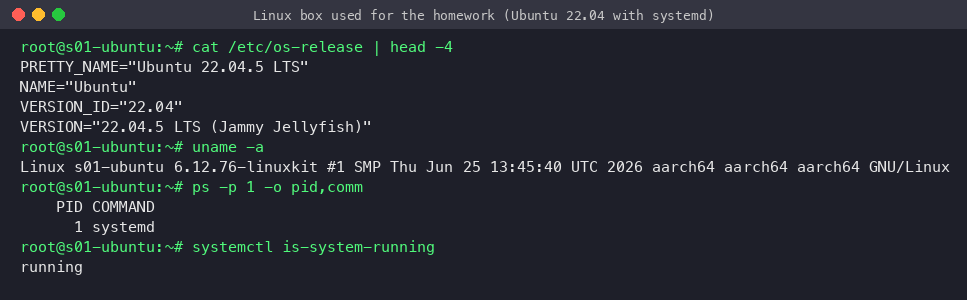

---

## Task 1 — Soft link vs hard link

### Background: inodes
A Linux file has two parts: the **inode**, which holds the metadata and points to the data blocks, and one or more **directory entries (names)** that point to the inode. `ls -i` shows the inode number.

| | Hard link | Soft (symbolic) link |
|---|---|---|
| Command | `ln target linkname` | `ln -s target linkname` |
| What it is | Another name for the **same inode** | A **separate small file** (own inode) that stores a *path* |
| Inode number | Same as the original | Different |
| Link count (`ls -l` col 2) | Goes up by 1 | Original's count does not change |
| Original deleted | Data **still reachable** (count just drops) | Link **breaks** ("dangling") |
| Directories | Not allowed (would create loops) | Allowed |
| Across filesystems/partitions | Not allowed (inodes are per filesystem) | Allowed |
| Permissions shown | Real permissions of the file | `lrwxrwxrwx` (the target's permissions apply) |
| Typical use | Backups/snapshots (rsnapshot), keeping data alive under two names | Versioned tools (`python -> python3.10`), `/etc/nginx/sites-enabled/*`, shortcuts |

### Create
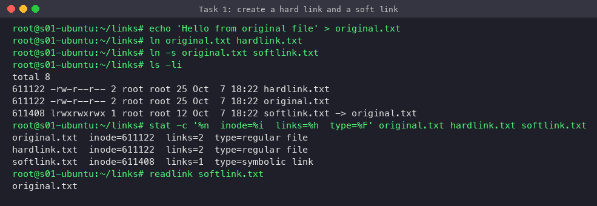

`original.txt` and `hardlink.txt` share inode **601309** and the link count is **2**. `softlink.txt` has its own inode (601310) and simply stores the text `original.txt` (`readlink`).

### Edit via the link, then delete the original
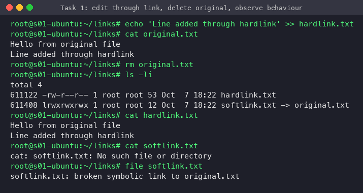

- Text written through `hardlink.txt` shows up in `original.txt`, because both names point to the same data.
- After `rm original.txt` the hard link still has all the content (link count is now 1). `rm` only removes a name; the data is freed once the count reaches 0.
- The soft link is now **broken**: `cat` fails and `file` reports `broken symbolic link`.

### Rules and deleting links
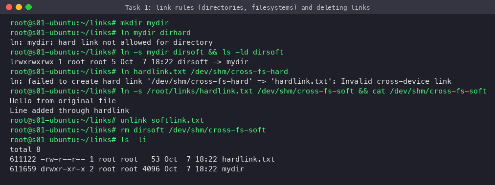

- `ln mydir dirhard` → `hard link not allowed for directory`.
- A hard link across filesystems (`/root` → `/dev/shm` tmpfs) → `Invalid cross-device link`. A soft link across filesystems works.
- You can delete a link with `rm` or `unlink`. Deleting a soft link never touches the target.

### Interview answer (short)
> "A hard link is an extra directory entry pointing to the same inode. It has the same inode number and still works if the original name is deleted, but it can't span filesystems or point to directories. A soft link is a separate file that stores a path to the target. It can point anywhere, including directories and other filesystems, but it breaks if the target is moved or deleted. Create them with `ln` and `ln -s`, and check them with `ls -li`."

---

## Task 2 — `adduser` vs `useradd`

| | `useradd` | `adduser` |
|---|---|---|
| Type | Low-level **compiled binary** (shadow-utils), on every distro | **Perl script** front-end (Debian/Ubuntu), calls `useradd` internally |
| Home directory | Not created unless you pass `-m` | Created automatically and populated from `/etc/skel` |
| Shell | `/bin/sh` by default unless `-s` | `/bin/bash` (from `/etc/adduser.conf`: `DSHELL`) |
| Password | None; the account is **locked** (`passwd -S` → `L`) | Prompts for a password and GECOS info interactively |
| Group | Depends on `/etc/login.defs` | Creates a private group with the same name (`USERGROUPS=yes`) |
| Config | `/etc/default/useradd`, `/etc/login.defs` | `/etc/adduser.conf` |
| Best for | Scripts/automation where you specify everything, and non-Debian distros | Interactive admin work on Ubuntu/Debian |

**Which is preferred on Ubuntu?** `adduser`. The Debian/Ubuntu `useradd` man page itself recommends it, because it applies sensible defaults: home directory, skeleton files, a bash shell, a private group, a UID from the right range and a password. With `useradd` you have to remember `-m -s /bin/bash` and run `passwd` afterwards. In scripts or Dockerfiles, `useradd` (with explicit flags) is common because it's non-interactive and works the same on every distro.

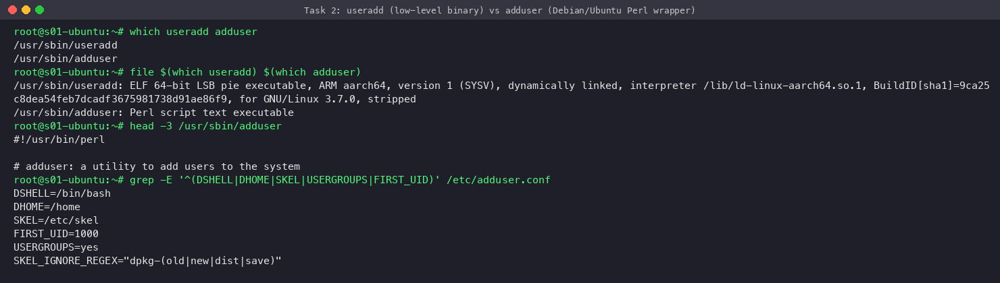

**`useradd` without options:** no home directory, `/bin/sh` shell, locked password. With `-m -s /bin/bash -c` you get a proper user:
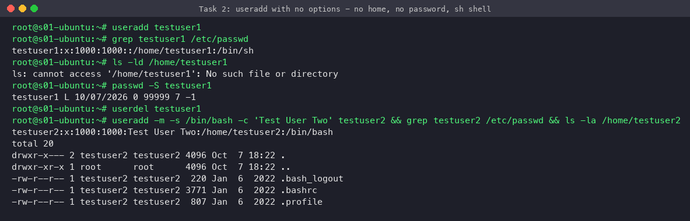

**Test user created with the recommended `adduser`.** `--gecos` and `--disabled-password` make it non-interactive here; the password is then set with `chpasswd`. Normally `adduser poorav-test` prompts for all of these interactively.
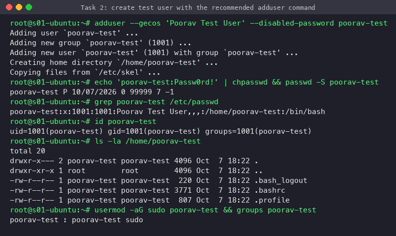

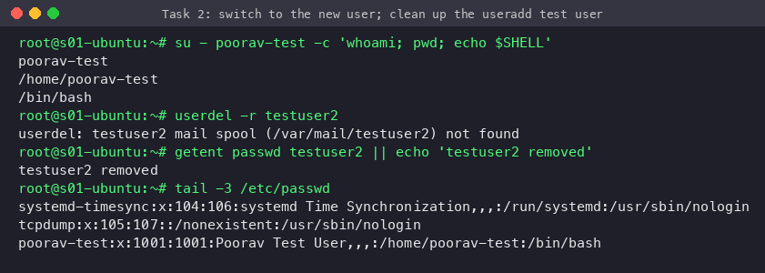

Related commands: `usermod -aG sudo user` (add to a group), `passwd user`, `userdel -r user` / `deluser --remove-home user`, `id`, `groups`, `getent passwd`.

---

## Task 3 — `journalctl`

`journalctl` is the query tool for the **systemd journal** (`systemd-journald`). journald collects logs from the kernel, early boot, every systemd service's stdout/stderr, syslog and `logger` in one indexed, binary store (`/run/log/journal` or `/var/log/journal`). Each entry has structured fields (`_SYSTEMD_UNIT`, `PRIORITY`, `_PID`, ...), so you can filter precisely.

To create realistic logs for the demo I:
1. added a cron job that logs a heartbeat every minute (`logger -t homework-cron`),
2. logged an error message with `logger -p user.err`,
3. **broke the nginx config on purpose** (`broken_directive;`), restarted nginx (it failed), restored the config and restarted it again.

### System logs
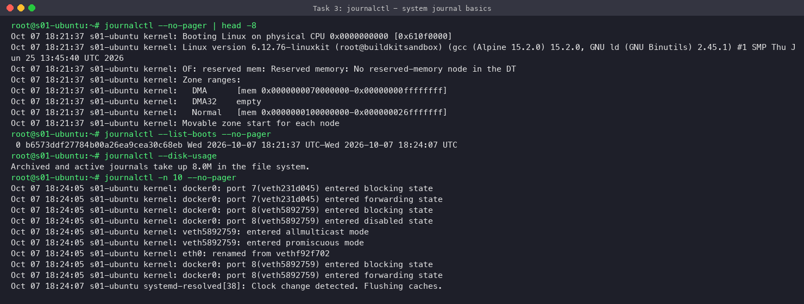

### Logs for one service: `-u nginx`
The failure and the recovery are both visible. The journal shows the exact cause: `unknown directive "broken_directive" in /etc/nginx/sites-enabled/default:92`. This is the usual workflow when `systemctl status` reports a service failure.
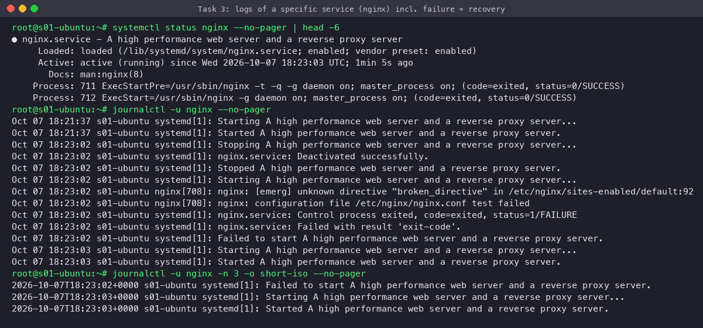

### Filtering
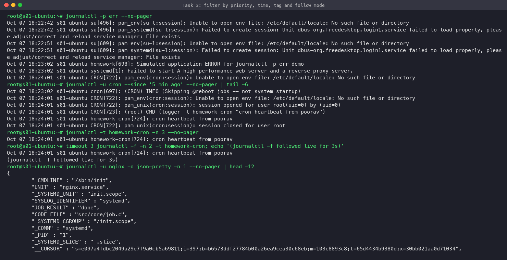

| Command | Purpose |
|---|---|
| `journalctl` | All logs, oldest first (pager) |
| `journalctl -n 20` | Last 20 lines |
| `journalctl -f` | Follow live (like `tail -f`) |
| `journalctl -u nginx` | One service/unit |
| `journalctl -u nginx -f` | Follow one service |
| `journalctl -b` / `-b -1` / `--list-boots` | Current boot / previous boot / list of boots |
| `journalctl -p err` | Priority `err` and above (emerg, alert, crit, err) |
| `journalctl --since "1 hour ago" --until "10 min ago"` | Time window |
| `journalctl -t TAG` / `_PID=123` / `_UID=1000` | Filter by syslog identifier / field |
| `journalctl -k` | Kernel messages (like `dmesg`) |
| `journalctl -o short-iso / json-pretty` | Output formats |
| `journalctl -r` | Newest first |
| `journalctl --disk-usage`, `--vacuum-time=7d`, `--vacuum-size=500M` | Manage journal size |

---

## Task 4 — Linux command cheat sheet practice

### Files and directories
`pwd, ls, cd, mkdir -p, touch, cp, mv, rm -r, tree, find, which, whereis`
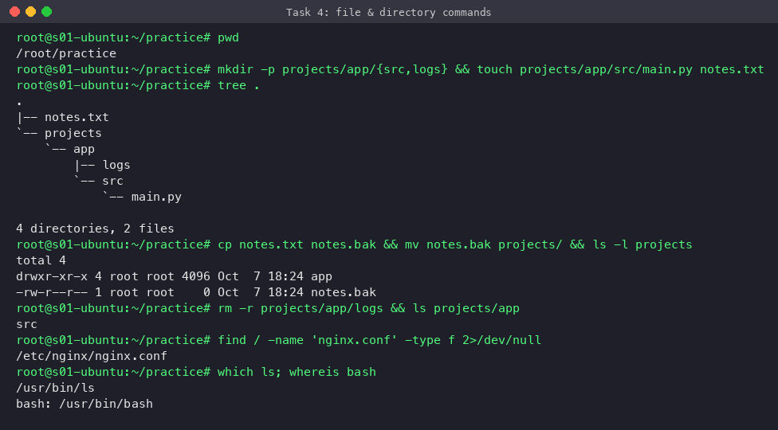

### Viewing and text processing
`cat, head, tail, grep -n, awk, sed, sort, uniq -c, wc, cut`. The `awk` line sums quantities per fruit, the kind of one-liner used on log files.
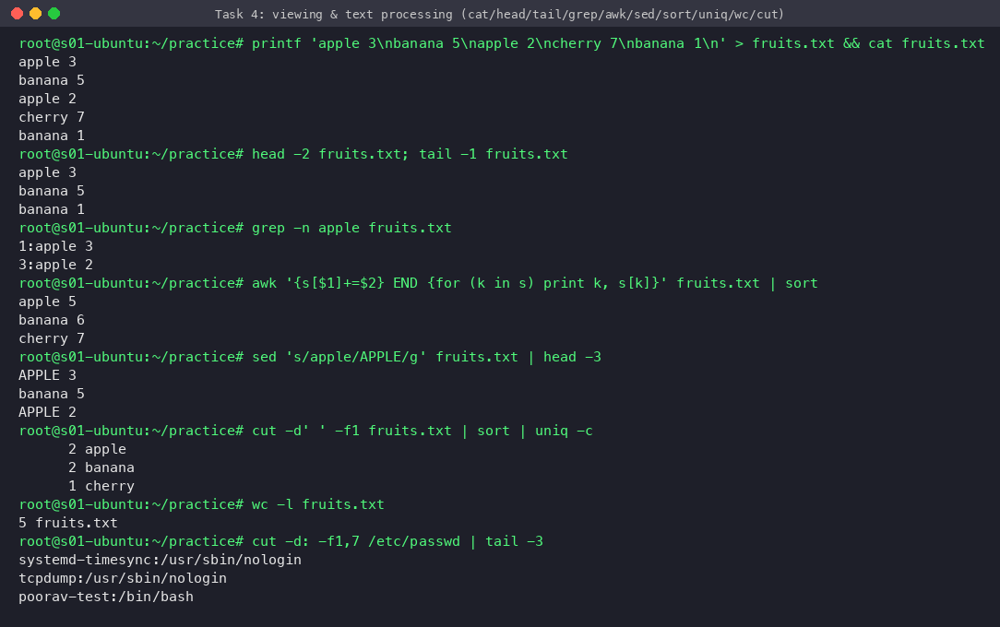

### Permissions and ownership
`chmod` (symbolic `u+x` and octal `640`), `chown user:group`, `umask`, `stat`. The normal user is refused access to `/etc/shadow`, which shows permissions being enforced.
Octal: r=4, w=2, x=1 → `744` = rwx for the owner, r for group/others.
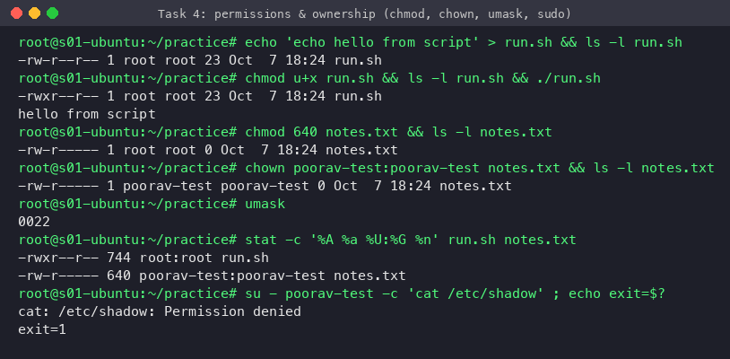

### Processes and services
`ps aux --sort, &` (background), `pgrep, pkill / kill PID, top -b, systemctl list-units`
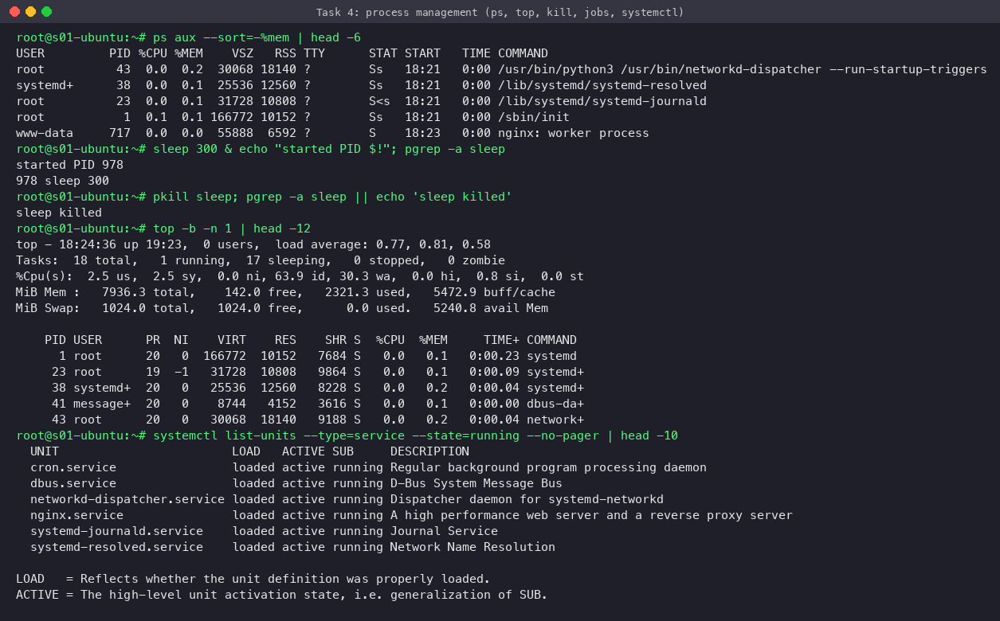

### Disk, memory and system info
`df -h` (filesystem free space), `du -sh` (directory size), `free -h`, `uptime` (load average), `lscpu`, `hostname, whoami, id, date`
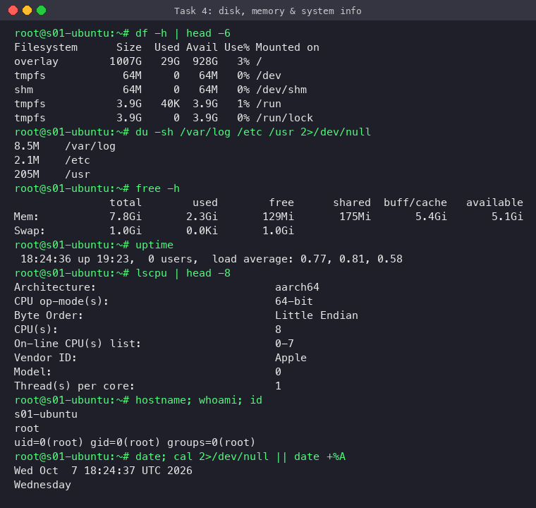

### Archives and packages
`tar -czf / -tzf, gzip -k, apt list --installed, dpkg -l, apt-cache policy` (also `apt update`, `apt install`, `apt remove`)
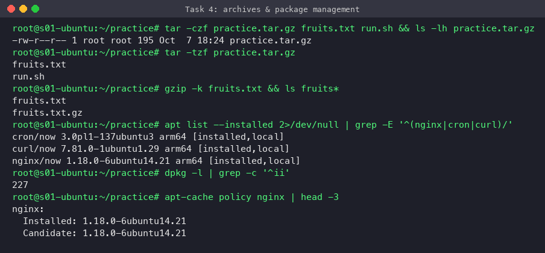

### Environment, aliases, redirection, help
`echo $PATH, export, env, alias, >` (overwrite), `>>` (append), `2>` (stderr), `|` (pipe), `--help`
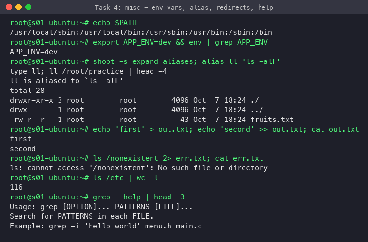

Networking commands (`ip, ss, ping, dig, curl`, ...) are covered in detail in [Session 04](../session04-networking/README.md).
