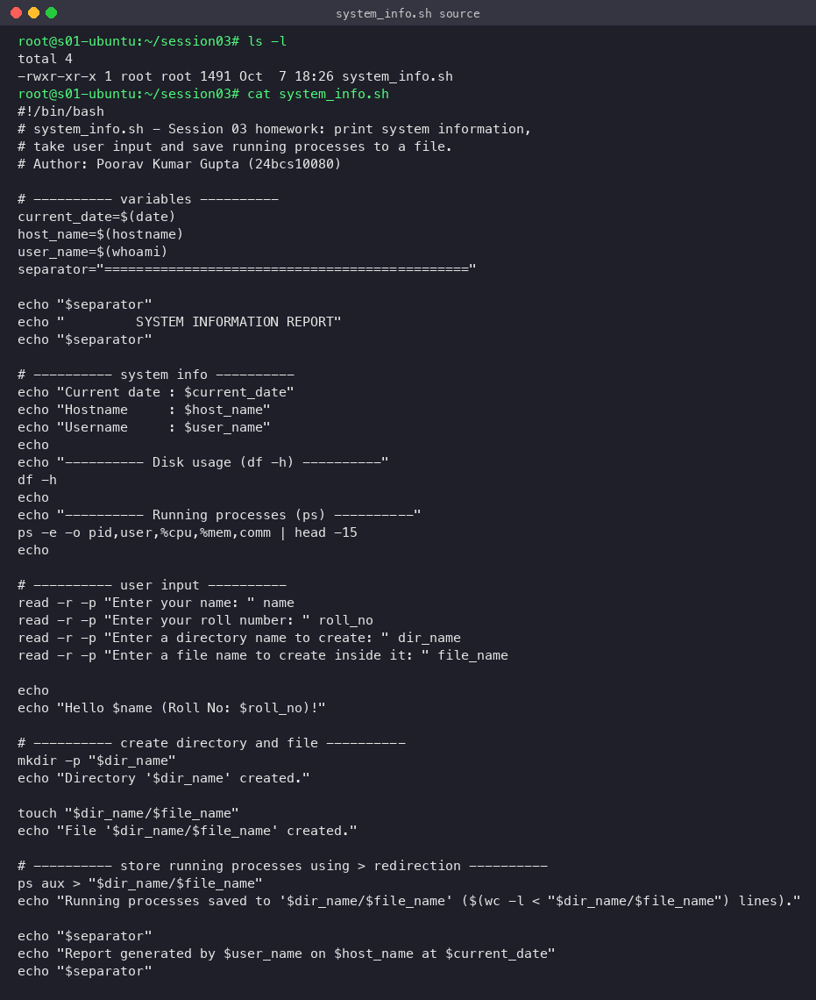
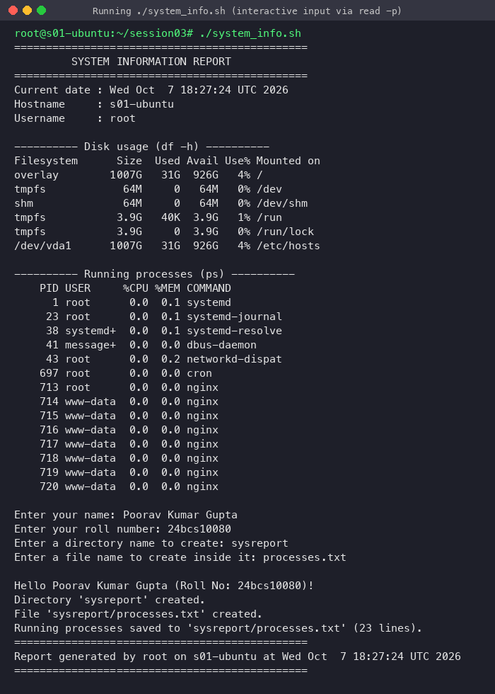
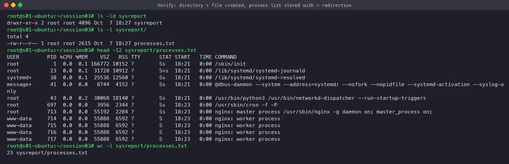
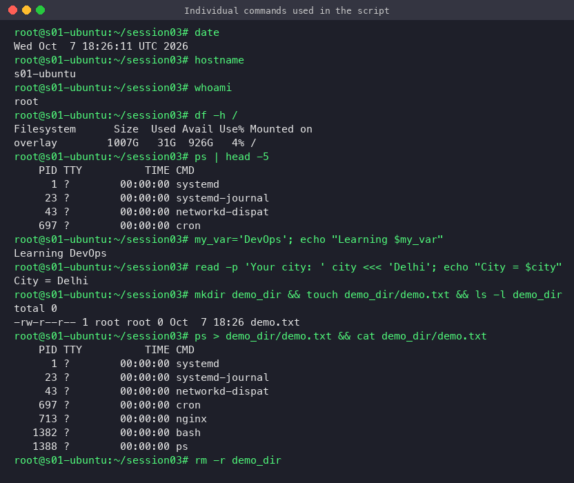
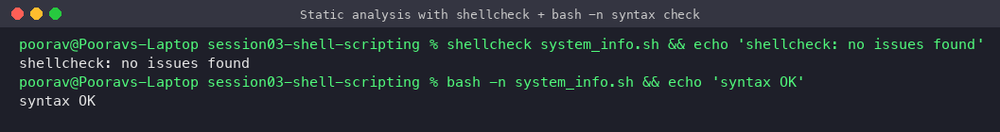
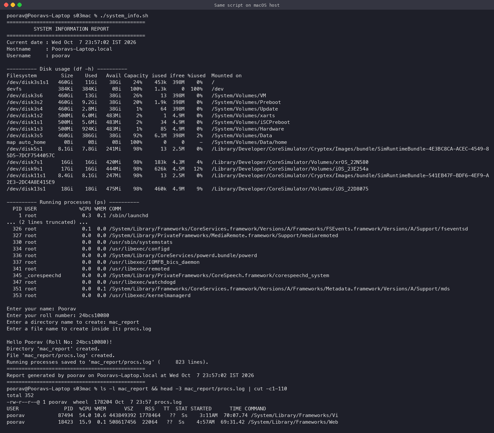

# Session 03 — Shell Scripting: System Information Script

**Student:** Poorav Kumar Gupta  **Enrollment No:** 24bcs10080

Script: [`system_info.sh`](system_info.sh)

## What the script does (requirement checklist)

| Requirement | How it is done in `system_info.sh` |
|---|---|
| Print current date | `current_date=$(date)` → `echo "Current date : $current_date"` |
| Print hostname | `host_name=$(hostname)` |
| Print username | `user_name=$(whoami)` |
| Print disk usage | `df -h` |
| Print running processes | `ps -e -o pid,user,%cpu,%mem,comm` |
| Use variables | `current_date`, `host_name`, `user_name`, `separator`, `name`, `roll_no`, `dir_name`, `file_name` |
| Take input with `read -p` | 4 prompts: name, roll number, directory name, file name (`read -r -p`; `-r` stops backslash mangling) |
| Create a directory with `mkdir` | `mkdir -p "$dir_name"` |
| Create a file with `touch` | `touch "$dir_name/$file_name"` |
| Save processes to the file with `>` | `ps aux > "$dir_name/$file_name"` |

## How to run

```bash
chmod +x system_info.sh
./system_info.sh
```

## Source


## Run (Ubuntu 22.04)


Full output:
```text
root@s01-ubuntu:~/session03# ./system_info.sh
==============================================
         SYSTEM INFORMATION REPORT
==============================================
Current date : Wed Oct  7 18:27:24 UTC 2026
Hostname     : s01-ubuntu
Username     : root

---------- Disk usage (df -h) ----------
Filesystem      Size  Used Avail Use% Mounted on
overlay        1007G   31G  926G   4% /
tmpfs            64M     0   64M   0% /dev
shm              64M     0   64M   0% /dev/shm
tmpfs           3.9G   40K  3.9G   1% /run
tmpfs           3.9G     0  3.9G   0% /run/lock
/dev/vda1      1007G   31G  926G   4% /etc/hosts

---------- Running processes (ps) ----------
    PID USER     %CPU %MEM COMMAND
      1 root      0.0  0.1 systemd
     23 root      0.0  0.1 systemd-journal
     38 systemd+  0.0  0.1 systemd-resolve
     41 message+  0.0  0.0 dbus-daemon
     43 root      0.0  0.2 networkd-dispat
    697 root      0.0  0.0 cron
    713 root      0.0  0.0 nginx
    714 www-data  0.0  0.0 nginx
    715 www-data  0.0  0.0 nginx
    716 www-data  0.0  0.0 nginx
    717 www-data  0.0  0.0 nginx
    718 www-data  0.0  0.0 nginx
    719 www-data  0.0  0.0 nginx
    720 www-data  0.0  0.0 nginx

Enter your name: Poorav Kumar Gupta
Enter your roll number: 24bcs10080
Enter a directory name to create: sysreport
Enter a file name to create inside it: processes.txt

Hello Poorav Kumar Gupta (Roll No: 24bcs10080)!
Directory 'sysreport' created.
File 'sysreport/processes.txt' created.
Running processes saved to 'sysreport/processes.txt' (23 lines).
==============================================
Report generated by root on s01-ubuntu at Wed Oct  7 18:27:24 UTC 2026
==============================================
```

## Verification: directory, file and redirected process list


```text
root@s01-ubuntu:~/session03# ls -ld sysreport
drwxr-xr-x 2 root root 4096 Oct  7 18:27 sysreport
root@s01-ubuntu:~/session03# ls -l sysreport/
total 4
-rw-r--r-- 1 root root 2615 Oct  7 18:27 processes.txt
root@s01-ubuntu:~/session03# head -12 sysreport/processes.txt
USER         PID %CPU %MEM    VSZ   RSS TTY      STAT START   TIME COMMAND
root           1  0.0  0.1 166772 10152 ?        Ss   18:21   0:00 /sbin/init
root          23  0.0  0.1  31728 10912 ?        S<s  18:21   0:00 /lib/systemd/systemd-journald
systemd+      38  0.0  0.1  25536 12560 ?        Ss   18:21   0:00 /lib/systemd/systemd-resolved
message+      41  0.0  0.0   8744  4152 ?        Ss   18:21   0:00 @dbus-daemon --system --address=systemd: --nofork --nopidfile --systemd-activation --syslog-only
root          43  0.0  0.2  30068 18140 ?        Ss   18:21   0:00 /usr/bin/python3 /usr/bin/networkd-dispatcher --run-startup-triggers
root         697  0.0  0.0   3956  2344 ?        Ss   18:23   0:00 /usr/sbin/cron -f -P
root         713  0.0  0.0  55192  2284 ?        Ss   18:23   0:00 nginx: master process /usr/sbin/nginx -g daemon on; master_process on;
www-data     714  0.0  0.0  55888  6592 ?        S    18:23   0:00 nginx: worker process
www-data     715  0.0  0.0  55888  6592 ?        S    18:23   0:00 nginx: worker process
www-data     716  0.0  0.0  55888  6592 ?        S    18:23   0:00 nginx: worker process
www-data     717  0.0  0.0  55888  6592 ?        S    18:23   0:00 nginx: worker process
root@s01-ubuntu:~/session03# wc -l sysreport/processes.txt
23 sysreport/processes.txt
```

A sample of the generated file is saved in [`sample-output/processes.txt`](sample-output/processes.txt).

## Each command on its own



```text
root@s01-ubuntu:~/session03# date
Wed Oct  7 18:26:11 UTC 2026
root@s01-ubuntu:~/session03# hostname
s01-ubuntu
root@s01-ubuntu:~/session03# whoami
root
root@s01-ubuntu:~/session03# df -h /
Filesystem      Size  Used Avail Use% Mounted on
overlay        1007G   31G  926G   4% /
root@s01-ubuntu:~/session03# ps | head -5
    PID TTY          TIME CMD
      1 ?        00:00:00 systemd
     23 ?        00:00:00 systemd-journal
     43 ?        00:00:00 networkd-dispat
    697 ?        00:00:00 cron
root@s01-ubuntu:~/session03# my_var='DevOps'; echo "Learning $my_var"
Learning DevOps
root@s01-ubuntu:~/session03# read -p 'Your city: ' city <<< 'Delhi'; echo "City = $city"
City = Delhi
root@s01-ubuntu:~/session03# mkdir demo_dir && touch demo_dir/demo.txt && ls -l demo_dir
total 0
-rw-r--r-- 1 root root 0 Oct  7 18:26 demo.txt
root@s01-ubuntu:~/session03# ps > demo_dir/demo.txt && cat demo_dir/demo.txt
    PID TTY          TIME CMD
      1 ?        00:00:00 systemd
     23 ?        00:00:00 systemd-journal
     43 ?        00:00:00 networkd-dispat
    697 ?        00:00:00 cron
    713 ?        00:00:00 nginx
   1382 ?        00:00:00 bash
   1388 ?        00:00:00 ps
root@s01-ubuntu:~/session03# rm -r demo_dir
```

| Command | Meaning |
|---|---|
| `date` | Prints the current date and time |
| `hostname` | Prints the machine's name |
| `whoami` | Prints the current user |
| `df -h` | Disk free space per filesystem, in human-readable units |
| `ps` / `ps aux` | Snapshot of running processes (`aux` = all users, user-oriented format, include processes without a terminal) |
| `var=value`, `$var`, `$(cmd)` | Assign a variable, use it, store a command's output in a variable |
| `read -p "prompt" var` | Show a prompt and store the typed input in `var` |
| `mkdir -p dir` | Create a directory (`-p`: no error if it exists, creates parents) |
| `touch file` | Create an empty file, or update its timestamp |
| `cmd > file` | Redirect stdout to a file (**overwrite**). `>>` appends |
| `echo` | Print text or variables |

## Quality checks

```text
$ shellcheck system_info.sh && echo 'shellcheck: no issues found'
shellcheck: no issues found
$ bash -n system_info.sh && echo 'syntax OK'
syntax OK
```


## Bonus: the same script on macOS
Because the script uses a `#!/bin/bash` shebang and only POSIX-ish tools, it runs unchanged on macOS. Only the `ps`/`df` columns differ.


## Submission note
The homework asks for a public GitHub repository. This folder is ready to push as-is (script + README with all outputs). Publishing was left to the student.
