# Session 04 — Networking Fundamentals

**Student:** Poorav Kumar Gupta  **Enrollment No:** 24bcs10080

Every command was run for real. Most ran on an **Ubuntu 22.04 container** (`s01-ubuntu`, a systemd box running nginx on port 80, see [Session 01-02](../session01-02-linux/README.md)); a few ran on the **macOS host**. The container sits behind Docker's NAT: its IP is `172.17.0.3` and its gateway is `172.17.0.1`.

## Task 1 — Practice from the course material

The session notes (`session4-networking/ip.md`) cover IP addresses, classes, subnet masks and private ranges. I practised them with `ipcalc`:

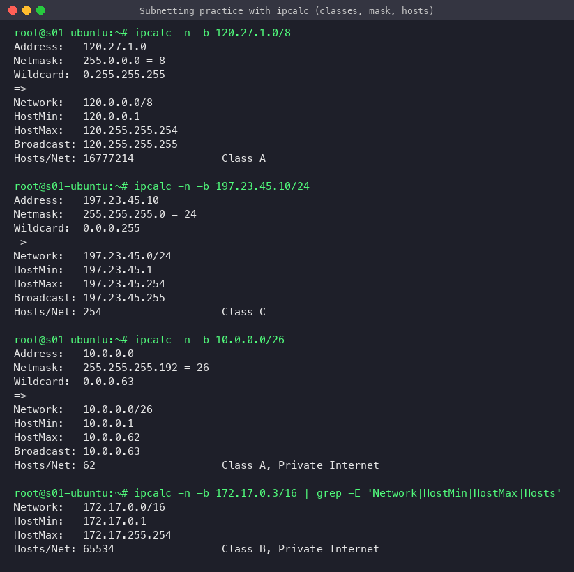

| Class | First octet | Default mask | Network/Host bits | Usable hosts |
|---|---|---|---|---|
| A | 1–126 (127 = loopback) | 255.0.0.0 (/8) | 8 / 24 | 2^24 − 2 = 16,777,214 |
| B | 128–191 | 255.255.0.0 (/16) | 16 / 16 | 65,534 |
| C | 192–223 | 255.255.255.0 (/24) | 24 / 8 | 254 |
| D | 224–239 | — | multicast | — |

Private ranges (RFC 1918): `10.0.0.0/8`, `172.16.0.0/12`, `192.168.0.0/16`. Docker's `172.17.0.0/16` is one of them. Usable hosts = 2^(host bits) − 2 (network and broadcast addresses are reserved). For example, `/26` → 2^6 − 2 = 62 hosts.

## Task 2 — Commands, output and what I understood

### 1. `ip addr`, `ifconfig`, `hostname -I` — interfaces and addresses
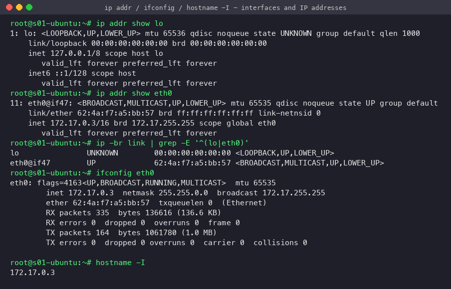
- `ip addr show` (iproute2, modern) lists each interface with its MAC (`link/ether`), IPv4 (`inet 172.17.0.3/16`) and state (`UP`). `lo` is loopback `127.0.0.1`.
- `ifconfig` (net-tools, legacy) shows the same plus RX/TX packet counters.
- `hostname -I` prints only the IPs, which is handy in scripts.

### 2. `ip route`, `route -n`, `ip neigh`, `arp -n` — routing and ARP
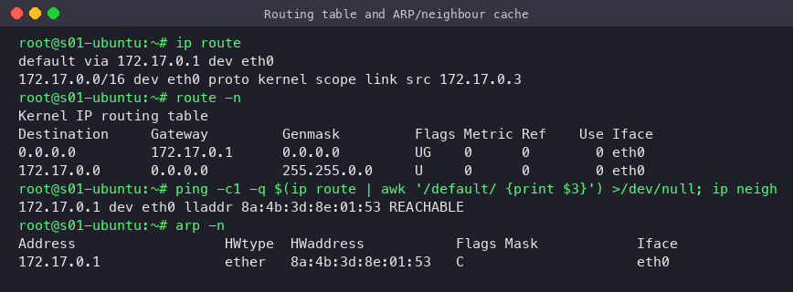
- The **default route** `via 172.17.0.1` means traffic for any non-local network goes to the gateway. `172.17.0.0/16` is reached directly (`scope link`).
- `route -n`: flag `UG` = Up + Gateway. `-n` skips DNS lookups.
- `ip neigh` / `arp -n` show the ARP cache, which maps IPs on the local link to MAC addresses (here the gateway's MAC, state `REACHABLE`).

### 3. `ping` — reachability and latency
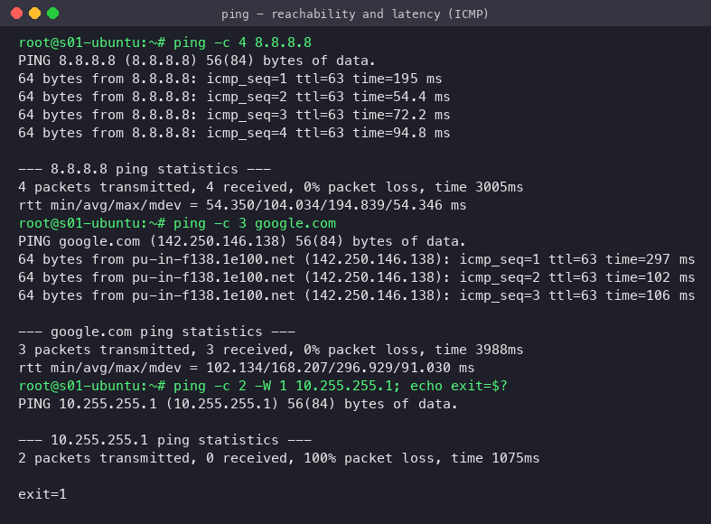
- Sends ICMP Echo Requests and measures the round-trip time. `-c` = count, `-W` = timeout.
- `ping google.com` also proves DNS works (the name is resolved to `142.250.x.x`).
- An unreachable private IP gives **100% packet loss** and exit code 1, which scripts can check.
- TTL=63 = 64 minus one hop (the Docker gateway).

### 4. `traceroute` / `tracepath` / `mtr` — the path packets take
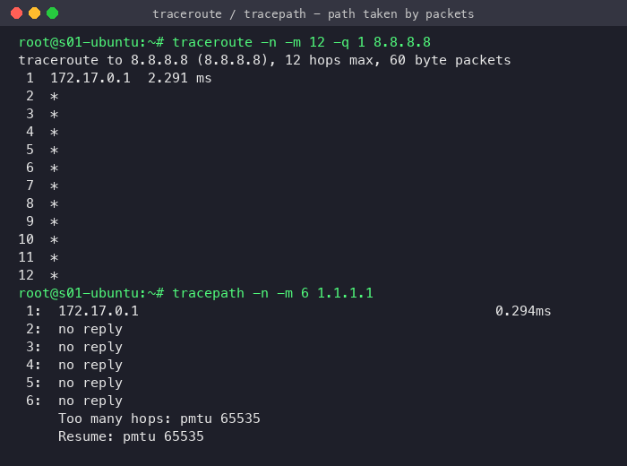
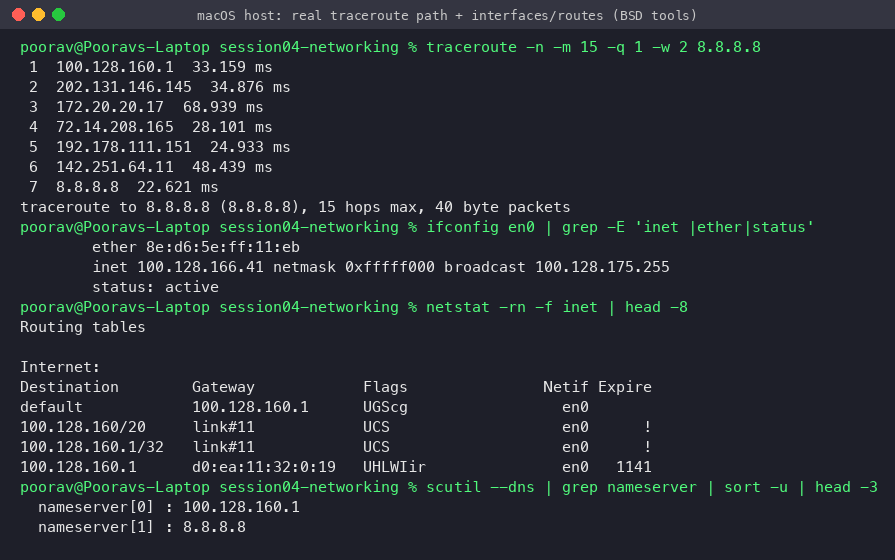
- traceroute sends probes with TTL 1, 2, 3... Each router that drops a probe returns *ICMP Time Exceeded*, which reveals that hop.
- **What I observed:** inside the container only hop 1 (`172.17.0.1`) responds and the rest are `*`. Docker Desktop's user-space NAT doesn't pass back ICMP time-exceeded messages. From the macOS host the full path shows up: home router `100.128.160.1` → ISP → Google `72.14.x / 142.251.x` → `8.8.8.8` in 7 hops. `*` means a hop didn't answer, not that the path is broken.
- `mtr` combines ping and traceroute and gives loss/latency statistics per hop (screenshot 10).

### 5. `dig`, `nslookup`, `host` — DNS
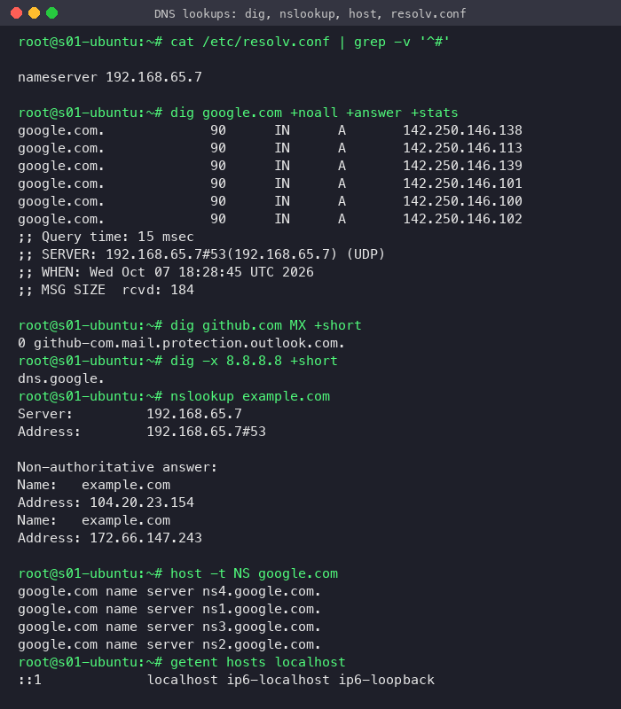
- `/etc/resolv.conf` names the DNS server (`192.168.65.7`, Docker's resolver).
- `dig google.com` → A records, TTL (90 s), query time and the server that answered. `dig MX` → mail servers. `dig -x` → reverse (PTR) lookup: `8.8.8.8` → `dns.google`.
- `nslookup` is the older interactive tool; "Non-authoritative answer" means a recursive resolver's cache answered, not the domain's own name server.
- `host -t NS` is a quick lookup by record type. `getent hosts` also uses `/etc/hosts` (the nsswitch order).

### 6. `curl` and `wget` — HTTP clients
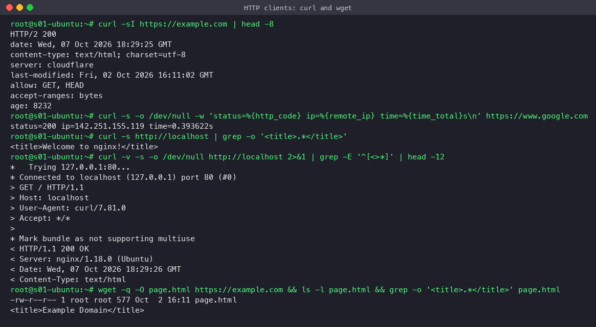
- `curl -I` fetches only the headers (status `HTTP/2 200`, server `cloudflare`).
- `curl -w` prints timing and status, useful for health checks. `curl -v` shows the TCP connect, the request (`>`) and the response (`<`).
- `curl localhost` hits nginx inside the container → `Welcome to nginx!`.
- `wget` downloads to a file (non-interactive and recursive-capable, good for scripts).

### 7. `ss`, `netstat`, `lsof` — sockets and listening ports
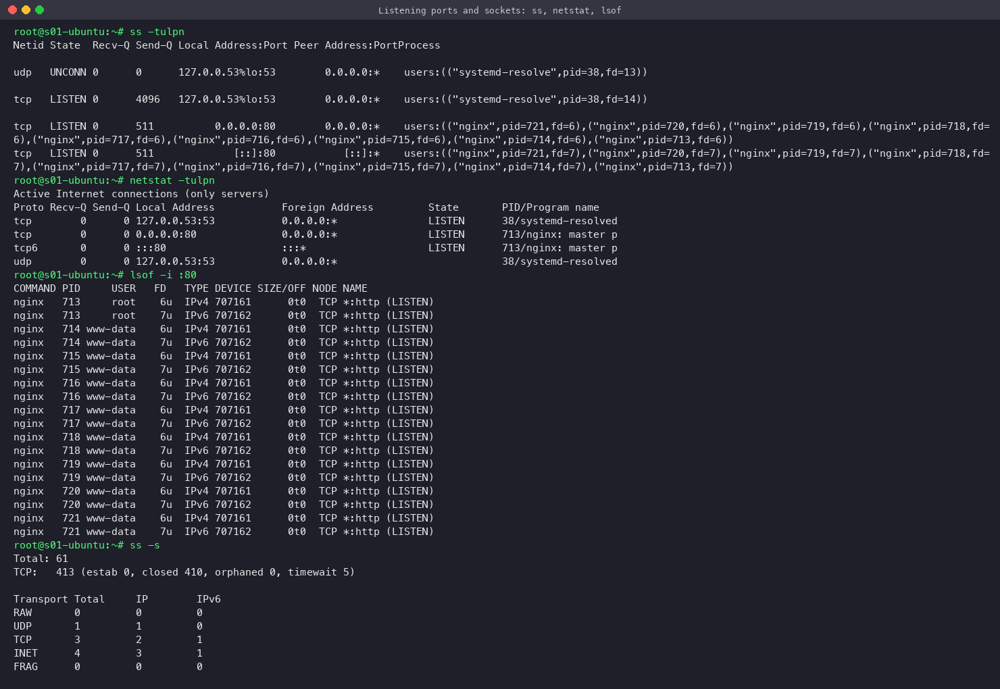
- `ss -tulpn` (= TCP, UDP, listening, process, numeric): nginx listens on `0.0.0.0:80` and `[::]:80`, and systemd-resolved on `127.0.0.53:53`.
- `netstat -tulpn` is the legacy equivalent. `lsof -i :80` shows which process (and user) owns the port: the master runs as root, the workers as `www-data`.
- `ss -s` gives a summary of socket counts. Typical use: "port already in use", or "is my app actually listening?"

### 8. `nc` (netcat) and `telnet` — raw TCP and port testing
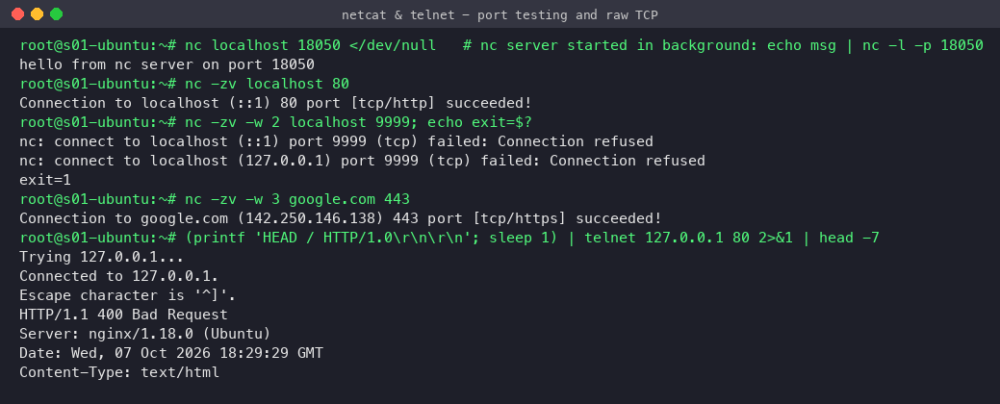
- I started a tiny TCP server with `echo msg | nc -l -p 18050`, and `nc localhost 18050` received the message. This is a minimal client/server.
- `nc -zv host port` checks whether a port is open (*succeeded* or *Connection refused*) without sending data. It's the standard way to test firewall/security-group rules.
- `telnet host 80` opens a raw TCP session (`Connected to 127.0.0.1`). I piped in a hand-written HTTP request and nginx answered with a status line and headers. The answer was `400 Bad Request` because the hand-made request wasn't well-formed, but getting any reply proves TCP connectivity to the port, which is what telnet is used for in troubleshooting.

### 9. `tcpdump` — packet capture
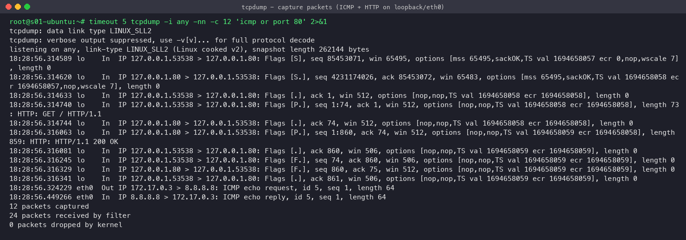
- Captured a full **TCP 3-way handshake** (`[S]` → `[S.]` → `[.]`), the HTTP `GET /` and `200 OK`, the FIN teardown, then an ICMP echo request/reply to 8.8.8.8.
- Filters such as `'icmp or port 80'` are BPF expressions. `-nn` = don't resolve names or ports.

### 10. `mtr`, `whois`, `/etc/hosts`
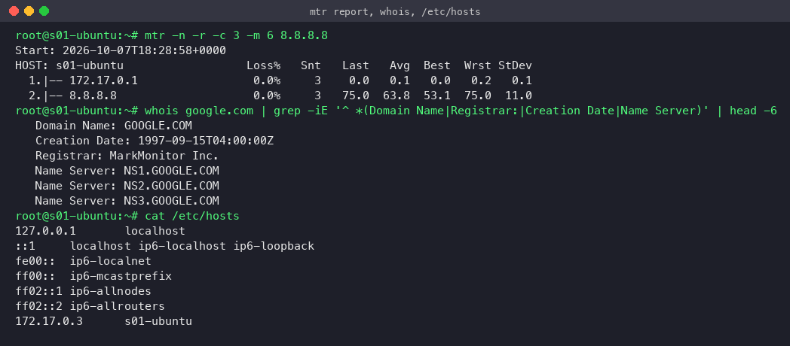
- `whois` shows who registered a domain, the registrar, creation date and name servers.
- `/etc/hosts` is the local static name → IP table, checked before DNS (Docker adds the container's own hostname to it).

### 11. macOS equivalents
On macOS (BSD tools): `ifconfig en0`, `netstat -rn` (routing table), `scutil --dns` (resolvers), and traceroute as above.

## Quick reference

| Goal | Command |
|---|---|
| My IP / interfaces | `ip a`, `ifconfig`, `hostname -I` |
| Gateway / routes | `ip route`, `route -n`, `netstat -rn` |
| Is host up? | `ping -c 4 host` |
| Where does the path fail? | `traceroute host`, `mtr host` |
| DNS resolution | `dig name`, `nslookup name`, `host name` |
| Is port open remotely? | `nc -zv host port`, `telnet host port` |
| What's listening locally? | `ss -tulpn`, `netstat -tulpn`, `lsof -i :port` |
| HTTP check | `curl -I url`, `curl -w '%{http_code}'`, `wget url` |
| See packets | `tcpdump -i any port 80` |
| MAC ↔ IP | `ip neigh`, `arp -n` |
