# Session 05 — Git / GitHub

**Student:** Poorav Kumar Gupta  **Enrollment No:** 24bcs10080

Both demos were run in throwaway local repositories. Each repo's full history is saved as a **git bundle** in [`demo-repos/`](demo-repos/), so it can be cloned and inspected:

```bash
git clone -b main demo-repos/cherry-pick-demo.bundle cherry-pick-demo
git clone -b main demo-repos/commit-a-vs-m-demo.bundle commit-demo
```

---

## Task 1 — `git commit -a -m` vs `git commit -m`

| | `git commit -m "msg"` | `git commit -a -m "msg"` |
|---|---|---|
| What gets committed | Only what's **already staged** (`git add`) | Automatically stages **all modified and deleted *tracked* files**, then commits |
| New (untracked) files | Only if you `git add` them | **Never**; `-a` ignores untracked files |
| Needs `git add` first? | Yes | No, for files Git already tracks |
| Control | Fine-grained (stage only some files/hunks) | All-or-nothing for tracked changes |
| Equivalent | — | `git add -u && git commit -m "msg"` |

### Setup
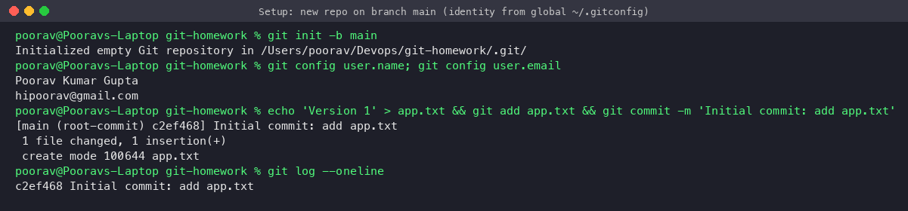

### a) Change a tracked file and create a new file, then run plain `git commit -m`
`git status --short`: `M app.txt` (modified, unstaged) and `?? notes.txt` (untracked).
Plain `git commit -m` **refuses**: `no changes added to commit (use "git add" and/or "git commit -a")`, exit code 1, because nothing was staged.
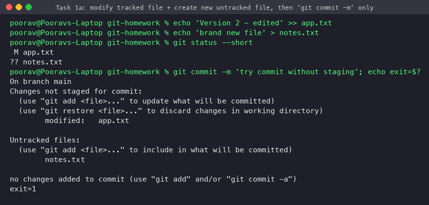

### b) `git commit -a -m`
The commit contains **only `app.txt`**. `notes.txt` is still `??` (untracked), because `-a` doesn't add new files.
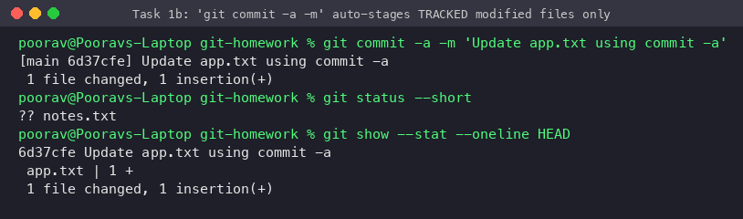

### c) The new file needs `git add`, then `git commit -m`
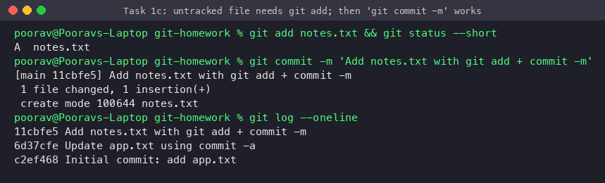

### d) `-a` also stages deletions of tracked files
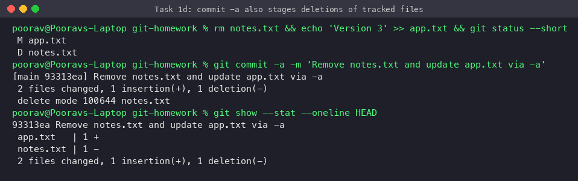

**Observation / takeaway:** `-a` is a shortcut for "commit everything Git already knows about". Use plain `git add <files>` + `git commit -m` when you want a focused commit, or when the commit includes new files.

---

## Task 2 — Git cherry-pick

`git cherry-pick <commit>` takes the **changes introduced by one commit** on another branch and re-applies them as a **new commit** (new hash) on the current branch, without merging the whole branch. Typical uses: backporting a bug fix to a release branch, or taking one finished change from a branch that also has unfinished work.

### Step 1 — 3 commits on `main`, viewed with `git log`
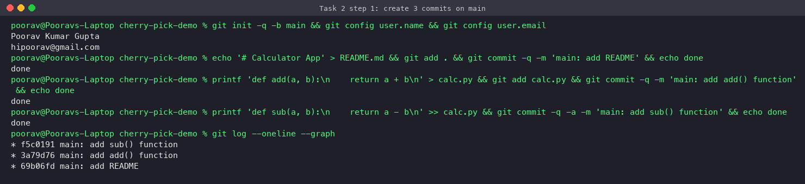

### Step 2 — New branch `feature` with 3 commits
1. `feature: add mul() function` ← the finished change we want on main
2. `feature: add experimental config (WIP)` ← must **not** go to main
3. `feature: document usage in README`

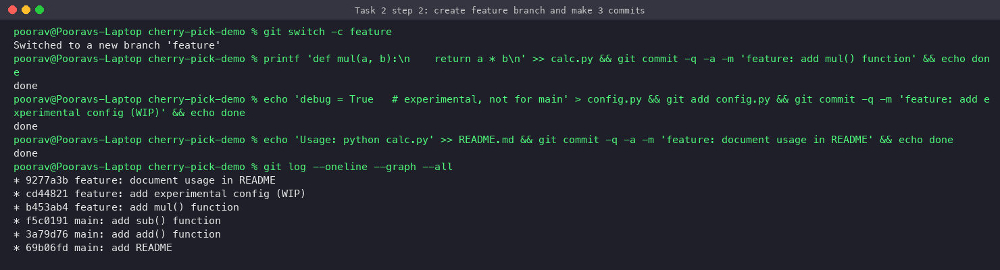

### Step 3 — Identify the commit with `git log`
`git log feature --not main` lists the commits that exist only on feature. The `mul()` commit is `b453ab4`.
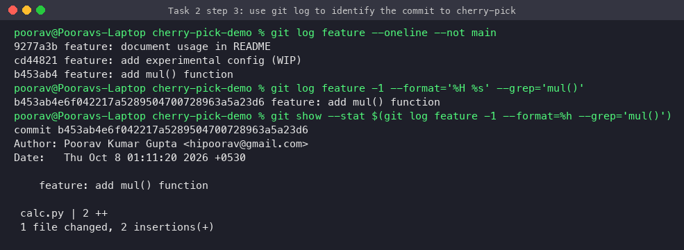

### Step 4 — Cherry-pick it into `main`
```bash
git switch main
git cherry-pick b453ab4
```
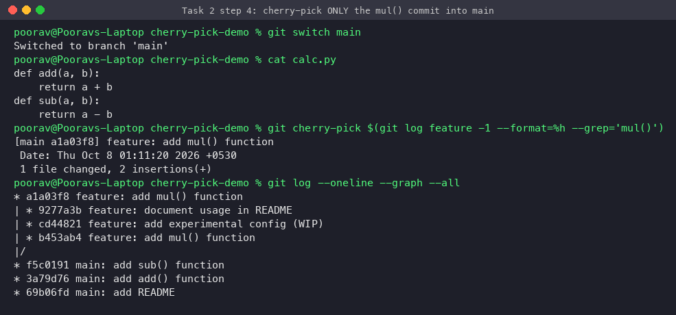

### Step 5 — Verify
- `calc.py` on main now contains `mul()`.
- `config.py` and the README "Usage" line are **not** on main; only the selected commit was applied.
- The new commit on main is **`a1a03f8`, not `b453ab4`**: the same change, but a new commit object with a new hash. A commit hash covers the tree, the parent, the author/committer and **both timestamps**. Cherry-pick keeps the author date (01:11:20) and sets a new committer date (01:11:24), so the hash changes. (Here the parent is the same, `f5c0191`, because `mul()` was the first commit on feature. In general the parent also differs.) That's why `git branch --contains b453ab4` lists only `feature`.
  - *Observed while redoing this demo:* when the cherry-pick ran in the **same second** as the original commit, Git produced a byte-identical commit (same hash): same tree, same parent, same timestamps. I re-ran it with a short pause to show the normal case.

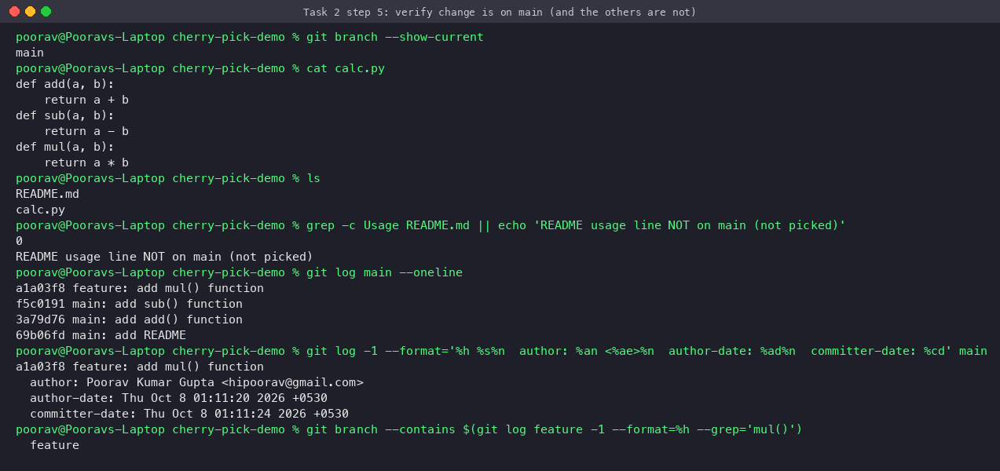

The cherry-picked code works on main (`add`, `sub` and `mul` all run), and the repos were bundled:
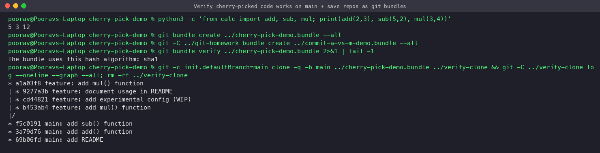

### Useful cherry-pick options
| Command | Purpose |
|---|---|
| `git cherry-pick A B C` / `A^..C` | Several commits / a range |
| `git cherry-pick -x <sha>` | Adds "(cherry picked from commit ...)" to the message, for traceability |
| `git cherry-pick -n <sha>` | Apply the changes without committing |
| `git cherry-pick --continue / --abort / --skip` | Handle conflicts |

---

## Submission note
Screenshots and this `.md` file are the deliverables. The work is kept local; pushing to GitHub is left to the student.
