# Session 06 – Docker Fundamentals: Hello World Applications

**Student:** Poorav Kumar Gupta — **Enrollment No:** 24bcs10080

Six "Hello World" web applications, each in its own folder with source code and a `Dockerfile`.
Every image was built, run as a container and verified in a real browser.

| Folder | Stack | Base image(s) | Container port | Host port used |
|---|---|---|---|---|
| `nodejs-app/` | Node.js 24 + Express 5 | `node:24-alpine` | 3000 | 18101 |
| `python-app/` | Python 3.13 + Flask | `python:3.13-slim` | 5000 | 18102 |
| `java-app/` | Java 21 (built-in `HttpServer`, no framework) | `eclipse-temurin:21-jdk-alpine` → `21-jre-alpine` | 8080 | 18103 |
| `Apache-app/` | Apache httpd 2.4 serving static HTML | `httpd:2.4-alpine` | 80 | 18104 |
| `React-app/` | React 19 + Vite, served by Nginx | `node:24-alpine` → `nginx:alpine` | 80 | 18105 |
| `nginx-app/` | Nginx serving static HTML | `nginx:alpine` | 80 | 18106 |

## Folder structure

```
session06-docker-fundamentals/
├── nodejs-app/   (package.json, server.js, Dockerfile, .dockerignore)
├── python-app/   (app.py, requirements.txt, Dockerfile)
├── java-app/     (HelloWorld.java, Dockerfile)
├── Apache-app/   (index.html, Dockerfile)
├── React-app/    (package.json, vite.config.js, index.html, src/App.jsx, src/main.jsx, Dockerfile, .dockerignore)
├── nginx-app/    (index.html, Dockerfile)
└── screenshots/
```

## Dockerfiles explained

- **nodejs-app** – copies `package*.json` first and runs `npm install --omit=dev` *before* copying the source, so the dependency layer is cached when only code changes.
- **python-app** – same layer-caching idea with `requirements.txt`; `--no-cache-dir` keeps the image smaller.
- **java-app** – two stages: compile with the JDK, then copy only the `.class` file into a much smaller JRE image.
- **Apache-app** – the official `httpd` image serves `/usr/local/apache2/htdocs/`, so we just copy `index.html` there.
- **React-app** – two stages: `npm run build` in Node produces static files in `dist/`; the final image is just Nginx with those files (no Node.js in production).
- **nginx-app** – the official `nginx` image serves `/usr/share/nginx/html/`.

## Commands used

```bash
# Build (run from session06-docker-fundamentals/)
docker build -t s06-nodejs-app:1.0  nodejs-app
docker build -t s06-python-app:1.0  python-app
docker build -t s06-java-app:1.0    java-app
docker build -t s06-apache-app:1.0  Apache-app
docker build -t s06-react-app:1.0   React-app
docker build -t s06-nginx-app:1.0   nginx-app

# Run (-d = detached, -p host:container)
docker run -d --name s06-nodejs -p 18101:3000 s06-nodejs-app:1.0
docker run -d --name s06-python -p 18102:5000 s06-python-app:1.0
docker run -d --name s06-java   -p 18103:8080 s06-java-app:1.0
docker run -d --name s06-apache -p 18104:80   s06-apache-app:1.0
docker run -d --name s06-react  -p 18105:80   s06-react-app:1.0
docker run -d --name s06-nginx  -p 18106:80   s06-nginx-app:1.0

# Verify
docker ps
curl localhost:18101     # ... and so on for each port
docker logs s06-nodejs

# Cleanup
docker rm -f s06-nodejs s06-python s06-java s06-apache s06-react s06-nginx
```

## Evidence

### 1. Building the images
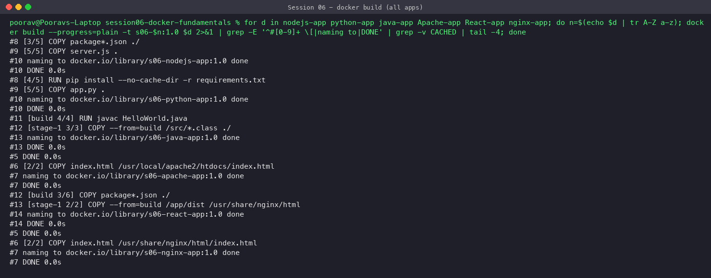

### 2. Images created
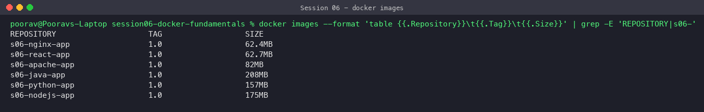

The multi-stage images (Java, React) stay small because the build tools (JDK, Node/npm) are not in the final image.

### 3. All six containers running
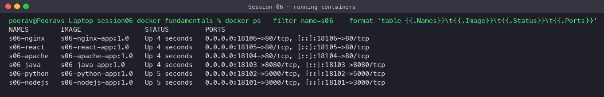

### 4. curl test of every app
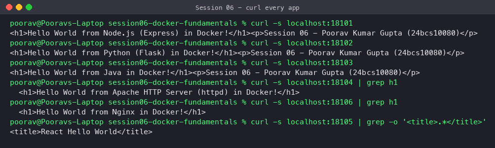

### 5. Hello World in the browser

| App | Screenshot |
|---|---|
| Node.js | 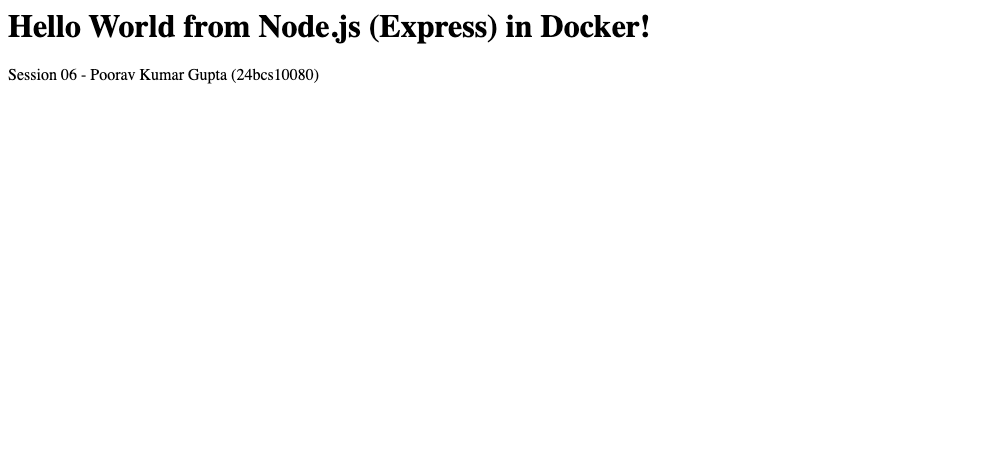 |
| Python | 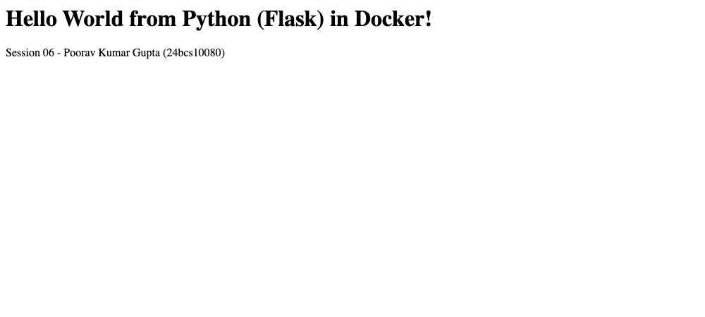 |
| Java | 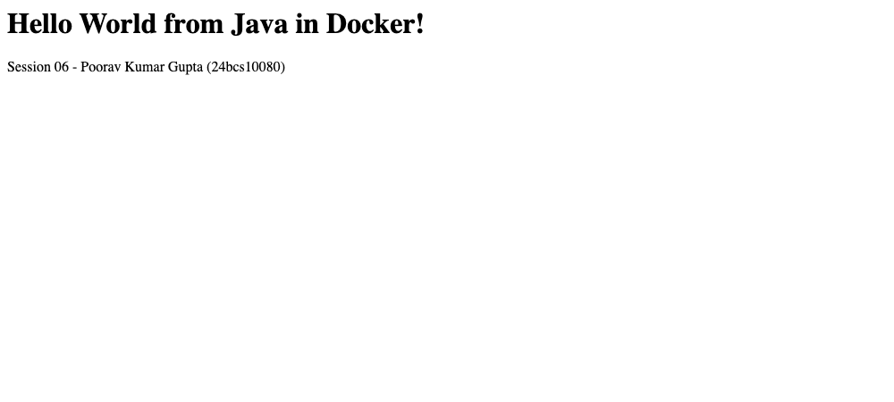 |
| Apache | 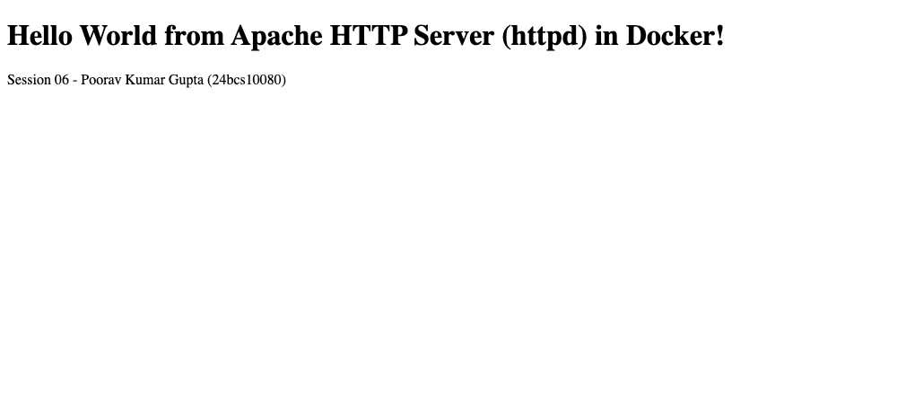 |
| React | 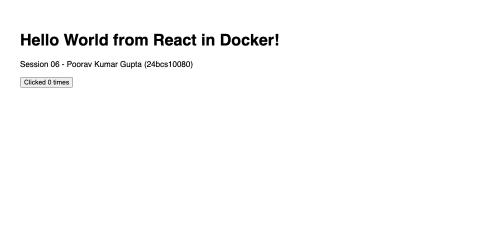 |
| Nginx | 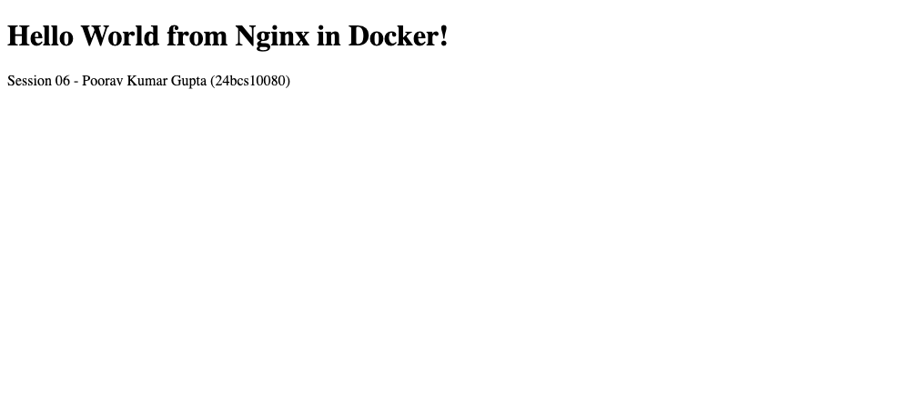 |

### 6. Container logs
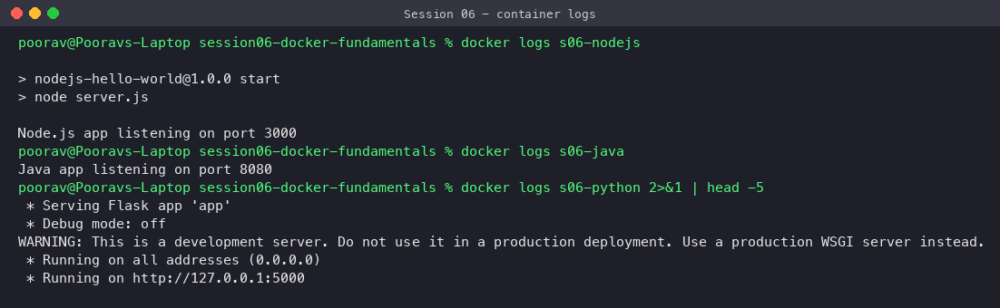

## What I learned

- An **image** is a read-only template built from a Dockerfile; a **container** is a running instance of it.
- Each Dockerfile instruction creates a layer — order instructions from least to most frequently changing to get good build caching.
- `EXPOSE` only documents a port; `-p host:container` actually publishes it.
- Multi-stage builds separate *build-time* tools from the *runtime* image, giving smaller and safer images.
- Static sites (Apache/Nginx/React build) only need a web server; dynamic apps (Node/Python/Java) need their language runtime.
