# Session 07 – Dockerfiles, Images & Multi-Stage Builds

| | |
|---|---|
| **Name** | Poorav Kumar Gupta |
| **Enrollment Number** | 24bcs10080 |

```
session07-dockerfiles-multistage/
├── task1-multistage-app/     # multi-stage project from the course repo (devops-heros/session6-7-docker/multi-stage-dockerfile)
│   ├── Dockerfile  package.json  server.js  .dockerignore
├── task3-apps/
│   ├── node-app/             # Express, multi-stage, non-root user
│   ├── python-app/           # Flask + gunicorn, virtualenv multi-stage, non-root user
│   └── java-app/             # Maven build stage -> JRE runtime stage
└── screenshots/
```

---

## Task 1 – Run the multi-stage Dockerfile

The multi-stage project was taken from the course repository (`devops-heros/session6-7-docker/multi-stage-dockerfile`) without changes.

```dockerfile
# Stage 1: Build
FROM node:24-alpine AS builder
WORKDIR /app
COPY package*.json ./
RUN npm install
COPY . .

# Stage 2: Production
FROM node:24-alpine AS production
WORKDIR /app
COPY --from=builder /app/package*.json ./
RUN npm install --omit=dev
COPY --from=builder /app/server.js ./
EXPOSE 3000
CMD ["npm", "start"]
```

**How it works:** the `builder` stage installs everything and holds the full source tree. The `production` stage starts from a fresh base image and uses `COPY --from=builder` to take only `package*.json` and `server.js`, then installs production dependencies only. Anything else from the builder stage is left out of the final image.

### Commands

```bash
cd task1-multistage-app
docker build -t s07-multistage-hello:1.0 .
docker run -d --name s07-multistage -p 8080:3000 s07-multistage-hello:1.0   # host 8080 -> container 3000
docker ps --filter name=s07-multistage
curl http://localhost:8080
docker logs s07-multistage
```

> The Express app listens on port 3000 inside the container. It is published on **host port 8080** with `-p 8080:3000`, so the application is reached at `http://localhost:8080`.

### Source of the project
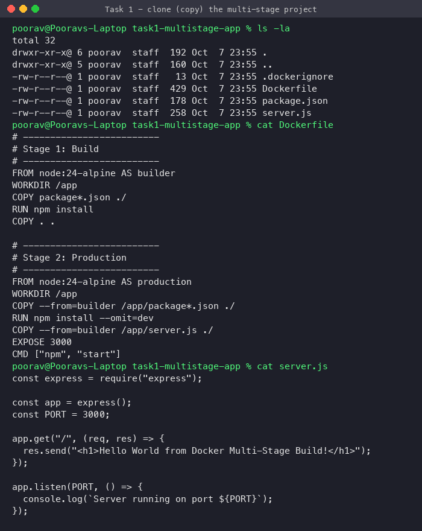

### Build output (both stages)
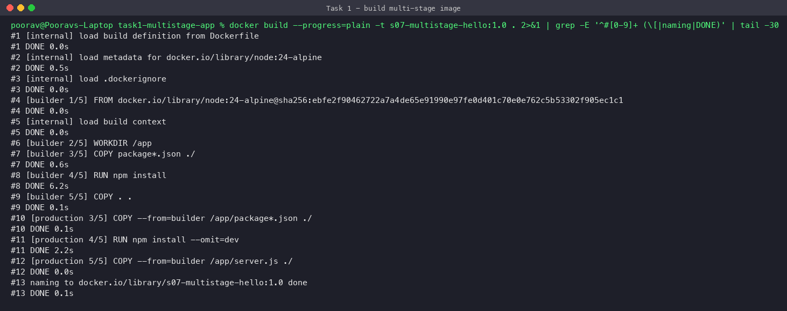

---

## Task 2 – Documentation / evidence

### Application running successfully – shows "Hello World from Docker Multi-Stage Build!"
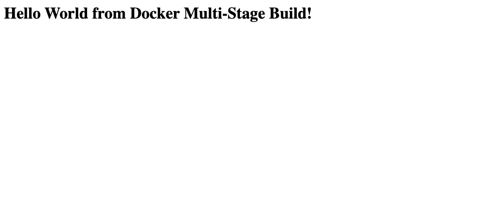

### `docker ps` showing the running container on port 8080
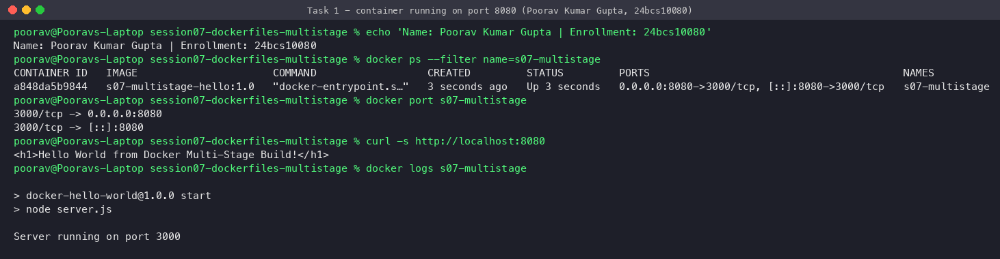

`0.0.0.0:8080->3000/tcp` means any request to port 8080 on the host goes to port 3000 in the container.

### Image size / layers
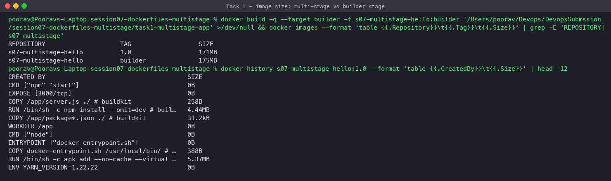

This app has no dev dependencies, so the final image is only a little smaller than the builder stage (171 MB vs 175 MB). The gain is much larger when a build needs compilers, dev dependencies or SDKs. The Java app in Task 3 is an example: Maven and the JDK stay in the build stage and the final image only has the JRE and one jar.

---

## Task 3 – Deploying 3 different types of applications with Docker

| App | Build stage | Runtime stage | Extras | Host port |
|---|---|---|---|---|
| `node-app` | `node:24-alpine` – `npm install` | `node:24-alpine` – prod deps only | runs as `node` user, `/health` endpoint | 18111 |
| `python-app` | `python:3.13-slim` – builds `/opt/venv` | `python:3.13-slim` + copied venv | gunicorn (2 workers), runs as `appuser`, `/health` | 18112 |
| `java-app` | `maven:3.9-eclipse-temurin-21` – `mvn package` | `eclipse-temurin:21-jre-alpine` + `app.jar` | no Maven/JDK in final image | 18113 |

```bash
cd task3-apps
docker build -t s07-node-app:1.0   node-app
docker build -t s07-python-app:1.0 python-app
docker build -t s07-java-app:1.0   java-app

docker run -d --name s07-node   -p 18111:3000 s07-node-app:1.0
docker run -d --name s07-python -p 18112:5000 s07-python-app:1.0
docker run -d --name s07-java   -p 18113:8080 s07-java-app:1.0
```

### Build
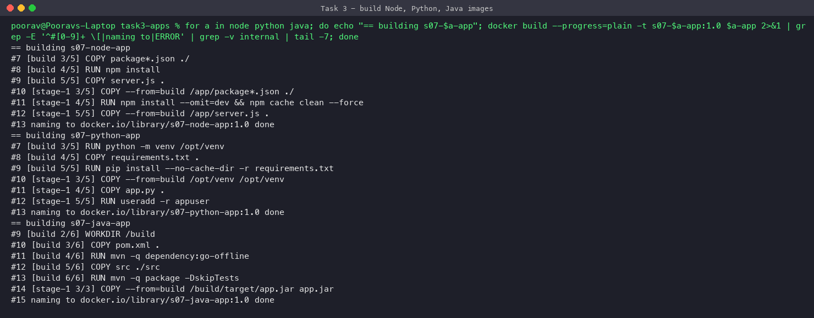

### Running + verified (curl, health checks, non-root users)
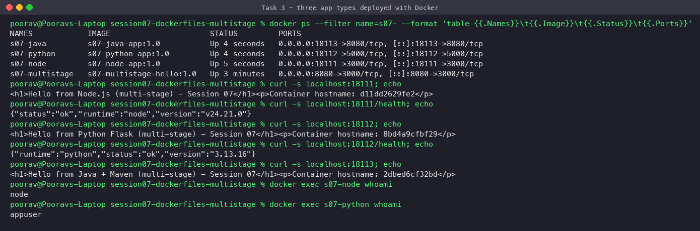

### Images
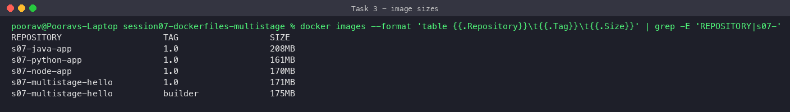

### Browser
| Node.js | Python | Java |
|---|---|---|
| 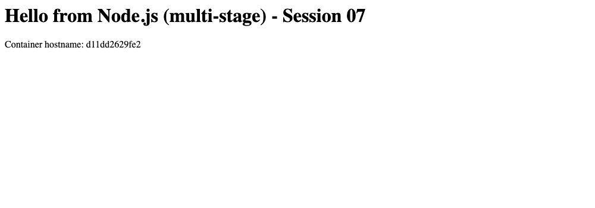 | 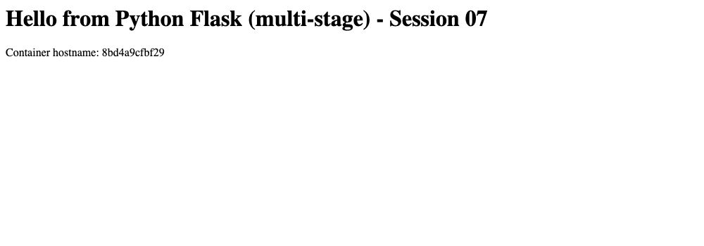 | 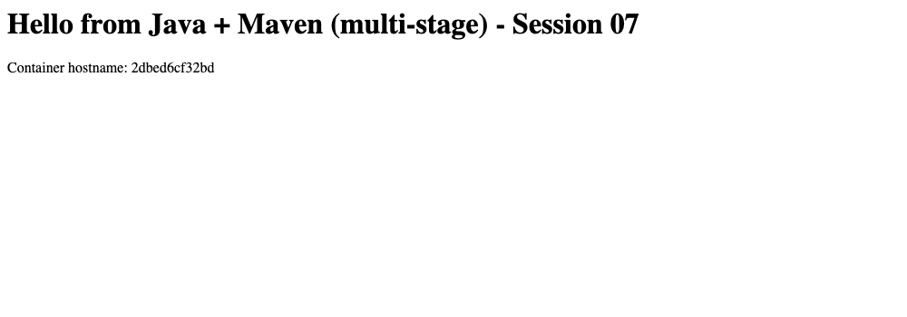 |

### Cleanup
```bash
docker rm -f s07-multistage s07-node s07-python s07-java
```

---

## Key learnings

- **Multi-stage builds** use several `FROM` lines in one Dockerfile. Each stage can `COPY --from=<stage>` from earlier stages, and only the last stage becomes the image.
- They give **smaller images**, a **smaller attack surface** (no compilers or package managers in production) and **one Dockerfile** for both build and runtime, so there is no separate build script.
- `--target <stage>` builds only up to a given stage, which helps when debugging a build.
- Running as a **non-root user** (`USER node` / `USER appuser`) is an easy hardening step.
- Port mapping `-p HOST:CONTAINER` is separate from the port the app listens on inside the container.
