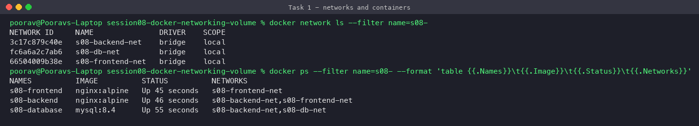
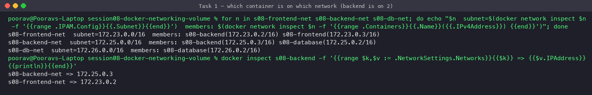
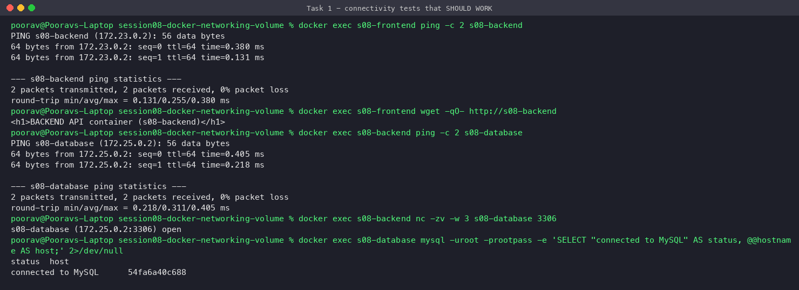
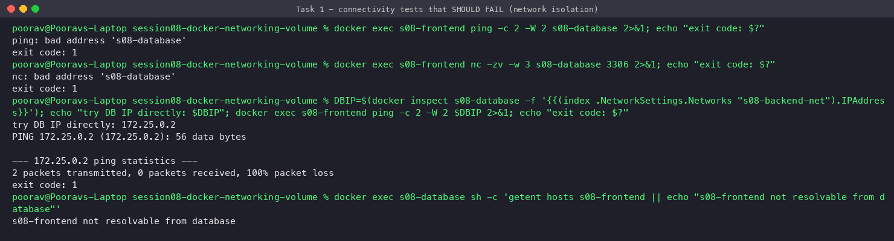
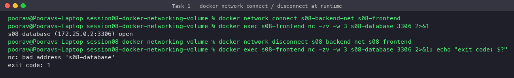
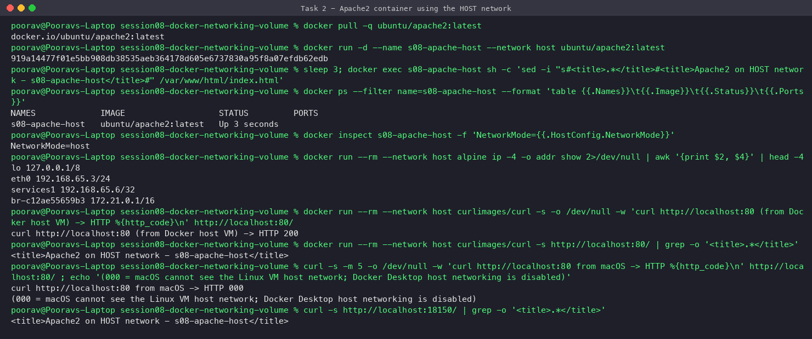
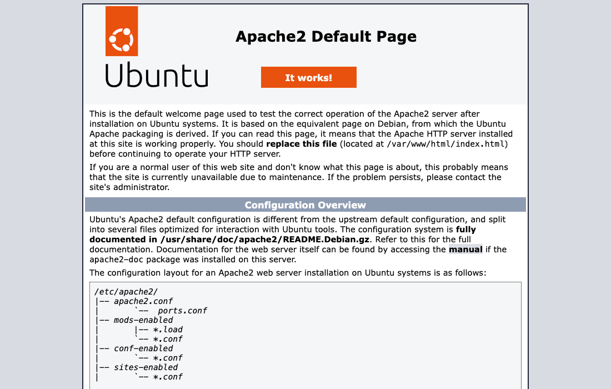
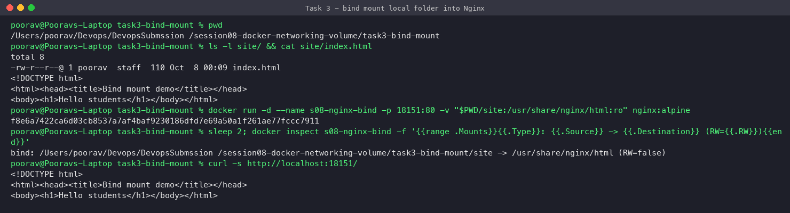
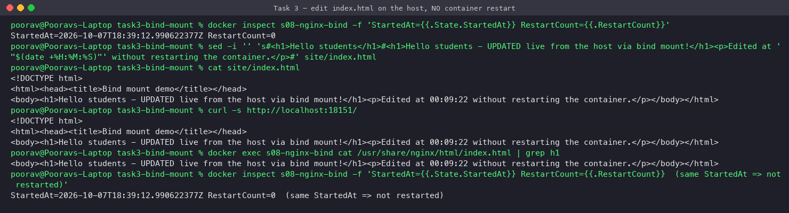
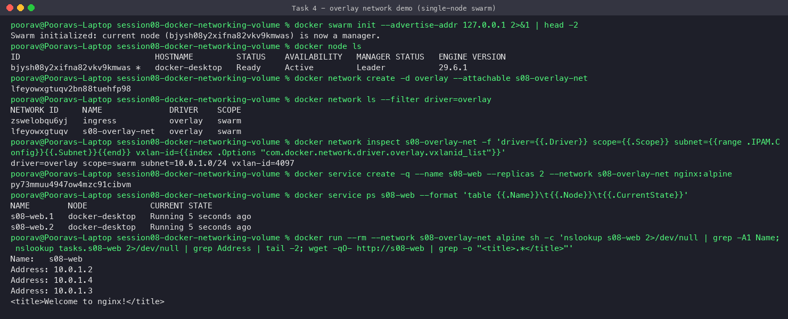

# Session 08 – Docker Networking & Volumes

**Student:** Poorav Kumar Gupta — **Enrollment No:** 24bcs10080

```
session08-docker-networking-volume/
├── task1-networking/        setup.sh, cleanup.sh  (3 containers, 3 networks)
├── task3-bind-mount/site/   index.html            (bind-mounted into Nginx)
├── task4-overlay-network.md                       (overlay research + demo)
├── screenshots/
└── README.md
```

---

## Task 1 – Container networking (frontend / backend / database)

### Design

| Network | Members | Purpose |
|---|---|---|
| `s08-frontend-net` | frontend, **backend** | UI talks to the API |
| `s08-backend-net` | **backend**, database | API talks to MySQL |
| `s08-db-net` | database | private DB-only network (backups/replication) |

```
 [s08-frontend] ──s08-frontend-net── [s08-backend] ──s08-backend-net── [s08-database] ──s08-db-net
  nginx:alpine                         nginx:alpine                      mysql:8.4
```

The **backend is attached to 2 networks**, so it is the only container that can reach both the frontend and the database. The frontend **cannot** reach the database directly, which is the usual tier isolation.

### Commands

```bash
docker network create s08-frontend-net
docker network create s08-backend-net
docker network create s08-db-net

docker run -d --name s08-database --network s08-backend-net \
  -e MYSQL_ROOT_PASSWORD=rootpass -e MYSQL_DATABASE=appdb mysql:8.4
docker network connect s08-db-net s08-database

docker run -d --name s08-backend  --network s08-frontend-net nginx:alpine
docker network connect s08-backend-net s08-backend        # backend on 2 networks

docker run -d --name s08-frontend --network s08-frontend-net nginx:alpine
```
(also saved in [`task1-networking/setup.sh`](task1-networking/setup.sh))

### Networks and containers


### Network membership – backend has an IP on two networks


### Connectivity that works ✅
frontend → backend (ping + HTTP) and backend → database (ping + MySQL port 3306):


### Isolation – connectivity that fails as expected ❌
The frontend can't even resolve `s08-database`, because Docker's embedded DNS only answers for containers on a shared user-defined network. Pinging the DB's IP directly also fails (100% packet loss), since the networks are separate Linux bridges with no route between them.


### Bonus – `docker network connect/disconnect` at runtime


---

## Task 2 – Host network (Apache2)

```bash
docker pull ubuntu/apache2:latest
docker run -d --name s08-apache-host --network host ubuntu/apache2:latest
curl http://localhost:80
```

With `--network host` the container has **no network namespace of its own**. Apache binds port 80 directly on the Docker host's interfaces, with no `-p` and no NAT. `docker ps` shows an empty PORTS column and `NetworkMode=host`.



**Note on macOS / Docker Desktop:** on Linux, `curl http://localhost:80` from the host works right away. On a Mac the "Docker host" is a small **Linux VM** run by Docker Desktop, so `--network host` means *the VM's* network. Docker Desktop's optional *"Enable host networking"* setting is off on this machine (macOS curl returns `000`), and turning it on would mean restarting Docker. So I verified it this way:
1. `docker run --rm --network host curlimages/curl http://localhost:80` runs curl **on the Docker host (VM) itself** and gets **HTTP 200** with the Apache page.
2. For a browser view I started a tiny relay (`alpine/socat` publishing `18150 → 172.17.0.1:80`, where `172.17.0.1` is the VM's own gateway address) and opened it in Chrome:



---

## Task 3 – Bind mount

```bash
mkdir -p task3-bind-mount/site
echo '<h1>Hello students</h1>' > task3-bind-mount/site/index.html
docker run -d --name s08-nginx-bind -p 18151:80 \
  -v "$PWD/site:/usr/share/nginx/html:ro" nginx:alpine
curl http://localhost:18151
```



**Before modification (browser):**


**Modify `index.html` on the host, without restarting the container:**


**After modification (browser):** the change shows immediately. `StartedAt` and `RestartCount=0` are the same before and after, which proves the container was never restarted.


A bind mount maps a host directory straight into the container, so the container reads the host file live. Mounting it `:ro` (read-only) means the container can't change the host files.

| | Bind mount | Named volume |
|---|---|---|
| Location | any host path you choose | managed by Docker (`/var/lib/docker/volumes`) |
| Typical use | dev live-reload, config files | databases, persistent app data |
| Portability | depends on host path | portable, `docker volume` CLI |

---

## Task 4 – Overlay networks

Full research and hands-on demo: **[task4-overlay-network.md](task4-overlay-network.md)**

Summary: overlay networks span **multiple Docker hosts** (Swarm). They use **VXLAN (UDP 4789)** to tunnel container traffic over the hosts' real network, **gossip (7946)** to share endpoint locations, and the embedded DNS + VIP for service discovery and load balancing.



---

## Cleanup

```bash
docker rm -f s08-frontend s08-backend s08-database s08-apache-host s08-host-relay s08-nginx-bind
docker network rm s08-frontend-net s08-backend-net s08-db-net
```

## Key learnings

- The default `bridge` network has **no DNS by container name**. User-defined bridges do, which is why the containers could reach each other by name.
- A container can join **many networks**. This is how you build "DMZ" style tiers.
- `host` networking removes isolation and NAT. It is fast, but you lose port mapping and can get port conflicts.
- On Docker Desktop (Mac/Windows) the Docker host is a VM, which matters for `host` networking and bind-mount paths.
- Bind mounts give live host↔container file sharing. Volumes are better for persistent data.
