# Session 09 — Kubernetes Fundamentals

**Student:** Poorav Kumar Gupta — **Roll No:** 24bcs10080

| Task | Status |
|---|---|
| 1. Install and configure Minikube | Done |
| 2. Verify Kubernetes cluster status | Done |
| 3. Explore Kubernetes architecture | Done (notes below + live control-plane evidence) |
| 4. Learn basic Kubernetes objects & commands | Done |
| 5. Kubernetes Basics tutorial hands-on (Modules 2–6) | Done, in namespace `s09-basics` |

Folder contents:

```
session09-k8s-fundamentals/
├── README.md
├── bootcamp-app/          # arm64 rebuild of the tutorial app (server.js + Dockerfile)
├── manifests/             # declarative YAML for the tutorial Deployment + Service
└── screenshots/           # PNG screenshots
```

---

## 1. Install and configure Minikube

Installed on macOS (Apple Silicon, arm64) with Homebrew:

```bash
brew install minikube kubectl
minikube start --driver=docker --cpus=4 --memory=6144
minikube addons enable ingress
minikube addons enable metrics-server
```

- **Driver:** `docker`, so the whole Kubernetes "node" runs inside one Docker Desktop container (`gcr.io/k8s-minikube/kicbase`).
- **Container runtime inside the node:** containerd
- **Kubernetes version:** v1.37.0, minikube v1.39.0, kubectl v1.37.0

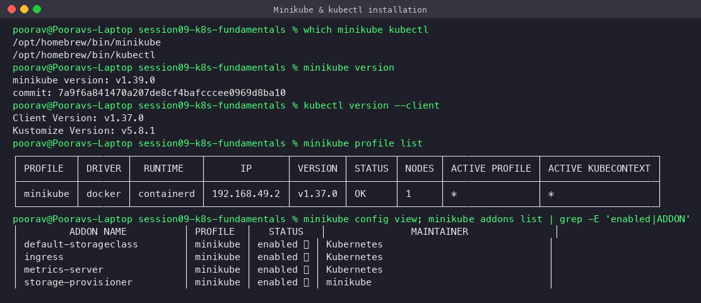

## 2. Verify cluster status

```bash
minikube status
kubectl cluster-info
kubectl get nodes -o wide
kubectl config current-context
```

`host`, `kubelet` and `apiserver` all show `Running`, kubeconfig is `Configured`, and the single node `minikube` is `Ready` with role `control-plane`.

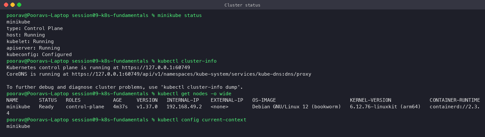

## 3. Kubernetes architecture

```
                    ┌──────────────────────── CONTROL PLANE ────────────────────────┐
 kubectl ──HTTPS──► │ kube-apiserver ◄──► etcd (cluster state, key/value)           │
                    │      ▲    ▲                                                   │
                    │      │    └── kube-scheduler (picks a node for new Pods)      │
                    │      └─────── kube-controller-manager (Deployment, ReplicaSet,│
                    │               Node, Job, EndpointSlice ... control loops)     │
                    └───────────────────────────┬───────────────────────────────────┘
                                                │ watch / report status
                    ┌────────────────────── WORKER NODE(S) ─────────────────────────┐
                    │ kubelet ──CRI──► containerd ──► Pods (containers)             │
                    │ kube-proxy (iptables rules for Services)                      │
                    │ CNI plugin (kindnet here) gives every Pod its own IP          │
                    │ CoreDNS (cluster add-on) for service discovery                │
                    └───────────────────────────────────────────────────────────────┘
```

**Control plane components**

| Component | Role |
|---|---|
| **kube-apiserver** | Front door of the cluster. Every client (kubectl, kubelet, controllers) talks only to it. Handles authentication, authorization, admission and validation, then stores objects in etcd. |
| **etcd** | Consistent, highly-available key/value store. It is the single source of truth for cluster state (desired + current). |
| **kube-scheduler** | Watches for Pods with no `nodeName` and picks the best node based on resource requests, affinity, taints/tolerations etc. |
| **kube-controller-manager** | Runs reconciliation loops ("controllers"): Deployment → ReplicaSet → Pods, Node lifecycle, Job, EndpointSlice, ServiceAccount… Each loop makes the current state match the desired state. |
| **cloud-controller-manager** | (Only on cloud clusters) talks to the cloud API for LoadBalancers, routes and node info. Not present in minikube. |

**Node components**

| Component | Role |
|---|---|
| **kubelet** | Agent on every node. Receives PodSpecs from the API server, asks the container runtime to start containers, runs probes, reports Pod/Node status. |
| **Container runtime** | containerd (via CRI) pulls images and runs containers. |
| **kube-proxy** | Programs iptables/IPVS rules so a Service's virtual ClusterIP load-balances to Pod IPs. |
| **CNI plugin** | Network plugin (kindnet in minikube) gives each Pod a routable IP. |

**Request flow when you run `kubectl create deployment`:** kubectl → API server (stored in etcd) → Deployment controller creates a ReplicaSet → ReplicaSet controller creates Pods → scheduler binds each Pod to a node → kubelet on that node tells containerd to pull the image and start the container → kubelet reports `Running` back to the API server.

Live evidence: every control-plane component runs as a Pod in `kube-system`, and `componentstatuses` reports them healthy:

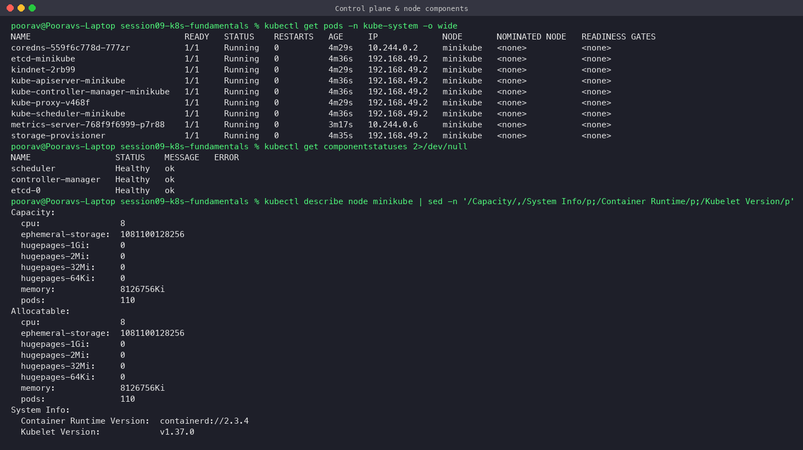

## 4. Basic Kubernetes objects and commands

| Object | What it is |
|---|---|
| **Pod** | Smallest deployable unit: one or more containers that share network namespace (one IP) and volumes. |
| **ReplicaSet** | Keeps N identical Pods running (self-healing). |
| **Deployment** | Manages ReplicaSets; adds rolling updates, rollback and revision history. |
| **Service** | Stable virtual IP + DNS name in front of a changing set of Pods (selected by labels). |
| **Namespace** | Virtual cluster used to isolate and group resources (`s09-basics` here). |
| **Node** | A worker machine (VM, physical, or here a Docker container). |
| **ConfigMap / Secret** | Configuration and sensitive data injected into Pods. |
| **DaemonSet / StatefulSet / Job** | One Pod per node / stable-identity Pods / run-to-completion Pods. |

Common commands:

```bash
kubectl get <resource> [-o wide|yaml|json]   # list objects
kubectl describe <resource> <name>           # details + events
kubectl logs <pod> [-f] [--previous]         # container logs
kubectl exec -it <pod> -- sh                 # shell inside a container
kubectl apply -f file.yaml                   # declarative create/update
kubectl create deployment / expose / scale   # imperative shortcuts
kubectl set image / rollout status|history|undo
kubectl delete <resource> <name>
kubectl explain <resource.field>             # built-in API documentation
kubectl api-resources                        # list every resource type
```

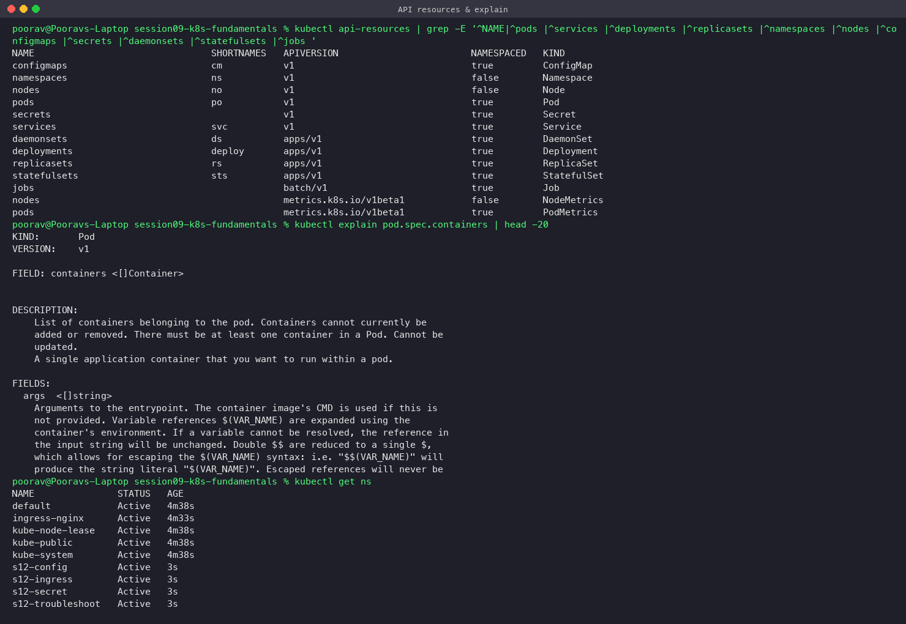

---

## 5. Kubernetes Basics tutorial — hands-on

Tutorial: <https://kubernetes.io/docs/tutorials/kubernetes-basics/> (all work in namespace `s09-basics`).

### Issue found and fixed: amd64-only tutorial image on an arm64 node

The tutorial uses `gcr.io/google-samples/kubernetes-bootcamp:v1`. On this Apple Silicon Mac the minikube node is **arm64**, and the image only ships for **amd64**. Pods kept crashing with `exit code 255`, and `kubectl exec` failed with `exec /usr/bin/env: exec format error`.

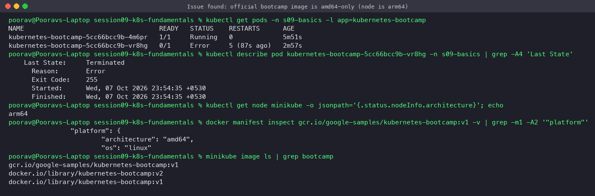

**Fix:** I rebuilt the same tutorial app (same output, `Hello Kubernetes bootcamp! | Running on: <pod> | v=<version>`) as a native multi-arch Node.js image. Source is in [`bootcamp-app/`](bootcamp-app/). I built v1 and v2 locally and loaded them into the cluster:

```bash
cd bootcamp-app
docker build -t kubernetes-bootcamp:v1 --build-arg APP_VERSION=1 .
docker build -t kubernetes-bootcamp:v2 --build-arg APP_VERSION=2 .
minikube image load kubernetes-bootcamp:v1
minikube image load kubernetes-bootcamp:v2
```

A helper Pod `curl` (`curlimages/curl`) in the same namespace is used to test the app from inside the cluster.

### Module 2 — Create a Deployment

```bash
kubectl create deployment kubernetes-bootcamp --image=kubernetes-bootcamp:v1 -n s09-basics
kubectl get deployments -n s09-basics
```

The Deployment created a ReplicaSet, and the ReplicaSet created one Pod.

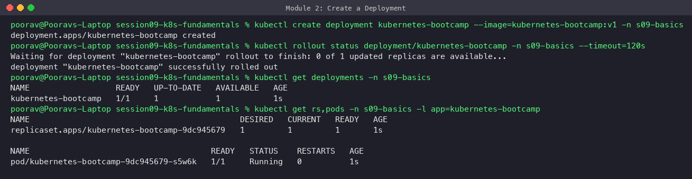

### Module 3 — Explore the app (get / describe / logs / exec)

```bash
kubectl get pods -o wide
kubectl describe pod <pod>
kubectl logs <pod>
kubectl exec <pod> -- env
kubectl exec <pod> -- wget -qO- localhost:8080
```

`describe` shows the scheduling/pull/start events. `logs` shows the app's startup line. `exec` runs commands inside the container, and the app answers on port 8080.

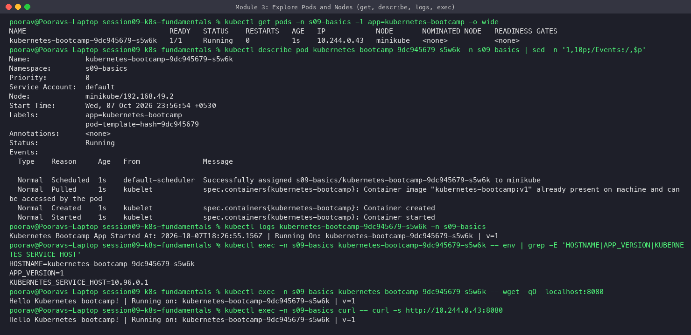

### Module 4 — Expose the app with a Service, use labels

```bash
kubectl expose deployment/kubernetes-bootcamp --type=NodePort --port 8080 -n s09-basics
kubectl get svc,endpoints -n s09-basics
kubectl exec curl -- curl -s http://kubernetes-bootcamp:8080          # via ClusterIP + DNS
kubectl exec curl -- curl -s http://$(minikube ip):<nodePort>         # via NodePort
kubectl label pods <pod> version=v1
kubectl get pods -l version=v1 --show-labels
```

The Service gets a stable ClusterIP. Its endpoint is the Pod IP, and it answers both via DNS name and via `<nodeIP>:<NodePort>`. Labels let you select objects (`-l version=v1`).

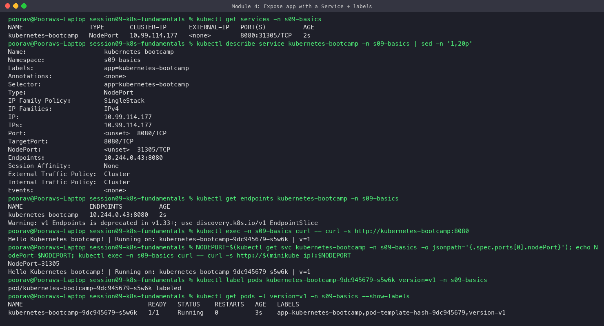

### Module 5 — Scale the app

```bash
kubectl scale deployment/kubernetes-bootcamp --replicas=4
kubectl get pods -o wide        # 4 pods, 4 different Pod IPs
kubectl get endpoints           # Service now has 4 endpoints
for i in $(seq 1 8); do kubectl exec curl -- curl -s http://kubernetes-bootcamp:8080; done
kubectl scale deployment/kubernetes-bootcamp --replicas=2
```

The responses come from different Pod names, which shows the Service load-balancing across the replicas.

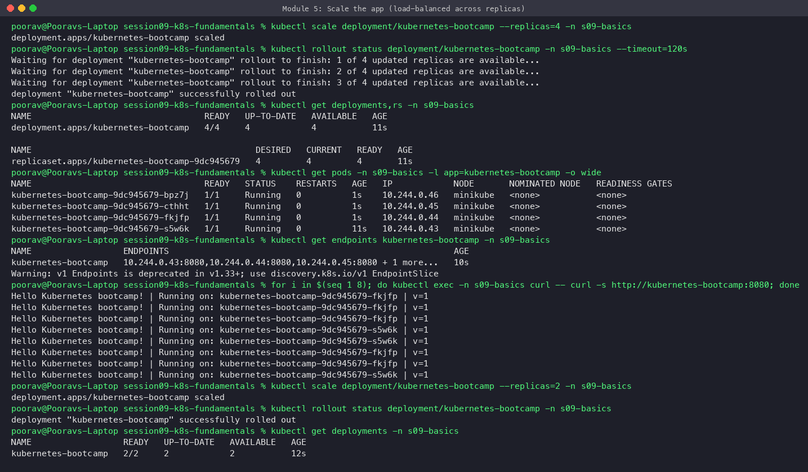

### Module 6 — Rolling update and rollback

```bash
kubectl set image deployment/kubernetes-bootcamp kubernetes-bootcamp=kubernetes-bootcamp:v2
kubectl rollout status deployment/kubernetes-bootcamp
kubectl get rs           # new RS (v2) = 4, old RS (v1) = 0
```

The rollout replaced Pods gradually ("2 out of 4 new replicas have been updated…"). A new ReplicaSet scaled up while the old one scaled down to 0, and all traffic now returns `v=2`. In the last pod listing, the v1 pods are still in graceful termination (the Node.js app does not trap SIGTERM, so they wait out the 30 s grace period). They no longer receive traffic.

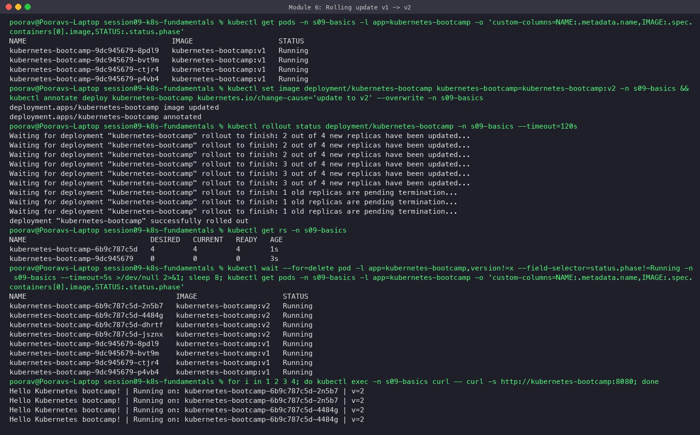

**Rollback:** next I deployed a tag that does not exist (`v10`). The new Pods went to `ErrImagePull`. Because of the default `maxUnavailable: 25%`, 3 healthy v2 Pods kept serving traffic the whole time. `kubectl rollout undo` brought the Deployment back to the previous revision (v2).

```bash
kubectl set image deployment/kubernetes-bootcamp kubernetes-bootcamp=kubernetes-bootcamp:v10
kubectl get pods                       # ErrImagePull
kubectl rollout history deployment/kubernetes-bootcamp
kubectl rollout undo deployment/kubernetes-bootcamp
```

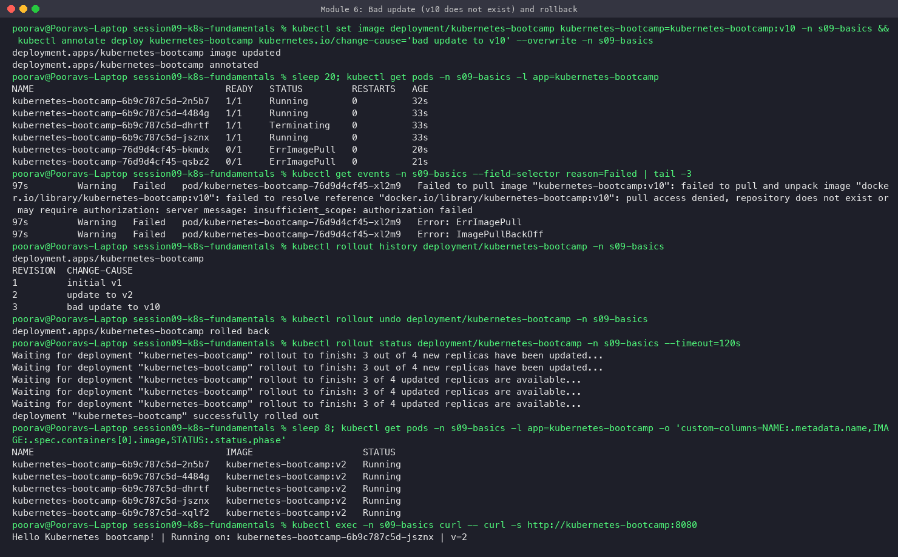

Final state after the old Pods finished terminating:

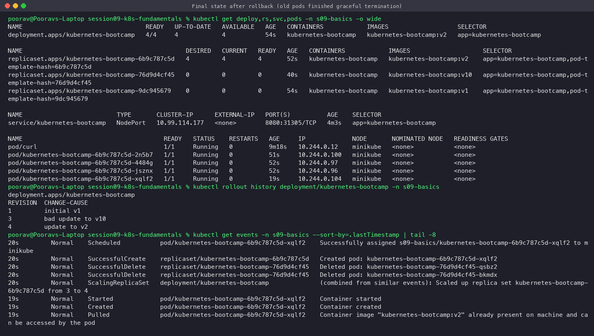

Accessing the Service from the Mac's browser through `kubectl port-forward svc/kubernetes-bootcamp 18200:8080`:

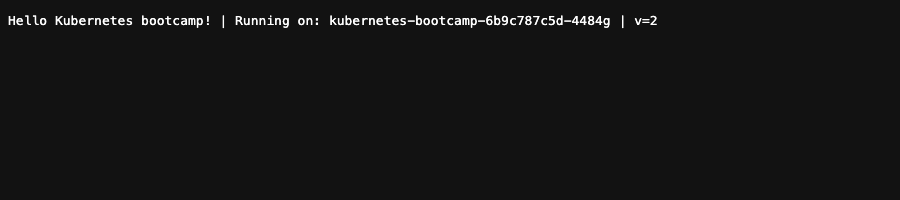

Declarative YAML equivalents of the imperative commands are in [`manifests/`](manifests/).

### Cleanup

```bash
kubectl delete namespace s09-basics
```

## Key learnings

- Kubernetes is declarative. You state the desired state, and controllers keep reconciling the current state toward it.
- A Deployment manages ReplicaSets, and a ReplicaSet manages Pods. Each rolling update creates a new ReplicaSet, and the old one is kept (at 0 replicas) for rollback.
- Services decouple clients from short-lived Pod IPs by using label selectors.
- Image architecture matters: on Apple Silicon, an amd64-only image fails with `exec format error`, so use multi-arch images.
