# Session 10 — Kubernetes Pods, ReplicaSets & Deployments

**Student:** Poorav Kumar Gupta — **Roll No:** 24bcs10080
**Cluster:** minikube v1.39 / Kubernetes v1.37 (single node, arm64, containerd)

```
session10-pods-replicasets-deployments/
├── 01-rolling-update/   deployment-v1.yaml, deployment-v2.yaml, service.yaml
├── 02-blue-green/       deployment-blue.yaml, deployment-green.yaml, service-blue.yaml, service-green.yaml
├── 03-canary/           deployment-stable.yaml, deployment-canary.yaml, service.yaml
├── 04-recreate/         deployment-v1.yaml, deployment-v2.yaml, service.yaml
├── pod-lifecycle/       01-running.yaml … 12-termination.yaml
└── screenshots/         (+ screenshots/lifecycle/)
```

Each demo runs in its own namespace (`s10-rolling`, `s10-bluegreen`, `s10-canary`, `s10-recreate`, `s10-lifecycle`). A helper Pod `curl` (`curlimages/curl`) in each strategy namespace sends traffic to the Service from inside the cluster. Every nginx Pod writes its own HTML page (via a `postStart` hook) that prints its version, so each response shows which version answered.

> Change from the course YAMLs: I removed the hard-coded `nodePort: 300xx` values so Kubernetes auto-assigns them. This avoids clashes with NodePorts already used by other demos on my cluster. Everything else is unchanged.

---

# Task 1 — Deployment strategies

## 01. Rolling Update

`deployment-v1.yaml` creates 4 replicas of `nginx:1.24-alpine` (page says **VERSION: v1**) with:

```yaml
strategy:
  type: RollingUpdate
  rollingUpdate:
    maxSurge: 1        # at most 1 extra pod (5) during the update
    maxUnavailable: 0  # never go below 4 ready pods
```

`deployment-v2.yaml` is identical except the image is `nginx:1.25-alpine` and the page says **VERSION: v2**.

**Commands**

```bash
kubectl apply -f 01-rolling-update/deployment-v1.yaml -f 01-rolling-update/service.yaml -n s10-rolling
kubectl rollout status deploy/app-rolling -n s10-rolling
kubectl get pods -w -l app=app-rolling -L version -n s10-rolling        # terminal 1
kubectl apply -f 01-rolling-update/deployment-v2.yaml -n s10-rolling    # terminal 2 -> the update
kubectl rollout status deploy/app-rolling -n s10-rolling
kubectl get rs -n s10-rolling ; kubectl rollout history deploy/app-rolling -n s10-rolling
```

**v1 deployed:**
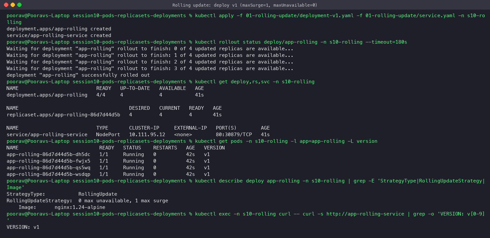

**Live pod watch during the update.** v1 and v2 pods exist side by side. A new v2 pod is created (surge), becomes Ready, and only then is one v1 pod terminated. This repeats one by one until all 4 pods are v2.
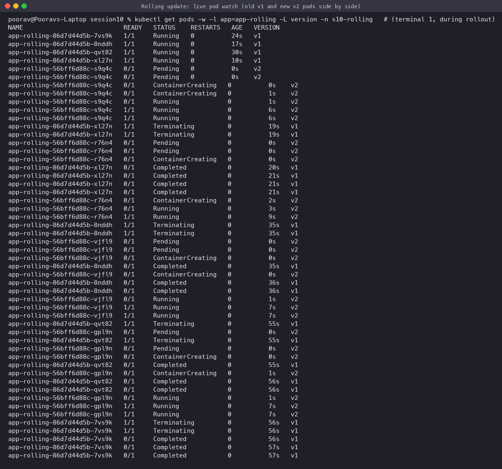

**Rollout status + live traffic.** While the rollout was running, a loop sent a request about every 0.3 s. Responses moved from all `v1` → a mix of `v1`/`v2` → all `v2`, which shows both versions served traffic during the update.
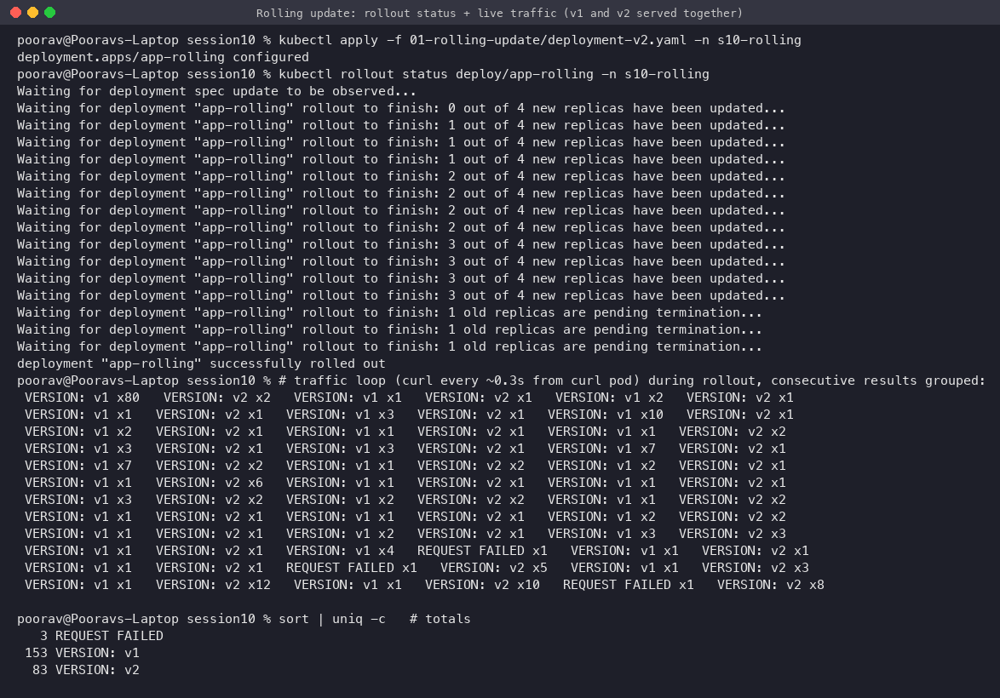

**After the rollout:** the new ReplicaSet has 4 pods and the old ReplicaSet is scaled to 0. It is kept so `kubectl rollout undo` works.
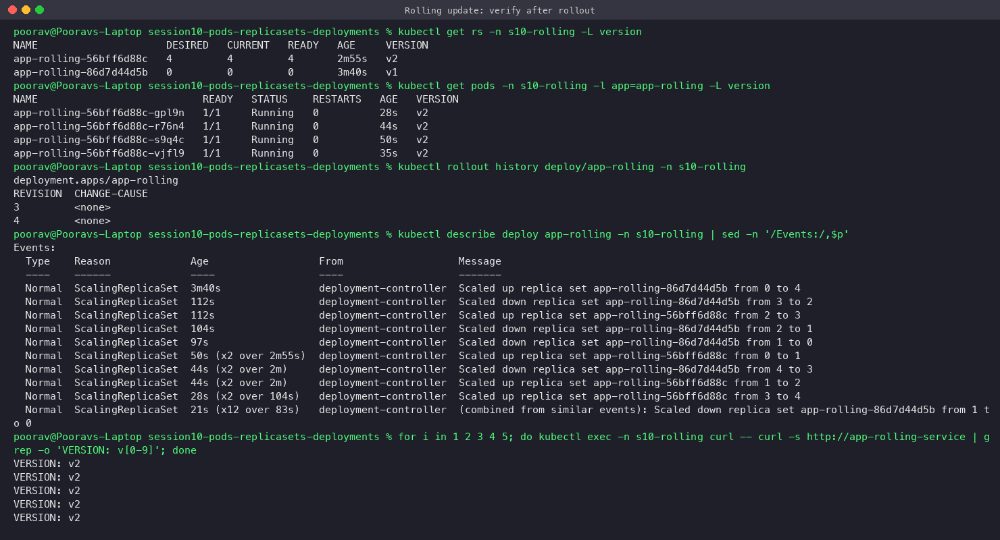

**Observation (honest result):** 3 of 239 requests failed (connection refused / timeout) during the rollout. The cause: when an old pod is terminated, nginx stops right away, but kube-proxy needs a moment to remove the pod from the Service endpoints. So a few requests still reach a pod that is shutting down. In production you fix this with a `preStop` hook (e.g. `sleep 5`) so the pod keeps serving until endpoints are updated. With `maxUnavailable: 0` and a readiness probe, there is always full capacity of *ready* pods.

## 02. Blue-Green Deployment

Two complete environments run at the same time:

- `app-blue`: 3 pods, labels `app=myapp, slot=blue`, v1
- `app-green`: 3 pods, labels `app=myapp, slot=green`, v2

One Service `myapp-service` decides which environment is live through its selector (`slot: blue` or `slot: green`).

```bash
kubectl apply -f 02-blue-green/deployment-blue.yaml -f 02-blue-green/service-blue.yaml -n s10-bluegreen
kubectl apply -f 02-blue-green/deployment-green.yaml -n s10-bluegreen      # standby, no traffic
kubectl apply -f 02-blue-green/service-green.yaml -n s10-bluegreen         # THE SWITCH
kubectl patch svc myapp-service -n s10-bluegreen -p '{"spec":{"selector":{"app":"myapp","slot":"blue"}}}'   # instant rollback
```

**Blue is live.** All requests return BLUE v1.
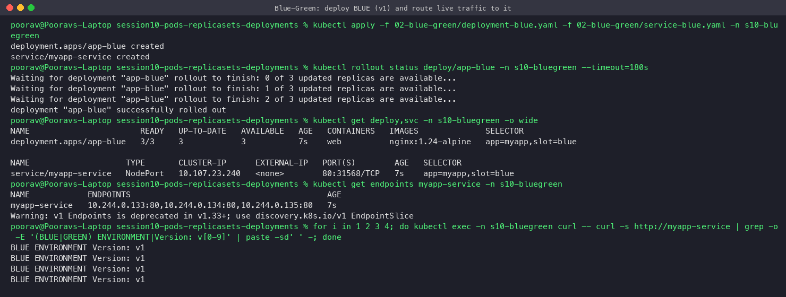
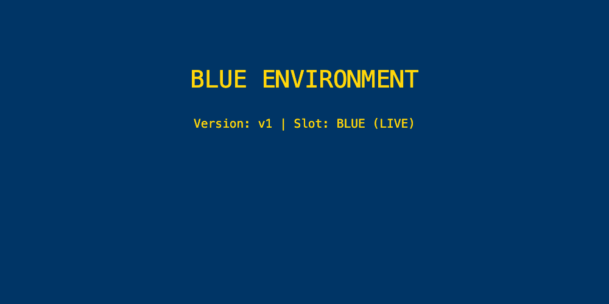

**Green deployed alongside, with no live traffic.** The Service selector still says `slot: blue`, so users still get BLUE. Green is smoke-tested directly through a pod IP before the switch.
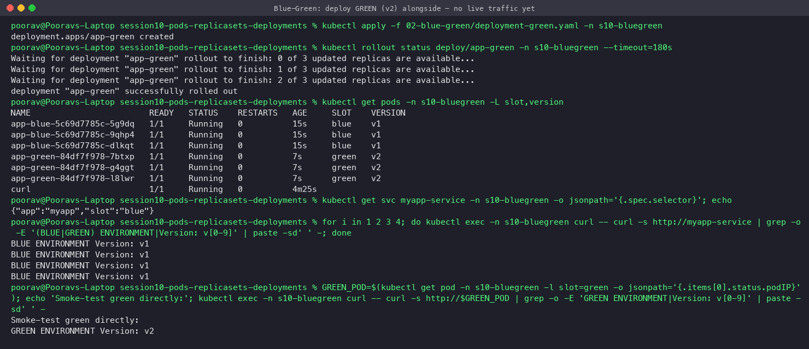

**Switch.** Applying `service-green.yaml` changes only the selector. The endpoints immediately become the green pod IPs, and every request now returns GREEN v2.
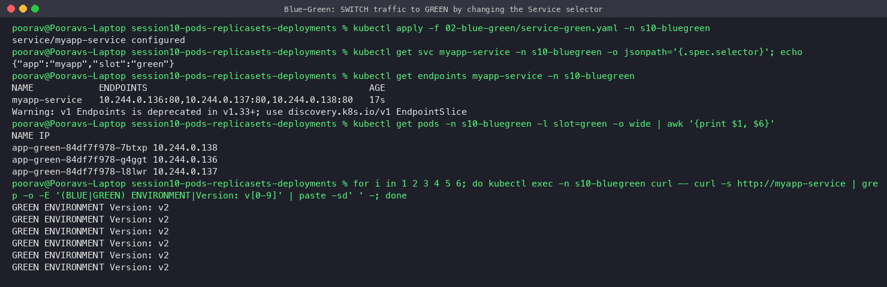
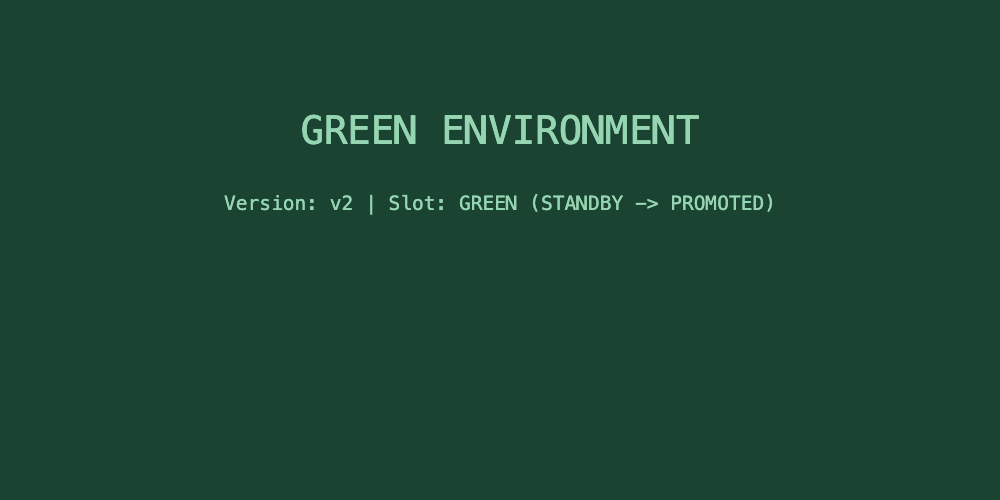

**Instant rollback and switch back, then retire blue.** Patching the selector back to blue restores v1 immediately (no pods are restarted). After switching back to green and verifying, blue is scaled to 0. The active version is the one in the Service selector (`green`).
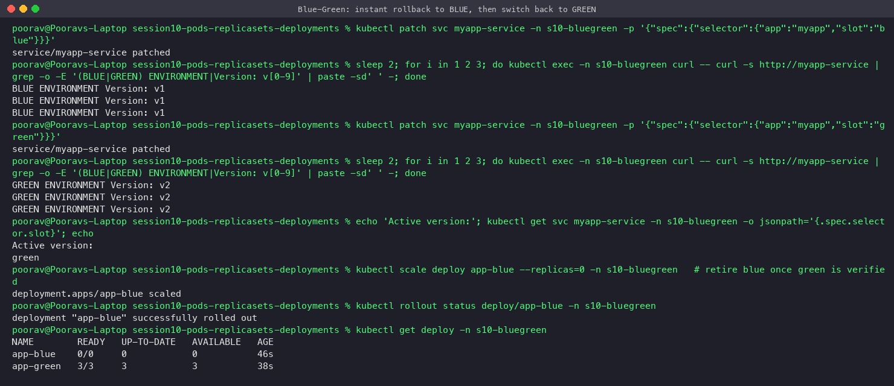

**Observation:** the switch is not perfectly instant. Right after the patch, it took about 1–2 s for EndpointSlices and kube-proxy rules to update. My first attempt (curling immediately) still hit blue. After a 2 s settle, every request went to the new colour.

## 03. Canary Deployment

- `app-stable`: **9** replicas, v1 (`track=stable`)
- `app-canary`: **1** replica, v2 (`track=canary`)
- One Service selects only the shared label `app=myapp-canary`, so it load-balances over **all 10 pods**. The traffic split therefore equals the pod ratio (9:1 = 90/10).

```bash
kubectl apply -f 03-canary/ -n s10-canary
kubectl exec curl -n s10-canary -- sh -c 'for i in $(seq 1 200); do curl -s http://myapp-canary-service | grep -o -E "STABLE v1|CANARY v2"; done' | sort | uniq -c
kubectl scale deploy app-canary --replicas=2 -n s10-canary && kubectl scale deploy app-stable --replicas=8 -n s10-canary
```

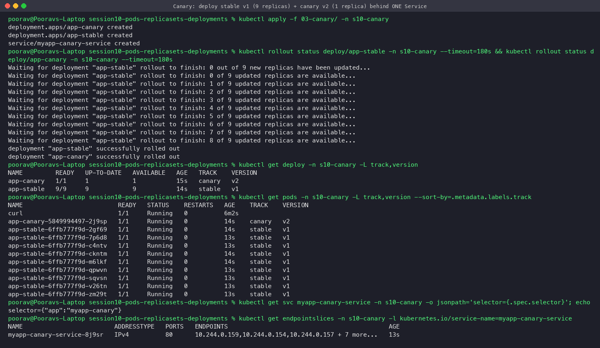

| Step | Stable pods | Canary pods | Expected canary % | Measured (200 requests) |
|---|---|---|---|---|
| Initial canary | 9 | 1 | 10 % | **20 / 200 = 10 %** |
| Increase | 8 | 2 | 20 % | **38 / 200 = 19 %** |
| Promote | 0 | 10 | 100 % | **200 / 200 = 100 %** |

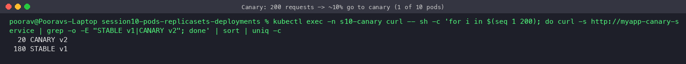
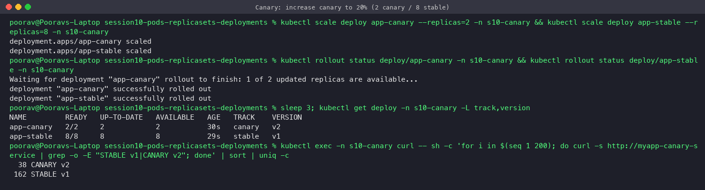
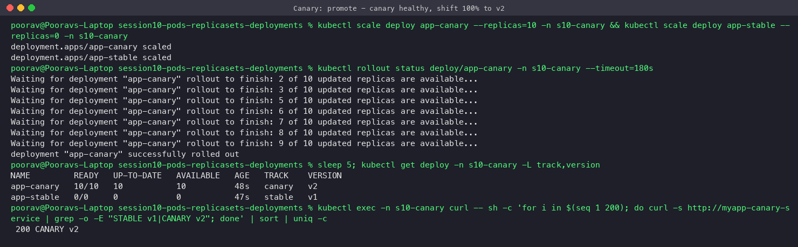

**Note:** replica-ratio canaries are coarse: 1 % would need 100 pods. For exact percentages, use an Ingress controller with canary weights (e.g. `nginx.ingress.kubernetes.io/canary-weight`), a service mesh (Istio/Linkerd), or Argo Rollouts.

## 04. Recreate Deployment

```yaml
strategy:
  type: Recreate   # kill ALL old pods first, then create new ones
```

```bash
kubectl apply -f 04-recreate/deployment-v1.yaml -f 04-recreate/service.yaml -n s10-recreate
kubectl get pods -w -l app=app-recreate -L version --output-watch-events -n s10-recreate   # terminal 1
kubectl apply -f 04-recreate/deployment-v2.yaml -n s10-recreate                            # terminal 2
```

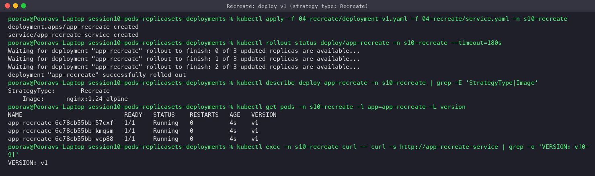

**The watch shows the order.** All 3 v1 pods go `Terminating` → `Completed` and are deleted, and only then are the 3 v2 pods `ADDED` (Pending → ContainerCreating → Running). At no moment do v1 and v2 run together.
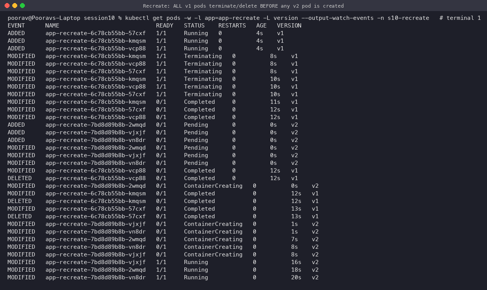

**Downtime window.** The traffic loop shows `v1` responses, then 7 consecutive `REQUEST FAILED (downtime)` while no pods exist, then `v2`.
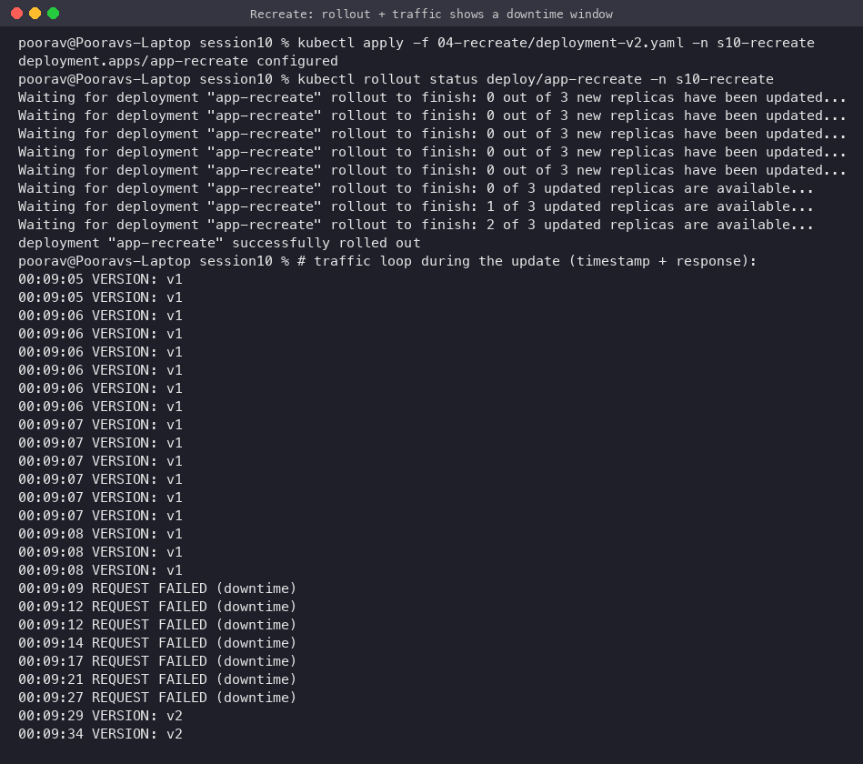
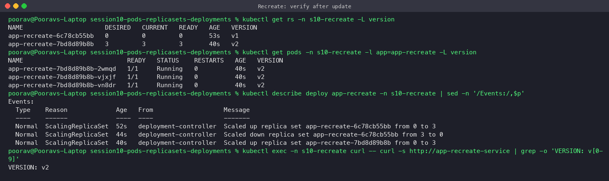

## Strategy comparison

| Strategy | Two versions at once? | Downtime | Extra resources | Rollback | Use when |
|---|---|---|---|---|---|
| Rolling Update (default) | Yes, briefly | None (with readiness probe + preStop) | `maxSurge` pods | `kubectl rollout undo` | Most stateless apps |
| Blue-Green | Yes (only one live) | None, instant switch | 2× full environment | Flip the selector back (seconds) | Releases that need instant, all-or-nothing switch and easy rollback |
| Canary | Yes, small % on new | None | A few extra pods | Scale canary to 0 | Testing a new version on real users with limited blast radius |
| Recreate | Never | Yes | None | Re-deploy old version | Apps that cannot run two versions at once (schema changes, singleton locks, RWO volumes) |

---

# Task 2 — Pod lifecycle

All 12 YAMLs were applied in namespace `s10-lifecycle`. For each one I captured `kubectl apply`, `kubectl get pod -o wide` (status), `kubectl describe pod` (filtered to State / Last State / Reason / Exit Code / Restart Count / probes / Conditions + all Events), and logs where useful.

```bash
kubectl apply -f pod-lifecycle/<file>.yaml -n s10-lifecycle
kubectl get pod <name> -n s10-lifecycle -o wide
kubectl describe pod <name> -n s10-lifecycle
kubectl logs <name> [-c container] [--previous] -n s10-lifecycle
```

**Overview of all 12 Pods at the same time:**
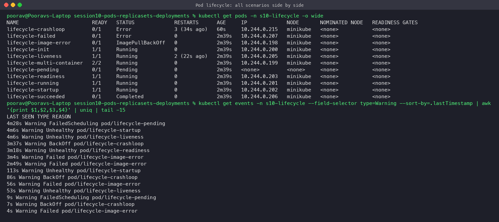

Pod **phases** are `Pending → Running → Succeeded | Failed` (plus `Unknown`). Strings like `CrashLoopBackOff`, `ImagePullBackOff`, `Init:0/1`, `Completed` and `Error` are *container state reasons* that kubectl shows in the STATUS column.

### 01 — Running
`nginx:1.27`, no probes. Phase **Running**, `1/1 Ready`, container State `Running`. Events show Scheduled → Pulled → Created → Started.
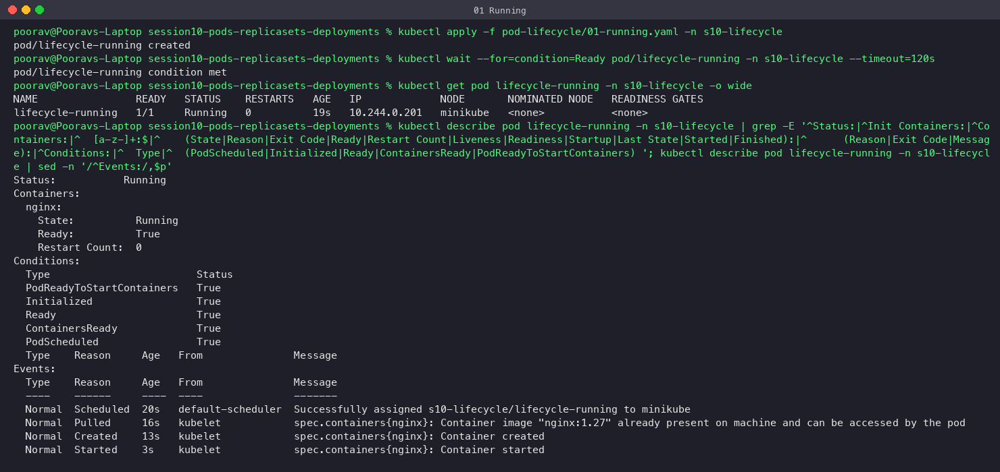

### 02 — Pending
The Pod requests `memory: 9Gi`, but the node only has about 7.75 Gi allocatable. It stays **Pending** with no IP and no node. Condition `PodScheduled=False`, event `FailedScheduling: 0/1 nodes are available: 1 Insufficient memory`. Preemption doesn't help either. **Fix:** lower the requests, or add a bigger node.
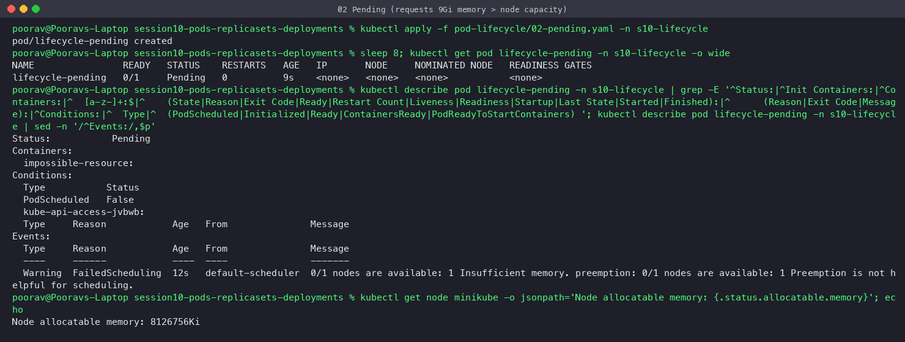

### 03 — Succeeded
`restartPolicy: Never`, the script exits `0` after 5 s. Running → **Succeeded** (STATUS `Completed`, `Reason: Completed`, `Exit Code: 0`, 0 restarts). Logs: "Task started / Task completed successfully". This is how Jobs finish.
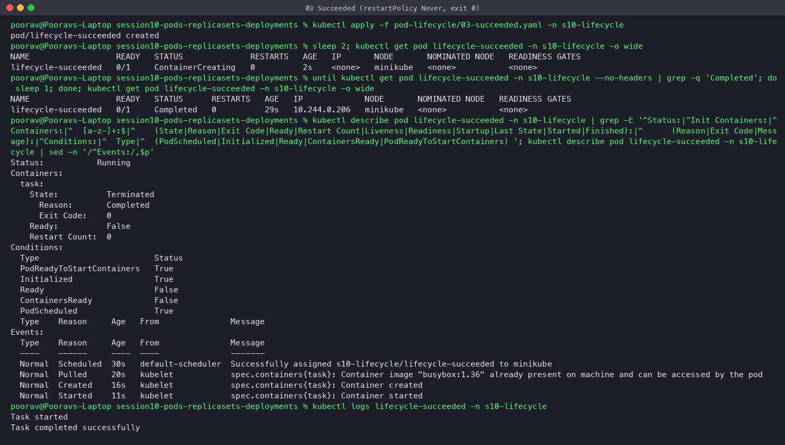

### 04 — Failed
Same as 03 but `exit 1`. Because restartPolicy is `Never`, the Pod goes to phase **Failed** (STATUS `Error`, `Exit Code: 1`) and is not restarted.
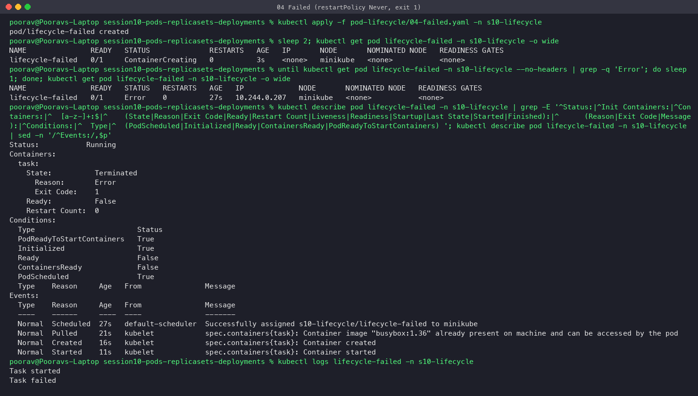

### 05 — CrashLoopBackOff
`restartPolicy: Always` (the default) and the container exits 1 after 3 s. The kubelet keeps restarting it with exponential back-off (10 s, 20 s, 40 s … up to 5 min). STATUS alternates `Error` → `CrashLoopBackOff`, `Last State: Terminated, Reason: Error, Exit Code: 1`, the restart count increases, and you see the `BackOff: Back-off restarting failed container` event. Phase stays **Running**, because the Pod itself is fine and only the container keeps dying. **Debug with:** `kubectl logs --previous` and `describe`.
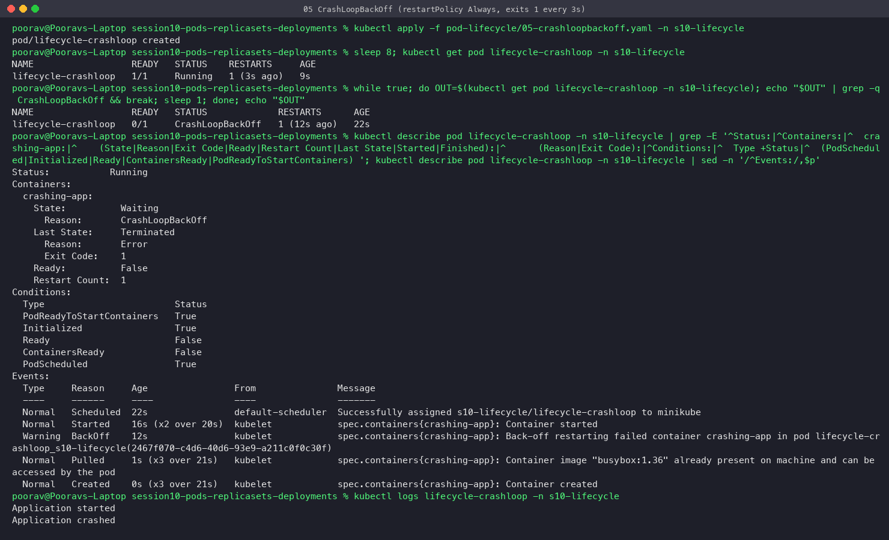

### 06 — ImagePullBackOff
The image `jakwehrgkaejw:kahsdfgkhj` does not exist. Status goes `ErrImagePull` → **ImagePullBackOff** (the kubelet retries with back-off). Phase **Pending**, State `Waiting`, and the event says `pull access denied, repository does not exist`. **Fix:** correct the image name/tag or add `imagePullSecrets` for private registries.
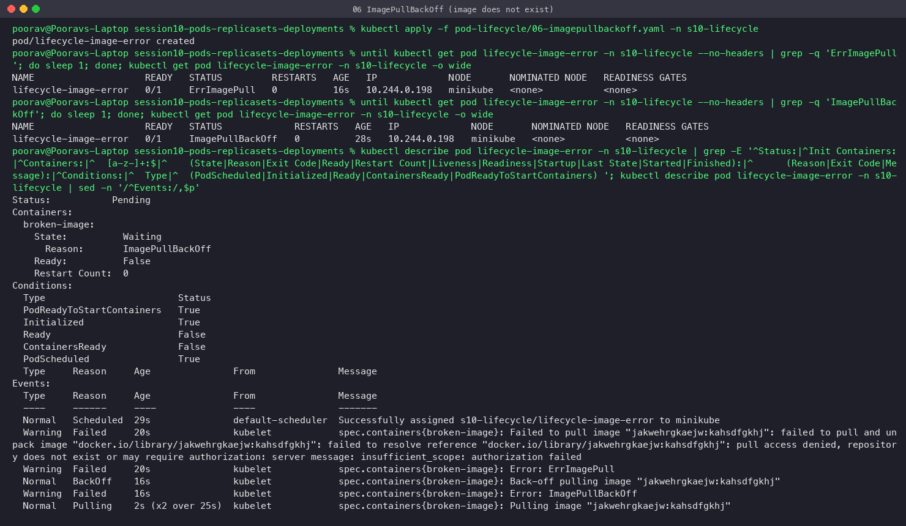

### 07 — Readiness probe
The `httpGet /` probe starts after 5 s. At 3 s the Pod is `Running` but **0/1 Ready** (it would get no Service traffic). At 14 s the probe has passed and it is `1/1 Ready`, with Conditions `Ready=True`. Readiness failures never restart the container. They only remove the Pod from Service endpoints.
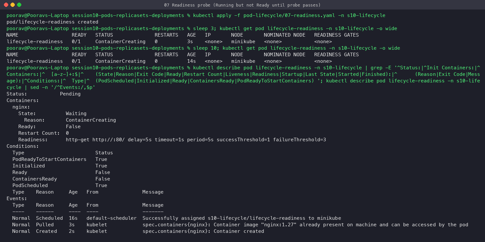

### 08 — Liveness probe
The app creates `/tmp/healthy`, deletes it after 20 s, and keeps running. The probe `test -f /tmp/healthy` (period 5 s, failureThreshold 2) starts failing. The events show `Liveness probe failed` ×2 → `Container app failed liveness probe, will be restarted`. Since `sleep` ignores SIGTERM, the kubelet waits the 30 s grace period and then kills it: `Last State: Terminated, Reason: Error, Exit Code: 137` (SIGKILL). The restart count becomes 1, and `logs --previous` shows "Health file removed". Liveness = "is the process stuck? Restart it."
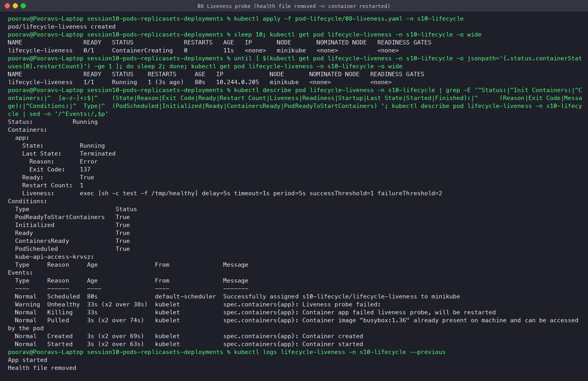

### 09 — Startup probe
The app needs 30 s to start. The startup probe allows up to `10 × 5 s = 50 s`. While it fails, the Pod is `Running 0/1`, and `Startup probe failed` events appear (×6). Those failures are expected and do not restart the container. Once `/tmp/started` exists, the probe passes and the Pod becomes `1/1 Ready` with 0 restarts. Liveness/readiness probes (if defined) only begin after the startup probe succeeds, so slow apps are not killed while booting.
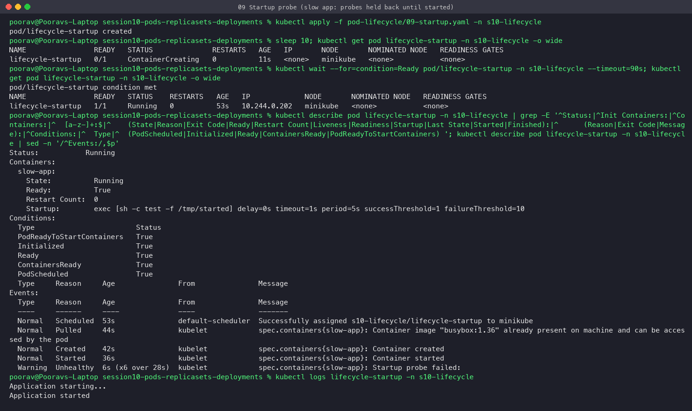

### 10 — Init container
The init container `setup` (busybox, sleeps 10 s) must finish before the main `nginx` container starts. At 3 s STATUS is **`Init:0/1`** with no IP yet for the app. Once the init container completes (`Reason: Completed, Exit Code: 0`), Initialized becomes True and nginx starts. The events show the `initContainers{setup}` steps before the `containers{app}` steps. Typical uses: wait for a DB, run migrations, fetch config.
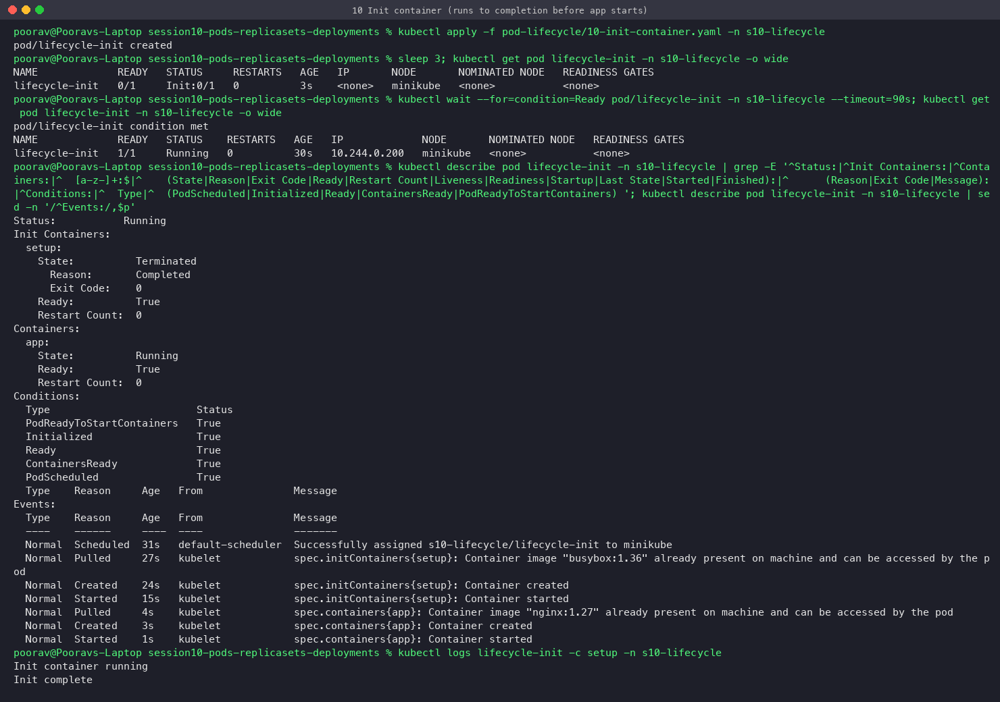

### 11 — Multi-container Pod (sidecar)
Two containers in one Pod: `app` (nginx) and `sidecar` (busybox loop). READY shows **2/2**. Logs are per container (`-c sidecar`). Because containers in a Pod share the network namespace, the sidecar reaches nginx at **`localhost:80`** (it returned "Welcome to nginx!").
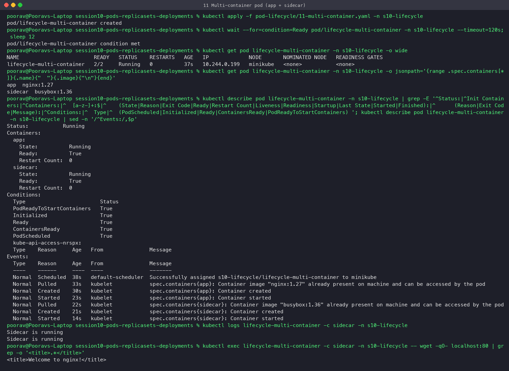

### 12 — Graceful termination
`terminationGracePeriodSeconds: 20`, and the app traps SIGTERM, cleans up for 10 s, then exits 0. On `kubectl delete`: the Pod becomes `Terminating` → the kubelet sends **SIGTERM** → the logs print "SIGTERM received; cleaning up..." (18:46:14) → "Cleanup complete" exactly 10 s later (18:46:24) → the container exits as `Completed` → the Pod is removed. `kubectl delete` took about 12 s, which is less than the 20 s grace period, so no SIGKILL was needed. Without the trap, the process would be SIGKILLed when the grace period ran out (compare the exit code 137 in demo 08).
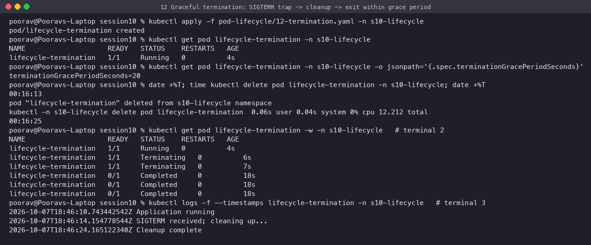

### Lifecycle summary

| # | Scenario | Phase | STATUS column | Key evidence |
|---|---|---|---|---|
| 01 | Running | Running | Running 1/1 | Started event |
| 02 | Pending | Pending | Pending | FailedScheduling: Insufficient memory |
| 03 | Succeeded | Succeeded | Completed | Exit Code 0, restartPolicy Never |
| 04 | Failed | Failed | Error | Exit Code 1, restartPolicy Never |
| 05 | CrashLoopBackOff | Running | CrashLoopBackOff/Error | BackOff event, restarts increasing |
| 06 | ImagePullBackOff | Pending | ErrImagePull → ImagePullBackOff | pull access denied |
| 07 | Readiness | Running | 0/1 → 1/1 | Ready condition flips True |
| 08 | Liveness | Running | Restarts 1 | Liveness probe failed → Killing, exit 137 |
| 09 | Startup | Running | 0/1 → 1/1 | Startup probe failed ×6, 0 restarts |
| 10 | Init container | Pending → Running | Init:0/1 → Running | init Completed before app Started |
| 11 | Multi-container | Running | 2/2 | sidecar curls localhost:80 |
| 12 | Termination | Running → deleted | Terminating → Completed | SIGTERM trap, cleanup within grace period |

## Cleanup

```bash
kubectl delete ns s10-rolling s10-bluegreen s10-canary s10-recreate s10-lifecycle
```
