# Session 11 — Kubernetes Networking & Services

**Student:** Poorav Kumar Gupta — **Roll No:** 24bcs10080
**Cluster:** minikube v1.39 / Kubernetes v1.37 (docker driver on macOS arm64)

```
session11-kubernetes-services/
├── 01-clusterip/      app-deployment.yaml, service.yaml, client-pod.yaml
├── 02-nodeport/       app-deployment.yaml, service.yaml
├── 03-loadbalancer/   app-deployment.yaml, service.yaml
├── 04-externalname/   service.yaml, client-pod.yaml
├── 05-headless/       app-statefulset.yaml, service.yaml, client-pod.yaml
├── fqdn/README.md     Task 3 – FQDN
├── coredns/README.md  Task 4 – CoreDNS (+ troubleshooting/ example)
└── screenshots/
```

**Setup.** Everything is in namespace `s11-services`. A second namespace, `s11-client`, holds a `dnsutils` Pod (`jessie-dnsutils`, has `dig`/`nslookup`) for cross-namespace DNS tests.

```bash
kubectl create ns s11-services && kubectl create ns s11-client
kubectl apply -n s11-services -f 01-clusterip -f 02-nodeport -f 03-loadbalancer -f 04-externalname -f 05-headless
kubectl run dnsutils -n s11-client --image=registry.k8s.io/e2e-test-images/jessie-dnsutils:1.3 --command -- sleep 36000
```

**Changes from the course YAMLs (and why):**

1. **nginx prints the Pod name.** Each container writes `Hello from pod <hostname> (<podIP>)` as its index page, so every response shows which replica answered and load-balancing is visible.
2. **NodePort `30080` → `30280`.** Avoids clashing with other demos already running on my cluster.
3. **LoadBalancer port `80` → `18280`.** On macOS, `minikube tunnel` needs `sudo` to bind ports below 1024. Using an unprivileged port lets the tunnel work without root. The Pods still listen on 80.
4. **ExternalName target `nencyravaliya.me` → `example.com`.** The original domain returns NXDOMAIN now. I also added `web-alias`, an ExternalName that points to an in-cluster Service FQDN.

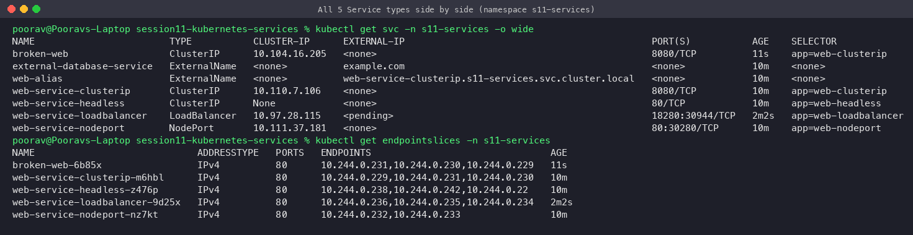

---

# Task 1 — The 5 Service types

## 1. ClusterIP (default)

A stable virtual IP that is reachable **only inside the cluster**. kube-proxy load-balances it across the Pods that match the selector.

```yaml
spec:
  type: ClusterIP
  selector: { app: web-clusterip }
  ports: [{ name: http, port: 8080, targetPort: 80 }]   # Service port 8080 -> container port 80
```

```bash
kubectl get svc,endpointslices -n s11-services
kubectl exec curl-client -n s11-services -- curl -s http://web-service-clusterip:8080
```

**Verify:** ClusterIP `10.110.7.106`, 3 endpoints (the 3 Pod IPs).
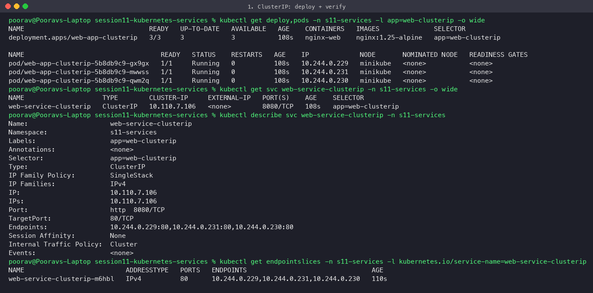

**Connectivity:** 6 requests were spread across all 3 Pods. The Service works by short name, by ClusterIP, and by FQDN. DNS resolves to the ClusterIP. From the Mac (outside the cluster) the ClusterIP is **not reachable**, which is expected.
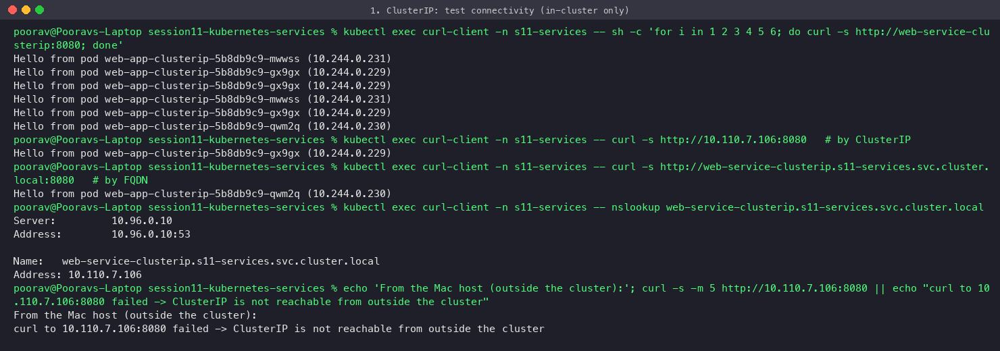

## 2. NodePort

ClusterIP **plus** a static port (30000–32767) opened on **every node**: `<NodeIP>:<NodePort>`.

```yaml
spec:
  type: NodePort
  ports: [{ port: 80, targetPort: 80, nodePort: 30280 }]
```

**Verify:** `80:30280/TCP`, node IP `192.168.49.2`.
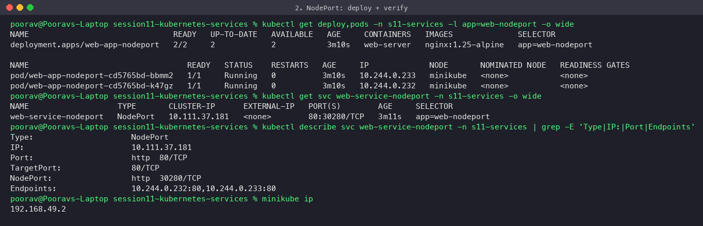

**Connectivity:**

- `curl http://192.168.49.2:30280` from inside the cluster works and load-balances across both Pods.
- The NodePort Service still has a ClusterIP, so `web-service-nodeport:80` works too.
- **From the Mac:** with minikube's docker driver on macOS, the node IP is inside Docker Desktop's VM, so `192.168.49.2:30280` times out. `minikube service web-service-nodeport --url` opens a tunnel (`http://127.0.0.1:55355`) and the requests succeed through it.

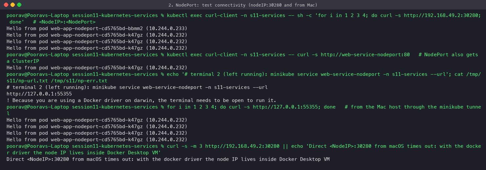
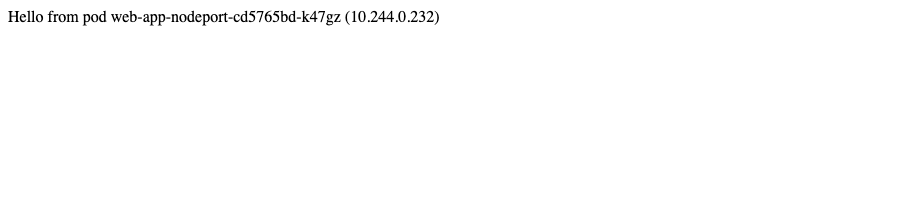

## 3. LoadBalancer

NodePort + ClusterIP **plus** an external load balancer from the cloud provider (AWS ELB/NLB, GCP LB, Azure LB), which fills `EXTERNAL-IP`. On minikube, `minikube tunnel` plays the role of the cloud LB controller.

```bash
minikube tunnel        # terminal 2, keep running
kubectl get svc web-service-loadbalancer -n s11-services   # EXTERNAL-IP 127.0.0.1
curl http://127.0.0.1:18280
```

**With the tunnel:** `EXTERNAL-IP` = `127.0.0.1`, and requests from the Mac load-balance across all 3 Pods. The same Service also has an auto-allocated NodePort (`31868`) and a ClusterIP, which shows LB ⊃ NodePort ⊃ ClusterIP.
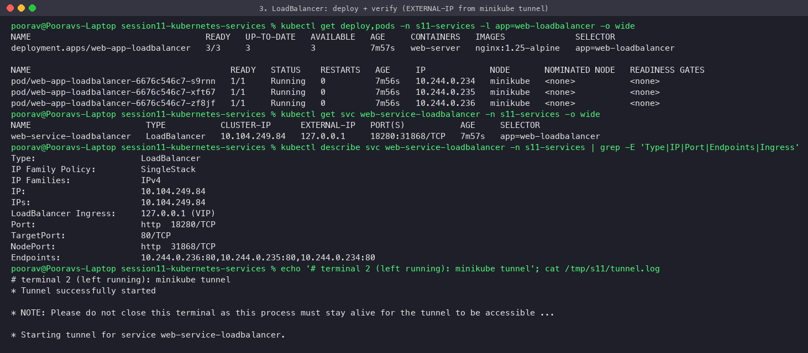
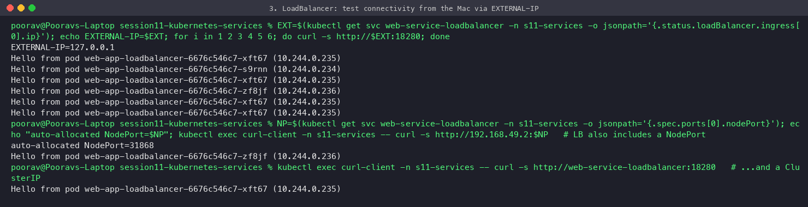
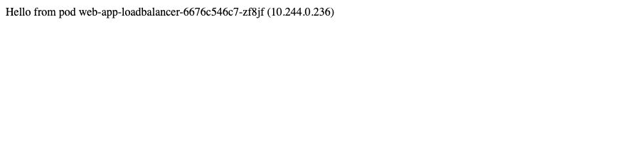

**Without a tunnel / cloud LB:** the recreated Service stays at `EXTERNAL-IP <pending>` and is not reachable from outside. This is what you see on bare-metal clusters without MetalLB.
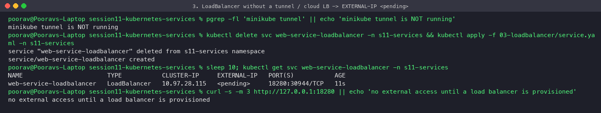

> First attempt (honest note): with the original `port: 80`, `minikube tunnel` assigned `127.0.0.1` but printed *"requires privileged ports to be exposed: [80] — sudo permission will be asked"*. It could not bind port 80 without a password, so I switched to port 18280.

## 4. ExternalName

A pure **DNS alias (CNAME)**. It has no selector, no ClusterIP, no endpoints and no kube-proxy rules. Apps call a stable in-cluster name, and you can repoint it (for example to a managed DB) without changing app config.

```yaml
spec:
  type: ExternalName
  externalName: example.com
```

**Verify:** `CLUSTER-IP <none>`, `EXTERNAL-IP example.com`, no endpoints.
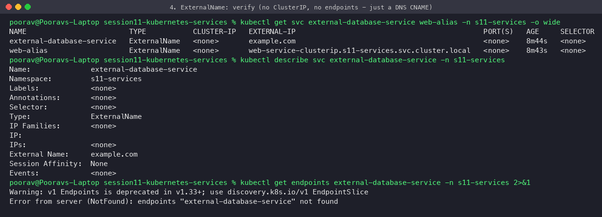

**Connectivity:** CoreDNS answers `external-database-service.s11-services.svc.cluster.local CNAME example.com`, followed by example.com's A records. `curl` through the alias returns `HTTP 200` / `<title>Example Domain</title>`. A `Host: example.com` header is needed because ExternalName only changes DNS: HTTP clients still send the alias as the Host header, so TLS/virtual-hosting must accept it. `web-alias` CNAMEs to an in-cluster Service FQDN and also works.
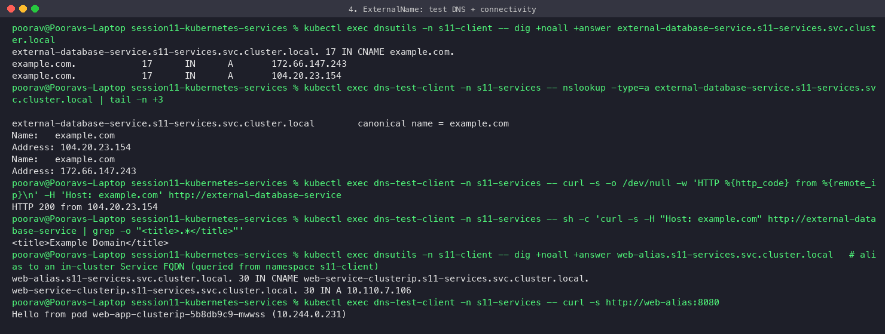

## 5. Headless (`clusterIP: None`)

No virtual IP and no kube-proxy load-balancing. DNS returns **the Pod IPs directly**. Combined with a StatefulSet (`serviceName: web-service-headless`), each Pod gets a **stable DNS name**: `web-stateful-0.web-service-headless.s11-services.svc.cluster.local`. It is used for databases, Kafka, ZooKeeper, etc., where clients must reach a specific replica.

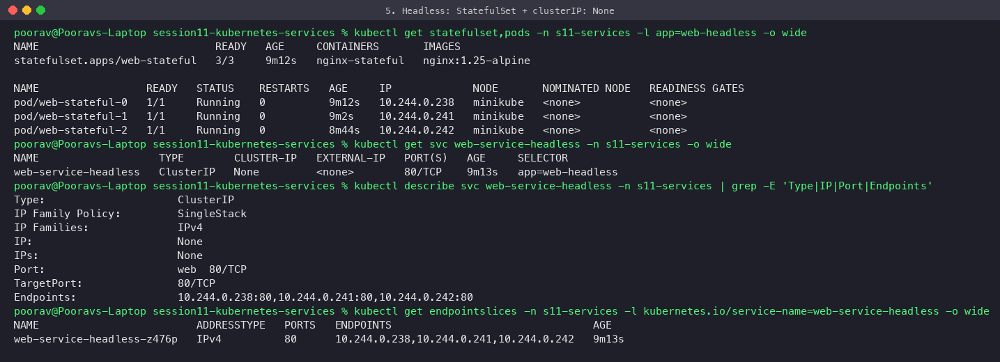

**DNS:** the headless Service returns **3 A records** (one per Pod), while a normal Service returns **1** ClusterIP. Per-Pod names reach exactly that Pod, and SRV records list each Pod with its port.
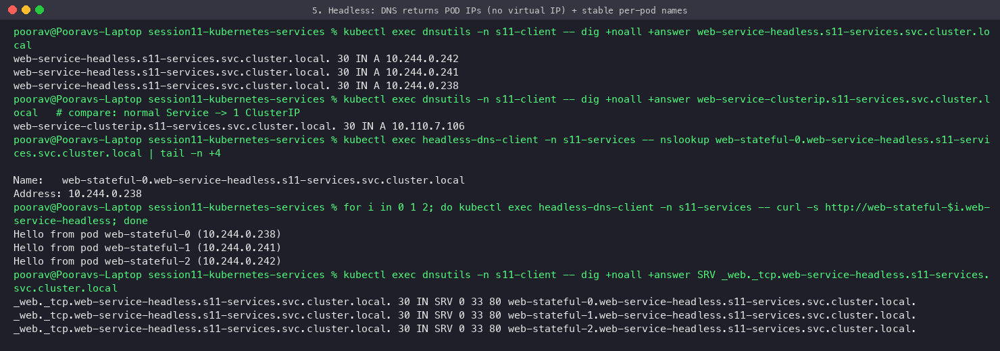

**Stable identity:** after deleting `web-stateful-1`, the StatefulSet recreated it with the **same name** but a **new IP** (`10.244.0.241` → `10.244.0.22`), and `web-stateful-1.web-service-headless` automatically resolved to the new IP.
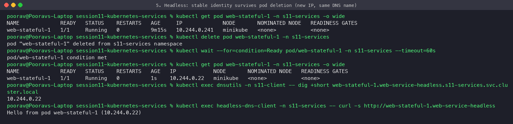

## Service types summary

| Type | ClusterIP | Reachable from | Load balancing | Typical use |
|---|---|---|---|---|
| ClusterIP | yes | inside the cluster | kube-proxy | internal microservices, DBs |
| NodePort | yes | `<anyNodeIP>:30000-32767` | kube-proxy | dev/test, on-prem behind an external LB |
| LoadBalancer | yes (+NodePort) | public/external IP | cloud LB → nodes → kube-proxy | exposing a service on a cloud |
| ExternalName | no | - (DNS CNAME only) | none | alias an external DB/API |
| Headless | `None` | inside the cluster | none (client picks a Pod IP) | StatefulSets, peer discovery |

---

# Task 2 — Kubernetes object comparison

## Deployment vs ReplicaSet

| | ReplicaSet | Deployment |
|---|---|---|
| **Purpose** | Keep exactly N identical Pods running (self-healing) | Manage the application's *releases*: owns ReplicaSets, which own Pods |
| **Pod management** | Creates/deletes Pods directly to match `replicas` and its label selector. Does not care which image they run. | Never touches Pods directly. It creates a ReplicaSet per Pod-template version (`pod-template-hash`) |
| **Scaling** | `kubectl scale rs` works | `kubectl scale deploy`. The Deployment passes the count to the current ReplicaSet. HPA usually targets Deployments |
| **Rolling updates** | **None.** Changing the template only affects *new* Pods. Existing Pods keep the old image until deleted | Built in: `RollingUpdate` (maxSurge/maxUnavailable) or `Recreate`, plus `rollout status/history/undo/pause/resume` |
| **Rollback** | Manual | `kubectl rollout undo` (old ReplicaSets are kept, scaled to 0, `revisionHistoryLimit`) |

**Relationship:** `Deployment → (1..n) ReplicaSets → (n) Pods`. On every template change, the Deployment controller creates a new ReplicaSet and gradually scales new up / old down (seen in Session 10: `app-rolling-xxxx` new RS = 4, old RS = 0). In practice you should almost never create a bare ReplicaSet. Use a Deployment.

## Deployment vs DaemonSet vs StatefulSet

| | Deployment | DaemonSet | StatefulSet |
|---|---|---|---|
| **Use cases** | Stateless apps: web servers, APIs, workers | One agent per node: log collectors (Fluent Bit), monitoring (node-exporter), CNI (kindnet, Calico), kube-proxy | Stateful apps needing identity: databases (MySQL, PostgreSQL, MongoDB), Kafka, ZooKeeper, Elasticsearch |
| **Pod creation** | All in parallel, random names (`web-7d9f-abc12`) | Exactly one per (matching) node, created automatically when a node joins | Ordered: `-0`, then `-1`, then `-2` (each waits for the previous to be Ready). Deleted in reverse order |
| **Scaling** | `replicas: N`, HPA | Not by replica count: it follows the number of nodes (nodeSelector/affinity/tolerations limit which ones) | `replicas: N`, scales one at a time, ordered |
| **Networking** | Normal Service, Pods are interchangeable | Often `hostNetwork`/`hostPort`, reached via the node | Needs a **headless Service**, giving stable DNS per Pod: `web-stateful-0.web-service-headless...` |
| **Storage** | Usually none or shared. A PVC in the template would be shared by all replicas | Usually `hostPath` (e.g. `/var/log`) | `volumeClaimTemplates`: each Pod gets **its own PVC** (`data-web-0`, `data-web-1`), which re-attaches to the same Pod after rescheduling |
| **Identity** | None | Tied to the node | Stable name, ordinal, DNS and storage |
| **Examples here** | `web-app-clusterip`, `web-app-nodeport` | `kube-proxy`, `kindnet` in kube-system | `web-stateful` (Task 1.5) |

## ReplicaSet vs Service

| | ReplicaSet | Service |
|---|---|---|
| **Responsibility** | *Availability / count*: makes sure N Pods exist, replaces dead ones | *Discovery / routing*: gives a stable name + virtual IP and load-balances to healthy Pods |
| **Works on** | Creates and deletes Pods | Never creates Pods. It only **selects** them by label and tracks their IPs in EndpointSlices |
| **Without the other** | Pods run, but clients must chase changing Pod IPs | A Service with no matching Pods has no endpoints (see `broken-web` in coredns/), so requests fail |

**Why a Service is required:** Pods are temporary. Every reschedule, scale or rollout gives them **new IPs** (seen in Task 1.5: `10.244.0.241 → 10.244.0.22`). A Service provides one stable DNS name / ClusterIP, keeps the list of *ready* Pod IPs up to date automatically (readiness probes remove unhealthy Pods), and spreads traffic across them.

**How traffic reaches Pods (ClusterIP example):**

```
client Pod ──DNS──► CoreDNS: web-service-clusterip.s11-services.svc.cluster.local → 10.110.7.106
     │
     └─TCP 10.110.7.106:8080─► kube-proxy iptables rules on the node (KUBE-SERVICES → KUBE-SVC-xxx)
                                 └─ random choice → KUBE-SEP-yyy: DNAT to PodIP:80 (from EndpointSlice)
                                                       └─► nginx container in the chosen Pod
```

The EndpointSlice controller keeps `Service selector → ready Pod IPs` up to date. kube-proxy watches EndpointSlices and rewrites the node's iptables (or IPVS/nftables) rules. NodePort/LoadBalancer just add more entry points (`nodeIP:30280`, external LB) into the same chain.

**Real rules on the minikube node.** `KUBE-SERVICES` matches `10.110.7.106:8080` and jumps to `KUBE-SVC-J7Q7…`. That chain picks one of the 3 endpoints with `statistic --mode random` (probability 1/3, then 1/2, then the rest, which gives an equal split). Each `KUBE-SEP-…` chain DNATs to one Pod IP:80, and those IPs are exactly the EndpointSlice entries.

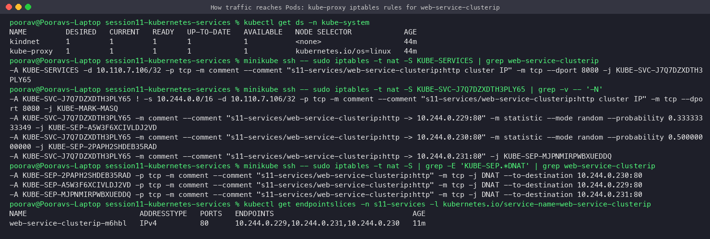

---

# Task 3 — FQDN → [fqdn/README.md](fqdn/README.md)
# Task 4 — CoreDNS → [coredns/README.md](coredns/README.md)

## Cleanup

```bash
kubectl delete ns s11-services s11-client
```
