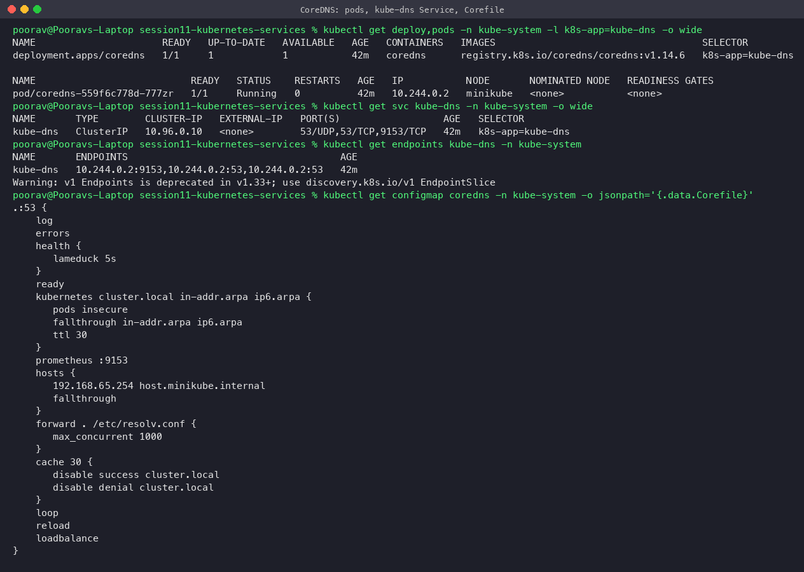
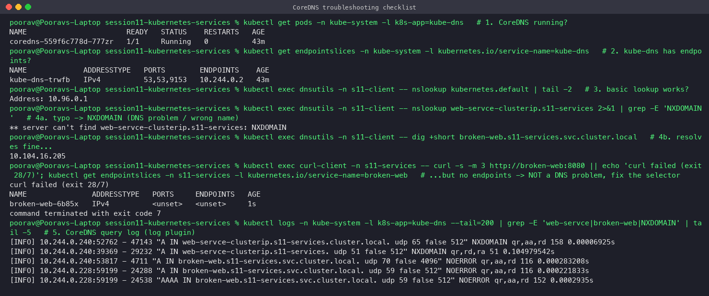
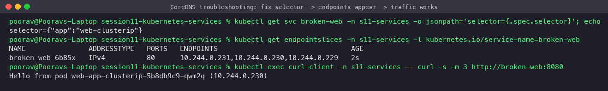

# Task 4 — CoreDNS

**Student:** Poorav Kumar Gupta — **Roll No:** 24bcs10080
All outputs below are real and come from the minikube cluster (CoreDNS v1.14.6).

## What is CoreDNS?

CoreDNS is a flexible DNS server written in Go and a CNCF graduated project. Its behaviour is defined by a chain of **plugins** configured in a `Corefile`. In Kubernetes it runs as the cluster DNS add-on: a Deployment `coredns` in `kube-system`, exposed through a Service still called **`kube-dns`** (ClusterIP `10.96.0.10`, ports 53/UDP, 53/TCP, plus 9153 for Prometheus metrics).



## Why Kubernetes uses CoreDNS

- It replaced kube-dns (dnsmasq + kubedns + sidecar) as the default in Kubernetes 1.13: one binary, fewer moving parts, smaller attack surface.
- The **plugin architecture** makes it easy to add caching, metrics, rewrites, stub domains, hosts entries and so on, all from one Corefile.
- The `kubernetes` plugin *watches* the API server (Services, EndpointSlices, Pods), so records update within seconds when Pods or Services change.
- It exposes Prometheus metrics and health/readiness endpoints, and the Corefile can be reloaded without a restart (`reload` plugin).

## How service discovery works

1. You create a Service. The API server stores it, and the EndpointSlice controller fills in the ready Pod IPs.
2. CoreDNS's `kubernetes` plugin watches Services and EndpointSlices and keeps an in-memory index.
3. kubelet writes every Pod's `/etc/resolv.conf` with `nameserver 10.96.0.10`, the namespace search domains, and `ndots:5`.
4. Any Pod can now find any Service by name. When Pods change, the Service name stays the same: only the ClusterIP rules (normal Services) or the A records (headless) change.

## How a DNS query is resolved

```
app in Pod (ns s11-client) ─ getaddrinfo("web-service-clusterip.s11-services")
  │ resolv.conf: fewer than 5 dots → try search domains in order
  ├─► "web-service-clusterip.s11-services.s11-client.svc.cluster.local"  → CoreDNS → NXDOMAIN
  └─► "web-service-clusterip.s11-services.svc.cluster.local"            → CoreDNS → A 10.110.7.106 ✔
                 │
  query to 10.96.0.10:53 → kube-proxy DNAT → coredns Pod 10.244.0.2:53
  CoreDNS plugin chain: log → errors → … → kubernetes (cluster.local? answer from API index)
                                            → hosts (host.minikube.internal)
                                            → forward . /etc/resolv.conf (everything else, e.g. example.com)
                                            → cache 30s
```

Live: a direct query is answered by `SERVER: 10.96.0.10#53` in about 0 ms with `NOERROR`. The search-list expansion shows the first try failing (NXDOMAIN) and the second succeeding:


External names (`example.com`) are passed to the upstream resolver by the `forward` plugin, and Service PTR/SRV records are served too:


## CoreDNS configuration (the Corefile)

Stored in ConfigMap `kube-system/coredns` (`kubectl get cm coredns -n kube-system -o yaml`). The minikube Corefile:

```
.:53 {
    log                                   # log every query (enabled on this cluster)
    errors                                # log errors to stdout
    health { lameduck 5s }                # :8080/health for liveness
    ready                                 # :8181/ready for readiness
    kubernetes cluster.local in-addr.arpa ip6.arpa {
       pods insecure                      # answer <pod-ip-dashed>.<ns>.pod.cluster.local
       fallthrough in-addr.arpa ip6.arpa  # unknown reverse lookups go to the next plugin
       ttl 30                             # record TTL (seen as "30" in dig answers)
    }
    prometheus :9153                      # metrics endpoint
    hosts {                               # static entries (minikube adds host.minikube.internal)
       192.168.65.254 host.minikube.internal
       fallthrough
    }
    forward . /etc/resolv.conf { max_concurrent 1000 }   # upstream for non-cluster names
    cache 30 { disable success cluster.local; disable denial cluster.local }
    loop                                  # detect forwarding loops and stop
    reload                                # pick up ConfigMap changes automatically
    loadbalance                           # round-robin the order of A records
}
```

Common customisations (edit the ConfigMap; `reload` applies it in about 30 s):

```
# stub domain: send *.corp.example to the company DNS
corp.example:53 {
    forward . 10.0.0.53
}
# rewrite an old name to a new Service
rewrite name old-db.prod.svc.cluster.local new-db.prod.svc.cluster.local
```

Per-Pod overrides use `spec.dnsPolicy` (`ClusterFirst` default, `Default`, `None`, `ClusterFirstWithHostNet`) and `spec.dnsConfig` (custom nameservers, searches, `ndots`).

## How to troubleshoot DNS issues

Checklist (run in order):

| # | Check | Command |
|---|---|---|
| 1 | CoreDNS Pods running and Ready? | `kubectl get pods -n kube-system -l k8s-app=kube-dns` |
| 2 | `kube-dns` Service has endpoints? | `kubectl get endpointslices -n kube-system -l kubernetes.io/service-name=kube-dns` |
| 3 | Basic lookup from a test Pod works? | `kubectl exec dnsutils -- nslookup kubernetes.default` |
| 4 | Pod's resolv.conf correct (nameserver 10.96.0.10, search domains)? | `kubectl exec <pod> -- cat /etc/resolv.conf` |
| 5 | Right name / namespace? Short names only work in the same namespace | `nslookup <svc>.<ns>.svc.cluster.local` |
| 6 | NXDOMAIN vs "resolves but no response"? | If the name resolves but the connection fails, it is **not DNS**. Check the Service selector/endpoints, targetPort and NetworkPolicy |
| 7 | CoreDNS logs / errors | `kubectl logs -n kube-system -l k8s-app=kube-dns` (`log` plugin shows each query + rcode) |
| 8 | Corefile valid? Loop detected? Upstream reachable? | `kubectl get cm coredns -n kube-system -o yaml`, look for `plugin/loop` / `i/o timeout` in logs |
| 9 | Performance: many NXDOMAINs from `ndots:5` | use FQDNs with a trailing dot, or lower `ndots` via `dnsConfig` |

**Live troubleshooting demo** (`troubleshooting/broken-selector-service.yaml`):

- A typo (`web-servce-clusterip`) gives **NXDOMAIN**. The CoreDNS log shows each search-domain attempt returning `NXDOMAIN`. That is a genuine name problem.
- `broken-web` **resolves fine** (`10.104.16.205`, `NOERROR` in the log), but `curl` fails because its EndpointSlice is `<unset>`: the selector `app=web-cluster-ip` matches no Pods. So it is not a DNS problem.



**Fix:** patch the selector to `app=web-clusterip`. The endpoints appear immediately and traffic works:

```bash
kubectl patch svc broken-web -n s11-services -p '{"spec":{"selector":{"app":"web-clusterip"}}}'
```


