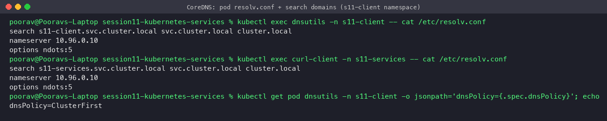
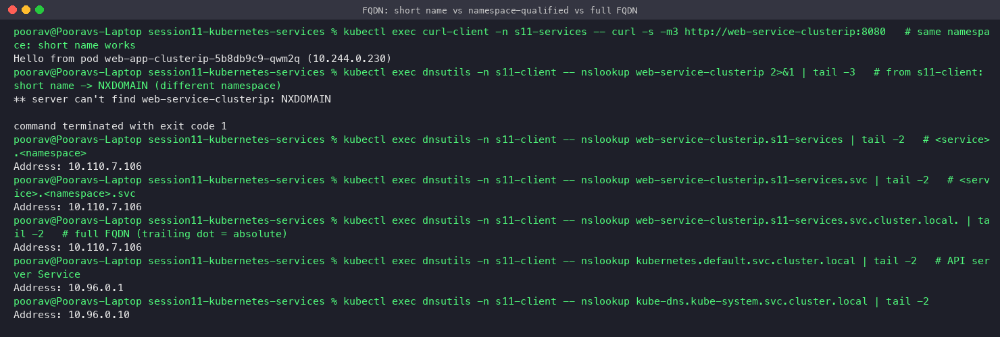
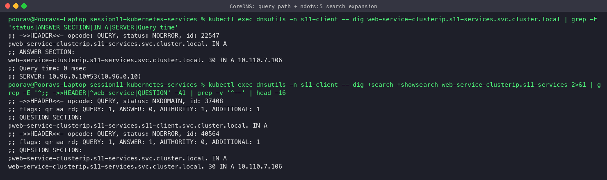
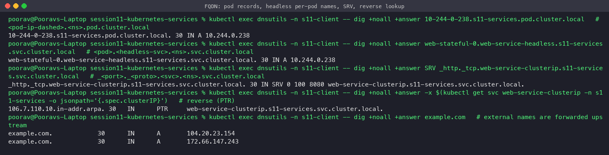

# Task 3 — FQDN in Kubernetes

**Student:** Poorav Kumar Gupta — **Roll No:** 24bcs10080
All outputs below are real and come from the minikube cluster (namespaces `s11-services` and `s11-client`).

## What is an FQDN?

A **Fully Qualified Domain Name** is the complete, unambiguous DNS name of a host. It includes every label up to the root, e.g. `www.example.com.`. The trailing dot is the DNS root and makes the name *absolute*. A name without all its labels (e.g. `web`, `web.prod`) is *relative*, and the resolver completes it using the **search domains** in `/etc/resolv.conf`.

## Kubernetes Service DNS

Every Service automatically gets a DNS record in the cluster domain (default `cluster.local`). CoreDNS serves these records from the Kubernetes API.

| Service kind | Record | Answer |
|---|---|---|
| Normal (ClusterIP / NodePort / LoadBalancer) | `A`/`AAAA` `<svc>.<ns>.svc.cluster.local` | the ClusterIP |
| Headless (`clusterIP: None`) | `A` `<svc>.<ns>.svc.cluster.local` | **all ready Pod IPs** |
| Headless + StatefulSet | `A` `<pod>.<svc>.<ns>.svc.cluster.local` | one Pod's IP |
| ExternalName | `CNAME` `<svc>.<ns>.svc.cluster.local` | the external name |
| Named ports | `SRV` `_<port>._<proto>.<svc>.<ns>.svc.cluster.local` | port + target |
| Reverse | `PTR` `<reversed-ip>.in-addr.arpa` | the Service FQDN |

## Kubernetes DNS naming convention

```
<service-name>.<namespace>.svc.<cluster-domain>
     │              │       │        └── cluster.local (configurable, kubelet --cluster-domain)
     │              │       └── "svc" = this is a Service record (vs "pod")
     │              └── namespace the Service lives in
     └── metadata.name of the Service

<pod-ip-with-dashes>.<namespace>.pod.<cluster-domain>          # Pod A record (needs "pods insecure|verified")
<pod-hostname>.<subdomain/headless-svc>.<namespace>.svc.<cluster-domain>   # StatefulSet / hostname+subdomain Pods
```

## Namespace-based DNS (search domains)

Every Pod (with the default `dnsPolicy: ClusterFirst`) gets this `/etc/resolv.conf`:

```
search s11-client.svc.cluster.local svc.cluster.local cluster.local
nameserver 10.96.0.10        # kube-dns Service ClusterIP -> CoreDNS
options ndots:5
```



- The first search domain is **the Pod's own namespace**. That is why a **short name only works inside the same namespace**.
- `ndots:5` means any name with fewer than 5 dots is tried with each search suffix first, before being tried as-is.

So from a Pod in namespace `s11-client`:

| Name you type | Expanded to (first match) | Result |
|---|---|---|
| `web-service-clusterip` | `web-service-clusterip.s11-client.svc.cluster.local` | **NXDOMAIN**: the Service lives in `s11-services` |
| `web-service-clusterip.s11-services` | `…s11-services.svc.cluster.local` (2nd search domain) | 10.110.7.106 |
| `web-service-clusterip.s11-services.svc` | `…svc.cluster.local` (3rd search domain) | 10.110.7.106 |
| `web-service-clusterip.s11-services.svc.cluster.local.` | absolute, no expansion | 10.110.7.106 |



You can see the search expansion with `dig +search +showsearch`. The first try, `…s11-services.s11-client.svc.cluster.local`, gets NXDOMAIN, and the second, `…s11-services.svc.cluster.local`, gets NOERROR:



**Tip:** in app config, use `<svc>.<ns>` or the full FQDN with a trailing dot. That avoids up to 4 wasted lookups caused by `ndots:5`, and the config keeps working if the client moves to another namespace.

## Pod-to-Service communication

1. The app calls `http://web-service-clusterip:8080`.
2. The resolver appends search domains, asks CoreDNS (10.96.0.10), and gets the ClusterIP `10.110.7.106`.
3. The TCP connection to `10.110.7.106:8080` is DNATed by kube-proxy's iptables rules to one ready Pod IP:80 (see `../screenshots/20-kube-proxy-iptables.png`).
4. The response goes back through conntrack.

Same namespace → short name. Different namespace → `<svc>.<ns>` or the FQDN. Headless → DNS returns Pod IPs and the client connects to a Pod directly.


## Examples of Kubernetes FQDNs (all resolved live)

| FQDN | Type | Answer |
|---|---|---|
| `kubernetes.default.svc.cluster.local` | API server Service | 10.96.0.1 |
| `kube-dns.kube-system.svc.cluster.local` | CoreDNS Service | 10.96.0.10 |
| `web-service-clusterip.s11-services.svc.cluster.local` | ClusterIP | 10.110.7.106 |
| `web-service-headless.s11-services.svc.cluster.local` | Headless | 3 Pod IPs |
| `web-stateful-0.web-service-headless.s11-services.svc.cluster.local` | StatefulSet Pod | 10.244.0.238 |
| `10-244-0-238.s11-services.pod.cluster.local` | Pod A record | 10.244.0.238 |
| `external-database-service.s11-services.svc.cluster.local` | ExternalName | CNAME example.com |
| `_http._tcp.web-service-clusterip.s11-services.svc.cluster.local` | SRV | `0 100 8080 web-service-clusterip…` |
| `106.7.110.10.in-addr.arpa` | PTR | `web-service-clusterip.s11-services.svc.cluster.local.` |



