# Session 12: Kubernetes Ingress, ConfigMaps & Secrets

**Student:** Poorav Kumar Gupta — **Roll No:** 24bcs10080
**Cluster:** minikube v1.37 (docker driver, macOS), `ingress-nginx` addon enabled.

```
session12-ingress-configmaps-secrets/
├── 01-configmap/        configmap.yaml, pod.yaml
├── 02-secret/           secret.yaml (dummy values), pod.yaml, .gitignore.example
├── 03-ingress/          apps.yaml (3 deployments + services), ingress.yaml
├── 04-ingress-vs-ingress-controller/README.md
├── 05-troubleshooting/  3 broken/fixed scenario pairs
└── screenshots/         PNG screenshots
```

---

## Task 1: ConfigMap

A **ConfigMap** stores non-sensitive configuration as key/value pairs (or whole files) so the same image can run in different environments without rebuilding.

[`01-configmap/configmap.yaml`](01-configmap/configmap.yaml) stores 4 simple keys plus a file-style key (`app.properties`).
[`01-configmap/pod.yaml`](01-configmap/pod.yaml) shows the 3 injection methods:

| Method | YAML | Result in container |
|---|---|---|
| Single key → env var | `env[].valueFrom.configMapKeyRef` | `$APP_NAME` |
| All keys → env vars | `envFrom[].configMapRef` | `$APP_ENV`, `$LOG_LEVEL`, ... |
| Mount as volume | `volumes[].configMap` | one file per key in `/etc/config/` |

```bash
kubectl create ns s12-config
kubectl apply -f 01-configmap/configmap.yaml
kubectl get configmap -n s12-config
kubectl describe configmap app-config -n s12-config
```
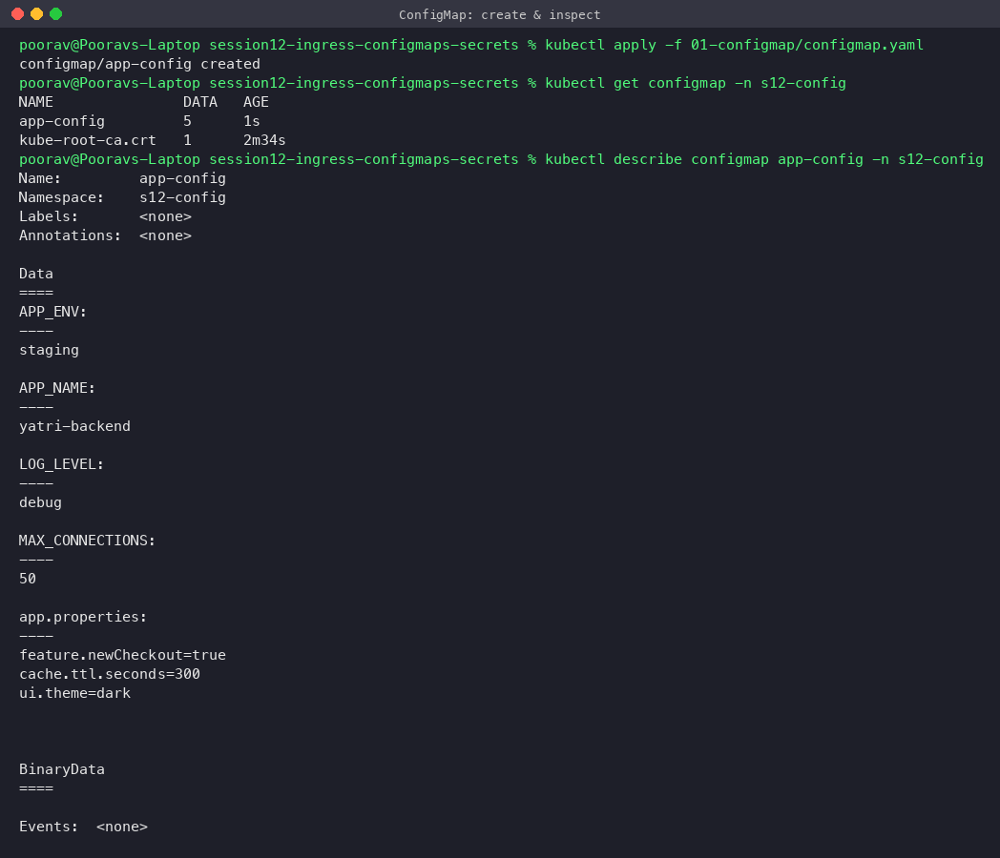

```bash
kubectl apply -f 01-configmap/pod.yaml
kubectl logs config-demo -n s12-config
kubectl exec config-demo -n s12-config -- sh -c 'env | grep -E "APP_|LOG_LEVEL|MAX_CONN" | sort'
kubectl exec config-demo -n s12-config -- ls /etc/config
kubectl exec config-demo -n s12-config -- cat /etc/config/app.properties
```
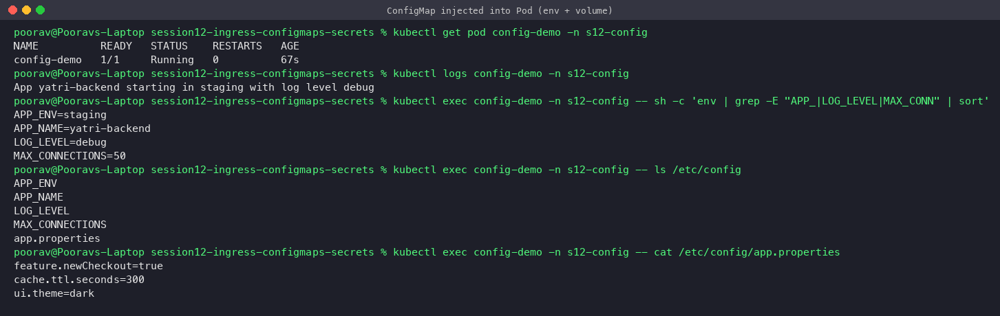

**Observation:** the container log line `App yatri-backend starting in staging with log level debug` proves the values were injected; every key also appears as a file under `/etc/config`.

### Bonus: updating a ConfigMap
```bash
kubectl patch configmap app-config -n s12-config --type merge -p '{"data":{"LOG_LEVEL":"info"}}'
# wait ~60s for kubelet sync
```
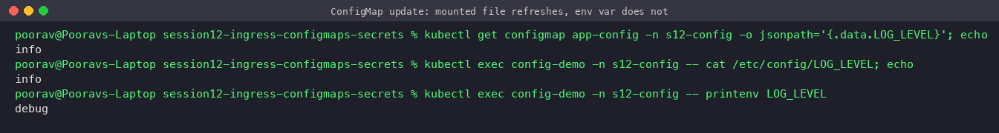

**Observation:** the **mounted file** was refreshed automatically (`info`) but the **environment variable** still shows `debug` — env vars are only read at container start, so a rollout restart is needed for env-based config.

---

## Task 2: Secret

A **Secret** stores sensitive data (passwords, tokens, keys). It is consumed exactly like a ConfigMap (env or volume) but Kubernetes treats it more carefully: tmpfs-mounted on nodes, separate RBAC, can be encrypted at rest in etcd.

```bash
echo -n 'yatri_admin' | base64        # -n is important (see troubleshooting #1)
echo -n 'S3cureP@ss'  | base64
kubectl apply -f 02-secret/secret.yaml
kubectl describe secret db-secret -n s12-secret    # values hidden (only byte sizes)
kubectl get secret db-secret -n s12-secret -o jsonpath='{.data.DB_PASSWORD}' | base64 -d
```
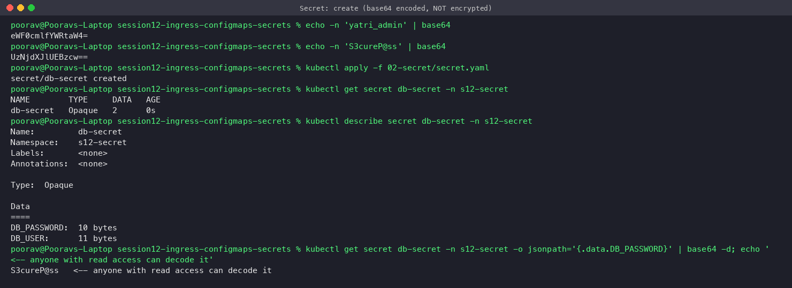

```bash
kubectl apply -f 02-secret/pod.yaml
kubectl exec secret-demo -n s12-secret -- sh -c 'echo DB_USER=$DB_USER; echo DB_PASSWORD=$DB_PASSWORD'
kubectl exec secret-demo -n s12-secret -- ls -l /etc/secrets/
# imperative alternative (no YAML file containing the value):
kubectl create secret generic api-key --from-literal=API_KEY=dummy-123 --dry-run=client -o yaml
```
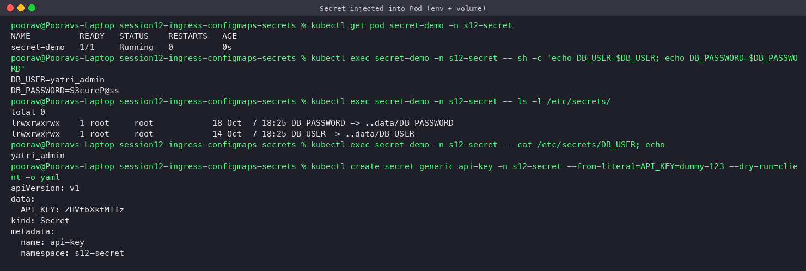

### Why Secrets must NOT be committed to Git
- **Base64 is encoding, not encryption.** The screenshot above decodes the password with one command — anyone who can read the YAML can read the secret.
- **Git history is forever.** Even if the file is deleted later, the value stays in every clone, fork, CI cache and backup. Removing it needs history rewriting *and* rotating the credential.
- **Repos are widely shared** (teammates, CI systems, public forks, leaked laptops); bots scan public GitHub for keys within minutes.
- **Compliance / least privilege** — access to code ≠ access to production credentials.

**What to do instead**
- Keep real secret manifests out of the repo with `.gitignore` → see [`02-secret/.gitignore.example`](02-secret/.gitignore.example); commit only a `*.example.yaml` with placeholders.
- Create secrets at deploy time: `kubectl create secret generic ... --from-literal / --from-env-file`, or from CI secrets (GitHub Actions `secrets.*`).
- **Sealed Secrets** (Bitnami): encrypt with the cluster's public key → the `SealedSecret` is safe to commit, only the in-cluster controller can decrypt.
- **External Secrets Operator / Secrets Store CSI driver** with AWS Secrets Manager, HashiCorp Vault, Azure Key Vault, GCP Secret Manager.
- **SOPS** (+ age/KMS) for encrypted files in GitOps repos.
- Enable **encryption at rest** for etcd and restrict `get secrets` with RBAC.
- Scan commits with **gitleaks / trufflehog** in pre-commit hooks and CI.

> The `secret.yaml` committed here contains **dummy demo values only**, for learning purposes.

---

## Task 3: Ingress

**Setup:** 3 Deployments (`frontend`, `backend`, `admin` — `hashicorp/http-echo`) each behind a ClusterIP Service ([`03-ingress/apps.yaml`](03-ingress/apps.yaml)) and one Ingress ([`03-ingress/ingress.yaml`](03-ingress/ingress.yaml)) with:
- **Path-based** routing on `yatri.local`: `/api/*` → `backend-svc`, `/*` → `frontend-svc` (with `rewrite-target` so `/api/health` reaches the backend as `/health`).
- **Host-based** routing: `admin.yatri.local` → `admin-svc`.

On macOS with the docker driver the minikube node IP is not reachable from the host, so the controller is reached through a port-forward:
```bash
kubectl apply -f 03-ingress/apps.yaml
kubectl apply -f 03-ingress/ingress.yaml
kubectl port-forward -n ingress-nginx svc/ingress-nginx-controller 18300:80 &
```
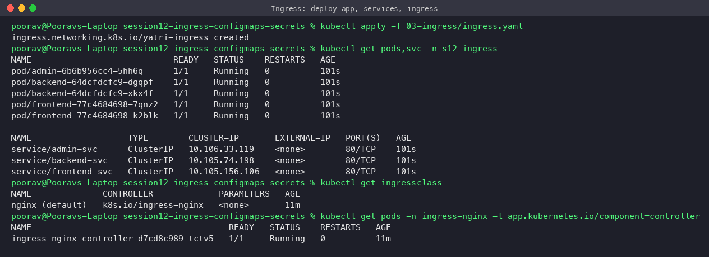

```bash
kubectl get ingress -n s12-ingress
kubectl describe ingress yatri-ingress -n s12-ingress
curl -H 'Host: yatri.local'       http://localhost:18300/
curl -H 'Host: yatri.local'       http://localhost:18300/api
curl -H 'Host: yatri.local'       http://localhost:18300/api/health
curl -H 'Host: admin.yatri.local' http://localhost:18300/
curl -H 'Host: other.local'       http://localhost:18300/     # -> 404 default backend
```
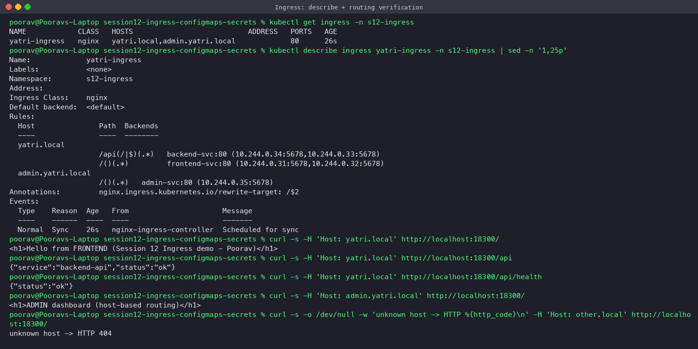

**Verification in a real browser** (Chrome, with `yatri.local`/`admin.yatri.local` resolving to 127.0.0.1):

| URL | Screenshot |
|---|---|
| `http://yatri.local:18300/` → frontend |  |
| `http://yatri.local:18300/api` → backend |  |
| `http://admin.yatri.local:18300/` → admin |  |

**Observation:** `describe ingress` lists the Pod IPs behind each backend — the controller proxies directly to Pod endpoints. An unknown host gets the controller's default 404 backend, proving routing is decided by Host header + path.

---

## Task 4: Ingress vs Ingress Controller
See [`04-ingress-vs-ingress-controller/README.md`](04-ingress-vs-ingress-controller/README.md).

---

## Task 5: Troubleshooting

All scenarios run in namespace `s12-troubleshoot`. Files are in [`05-troubleshooting/`](05-troubleshooting/) as `*-broken.yaml` / `*-fixed.yaml` pairs.

### Scenario 1 – "Password authentication failed" (Secret base64 newline gotcha)
1. **Problem:** `db-client` pod ends in `Error`; log says `FATAL: password authentication failed (got 11 chars, expected 10)`.
2. **Commands:** `kubectl get pod`, `kubectl logs`, decode the secret and inspect bytes with `xxd`.
3. **Root cause:** the value was encoded with `echo "S3cureP@ss" | base64` → trailing `0a` (`\n`) byte → `UzNjdXJlUEBzcwo=`.
4. **Fix:** re-encode with `echo -n` → `UzNjdXJlUEBzcw==` (or use `kubectl create secret --from-literal`, which never adds a newline), re-apply, recreate the pod.

| Before | After |
|---|---|
| 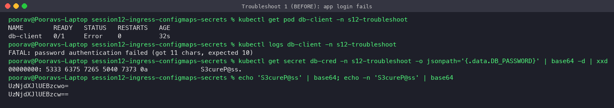 | 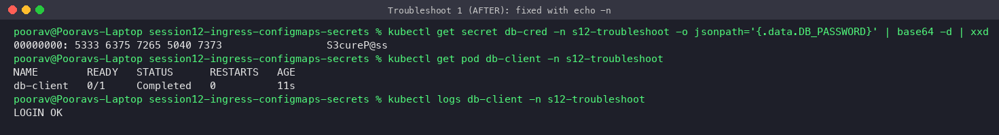 |

### Scenario 2 – Ingress returns HTTP 503
1. **Problem:** `curl -H 'Host: shop.local'` → `503 Service Temporarily Unavailable`, although pods are Running.
2. **Commands:** `kubectl get pods --show-labels`, `kubectl get svc -o wide` (selector), `kubectl get endpointslices`, `kubectl describe ingress`, ingress-nginx controller logs.
3. **Root cause:** Service selector `app=shop-web` doesn't match pod label `app=shop` → EndpointSlice empty → controller log `Service "s12-troubleshoot/shop-svc" does not have any active Endpoint`. Also `targetPort: 8080` while the container listens on `5678`.
4. **Fix:** selector `app: shop`, `targetPort: 5678` → endpoints populated → HTTP 200 `Shop is UP`.

| Before | After |
|---|---|
| 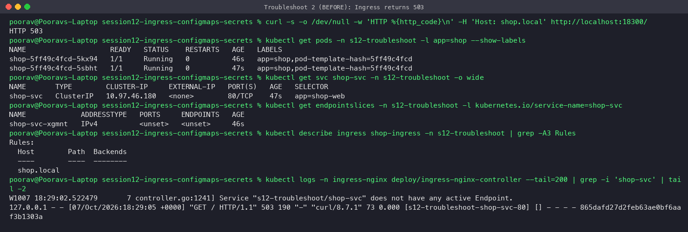 | 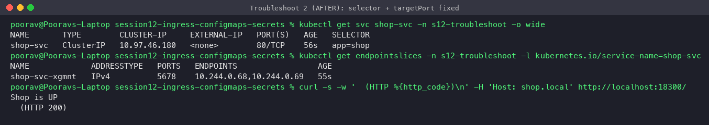 |

### Scenario 3 – CreateContainerConfigError (missing ConfigMap key)
1. **Problem:** pod stuck in `CreateContainerConfigError`.
2. **Commands:** `kubectl describe pod` (Events), `kubectl get configmap -o yaml`.
3. **Root cause:** event `couldn't find key THEME_COLOR in ConfigMap s12-troubleshoot/web-config` — the pod references a key that doesn't exist.
4. **Fix:** add `THEME_COLOR` to the ConfigMap (alternative: mark the ref `optional: true`). Kubelet retries automatically and the pod becomes `Running` without being recreated.

| Before | After |
|---|---|
| 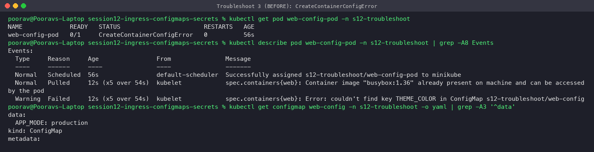 | 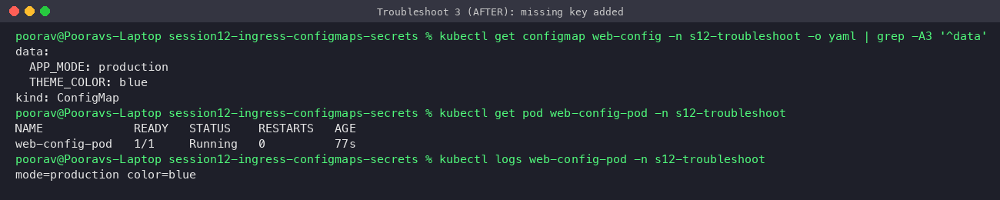 |

---

## Key learnings
- ConfigMap = non-secret config, Secret = sensitive config; both decouple config from images.
- Mounted ConfigMaps/Secrets update live; env vars need a pod restart.
- Base64 ≠ encryption; never commit real secrets — use Sealed Secrets / External Secrets / SOPS.
- Ingress needs an Ingress Controller; routing is by host + path to Services → EndpointSlices → Pods.
- 503 from ingress almost always means "no ready endpoints" → check selectors, labels, ports, readiness.

## Cleanup
```bash
kubectl delete ns s12-config s12-secret s12-ingress s12-troubleshoot
```
