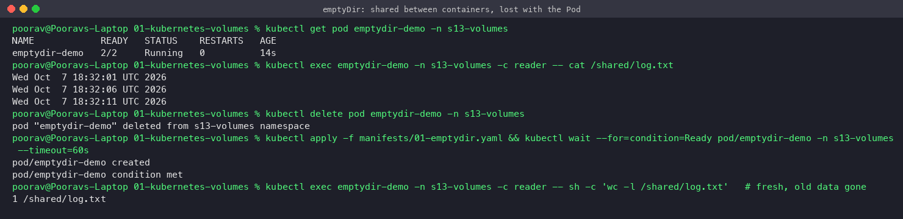
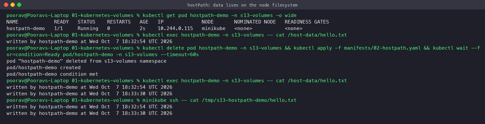
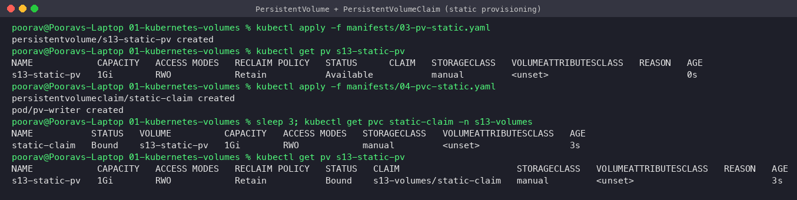
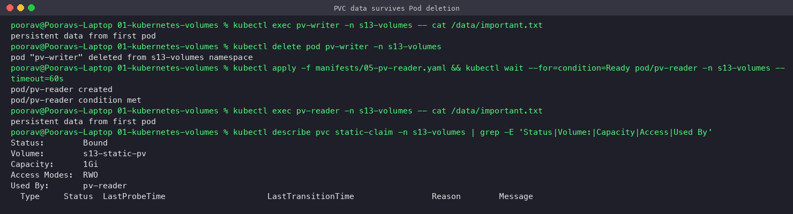
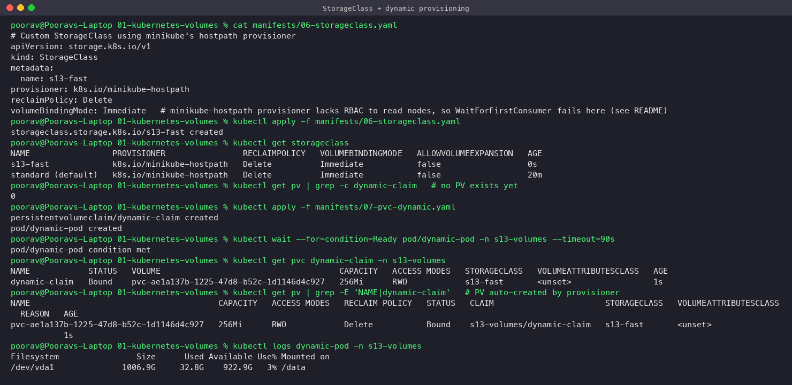
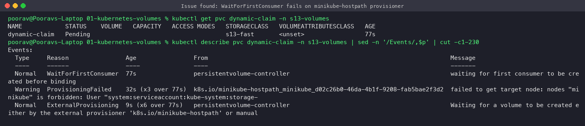
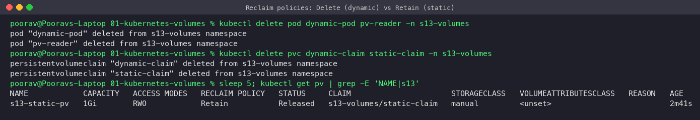

# 01 – Kubernetes Volumes

**Student:** Poorav Kumar Gupta — **Roll No:** 24bcs10080

Containers have an **ephemeral filesystem**: when a container restarts, everything it wrote is lost. Kubernetes **Volumes** attach storage to a Pod so data can be shared between containers and/or outlive containers and Pods.

```
Pod ──► volumeMounts ──► volume ──┬── emptyDir         (lives as long as the Pod)
                                  ├── hostPath         (lives on the node)
                                  ├── configMap/secret (projected config)
                                  └── persistentVolumeClaim ──► PersistentVolume ──► real storage
                                                    ▲                      ▲          (disk, NFS, EBS...)
                                                    │                      │
                                            StorageClass ── dynamic provisioner creates PVs on demand
```

All manifests are in [`manifests/`](manifests/); demos ran in namespace `s13-volumes` on minikube.

---

## 1. emptyDir
- Created **empty when the Pod is scheduled**, deleted **when the Pod is removed** (survives container restarts, not Pod deletion).
- Shared by all containers in the Pod → classic sidecar pattern (log shipper, cache, scratch space).
- `emptyDir.medium: Memory` uses tmpfs (RAM); `sizeLimit` caps usage.

[`01-emptydir.yaml`](manifests/01-emptydir.yaml): a `writer` container appends dates to `/cache/log.txt`, a `reader` container sees the same file at `/shared/log.txt`.



**Observed:** reader sees writer's lines (shared). After deleting and recreating the Pod the file restarts at 1 line → data was lost with the Pod.

**Use cases:** scratch/temp files, caches, sharing files between init container and app, sidecars.

---

## 2. hostPath
- Mounts a file/directory **from the node's filesystem** into the Pod.
- Data survives Pod deletion **but only on that node** — if the Pod is rescheduled elsewhere it sees different data.
- Security risk (a Pod can read/write the host) → avoid in production; used by system DaemonSets (log collectors reading `/var/log`, CNI, node exporters).
- `type: DirectoryOrCreate | Directory | File | Socket ...`

[`02-hostpath.yaml`](manifests/02-hostpath.yaml) mounts `/tmp/s13-hostpath-demo` of the minikube node.



**Observed:** after deleting/recreating the Pod both lines exist, and `minikube ssh` shows the same file directly on the node.

---

## 3. PersistentVolume (PV)
- A **cluster-scoped** piece of storage provisioned by an admin (static) or by a StorageClass (dynamic).
- Independent of any Pod lifecycle.
- Key fields: `capacity`, `accessModes`, `persistentVolumeReclaimPolicy`, `storageClassName`, and the backend (`hostPath`, `nfs`, `csi` (EBS/GCE PD/Azure Disk) ...).

| Access mode | Meaning |
|---|---|
| `ReadWriteOnce` (RWO) | mounted read-write by a single node |
| `ReadOnlyMany` (ROX) | read-only by many nodes |
| `ReadWriteMany` (RWX) | read-write by many nodes (NFS, EFS, CephFS) |
| `ReadWriteOncePod` | read-write by a single Pod |

| Reclaim policy | After PVC is deleted |
|---|---|
| `Retain` | PV becomes `Released`, data kept, admin cleans up manually |
| `Delete` | PV and underlying storage are deleted |

PV phases: `Available → Bound → Released (→ Failed)`.

## 4. PersistentVolumeClaim (PVC)
- A **namespaced request** for storage by a user/app: "I need 500Mi RWO of class X".
- Kubernetes **binds** the PVC to a matching PV (size ≥ request, same class & access mode, optional label selector). 1 PVC ↔ 1 PV.
- Pods reference only the PVC → app manifests stay independent of the storage backend.

**Static provisioning demo:** [`03-pv-static.yaml`](manifests/03-pv-static.yaml) (1Gi, class `manual`, Retain) + [`04-pvc-static.yaml`](manifests/04-pvc-static.yaml) (500Mi claim + writer pod).



**Observed:** PV goes `Available → Bound`; PVC shows capacity **1Gi** (the whole PV is bound even though 500Mi was requested).



**Observed:** the writer pod was deleted; a completely new pod (`pv-reader`) mounted the same claim and read `persistent data from first pod`.

---

## 5. StorageClass
- Describes a **"class" of storage** (fast SSD, cheap HDD, replicated...) and **which provisioner** creates volumes for it.
- Fields: `provisioner`, `parameters` (e.g. `type: gp3`), `reclaimPolicy`, `volumeBindingMode`, `allowVolumeExpansion`.
- One class can be marked `default` → PVCs without `storageClassName` use it (minikube: `standard`).
- Examples: `ebs.csi.aws.com` (AWS EBS), `pd.csi.storage.gke.io`, `disk.csi.azure.com`, `k8s.io/minikube-hostpath`.

```yaml
apiVersion: storage.k8s.io/v1
kind: StorageClass
metadata: {name: gp3}
provisioner: ebs.csi.aws.com
parameters: {type: gp3, encrypted: "true"}
reclaimPolicy: Delete
volumeBindingMode: WaitForFirstConsumer
allowVolumeExpansion: true
```

## 6. Dynamic provisioning
No admin-written PV: the PVC names a StorageClass, the **provisioner automatically creates a PV** (named `pvc-<uid>`) and binds it.

Demo: [`06-storageclass.yaml`](manifests/06-storageclass.yaml) + [`07-pvc-dynamic.yaml`](manifests/07-pvc-dynamic.yaml).



**Observed:** no PV existed before; after creating the PVC a PV `pvc-ae1a137b-...` of exactly **256Mi** appeared, was `Bound`, and the pod mounted it at `/data`.

### Real issue hit during the demo: `WaitForFirstConsumer` on minikube
I first created the class with `volumeBindingMode: WaitForFirstConsumer` (best practice on multi-zone clouds: the volume is created in the zone where the Pod is scheduled). The PVC stayed **Pending**:



- **Investigation:** `kubectl describe pvc` → `ProvisioningFailed: failed to get target node: nodes "minikube" is forbidden: User "system:serviceaccount:kube-system:storage-provisioner" cannot get resource "nodes"`.
- **Root cause:** with WaitForFirstConsumer the provisioner must read the selected Node object; minikube's built-in hostpath provisioner service account has no RBAC permission for `nodes`.
- **Fix used:** `volumeBindingMode: Immediate` (StorageClass fields are immutable → delete & recreate the class). On a real cloud (EBS CSI driver) WaitForFirstConsumer works and is recommended.

### Reclaim policy in action


**Observed:** after deleting both PVCs, the dynamic PV (policy `Delete`) disappeared automatically, while the static PV (policy `Retain`) stayed in `Released` state with its data.

---

## Summary table

| Type | Lifetime | Scope | Typical use |
|---|---|---|---|
| emptyDir | Pod | Pod | scratch, cache, sidecar sharing |
| hostPath | Node | Node | node agents, dev only |
| PV | Independent | Cluster | real persistent storage |
| PVC | Until deleted | Namespace | app's request for storage |
| StorageClass | – | Cluster | template + provisioner for dynamic PVs |
| Dynamic provisioning | – | – | PVs created on demand from PVC + StorageClass |
