# Session 13: Kubernetes Storage, HPA & Probes

**Student:** Poorav Kumar Gupta — **Roll No:** 24bcs10080
**Cluster:** minikube v1.37 (docker driver, 1 node), `metrics-server` addon enabled.

```
session13-storage-hpa-probes/
├── 01-kubernetes-volumes/   README.md + manifests/ + screenshots/   (Task 1)
├── 02-hpa/                  deployment.yaml, hpa.yml, load-generator.yaml   (Task 2)
├── 03-probes/               liveness / readiness / startup demos
└── 04-mini-project/         namespace, pvc, deployment, service, hpa, load-test   (Task 3)
```

---

## Task 1: Kubernetes Volumes
Full documentation with hands-on demos: **[01-kubernetes-volumes/README.md](01-kubernetes-volumes/README.md)**
(emptyDir, hostPath, PersistentVolume, PersistentVolumeClaim, StorageClass, dynamic provisioning, reclaim policies, plus a real `WaitForFirstConsumer` provisioning issue I hit and fixed on minikube).

---

## Task 2: HPA Hands-on

### How HPA works
```
metrics-server ──(scrapes kubelet every ~15s)──► Metrics API (metrics.k8s.io)
                                                     │
HPA controller (every 15s) ◄─────────────────────────┘
   desiredReplicas = ceil( currentReplicas × currentUtilization / targetUtilization )
   │
   └─► scales Deployment/cpu-app between minReplicas and maxReplicas
```
- Utilization is measured **as a percentage of the container's CPU *request*** → requests are mandatory.
- Scale-up is immediate; scale-down waits for the stabilization window (default 300s; set to 60s here for the demo).

### Files
| File | Purpose |
|---|---|
| [`02-hpa/deployment.yaml`](02-hpa/deployment.yaml) | CPU-heavy Python web app (every request runs a 300k-iteration sqrt loop), `requests.cpu: 100m`, `limits.cpu: 300m`, plus ClusterIP Service |
| [`02-hpa/hpa.yml`](02-hpa/hpa.yml) | `autoscaling/v2` HPA: min 1, max 8, target **50 % CPU**, custom scale-down behaviour |
| [`02-hpa/load-generator.yaml`](02-hpa/load-generator.yaml) | busybox Deployment running 4 parallel infinite `wget` loops against the Service |

### Step 1–3: Deploy app, configure HPA, verify
```bash
kubectl create ns s13-hpa
kubectl apply -f 02-hpa/deployment.yaml
kubectl apply -f 02-hpa/hpa.yml
kubectl get hpa -n s13-hpa
kubectl top pods -n s13-hpa
```
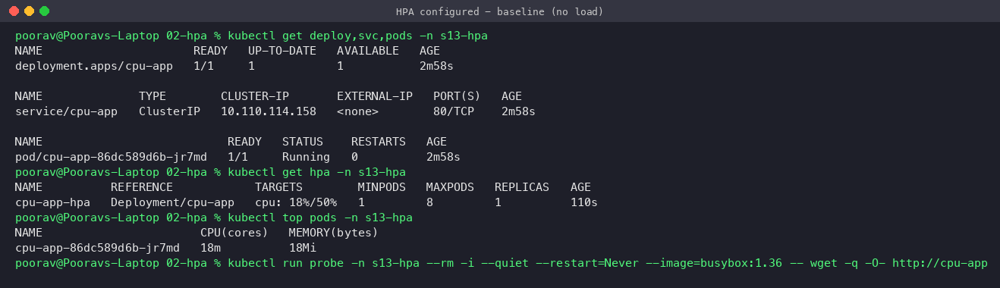
**Observed:** 1 replica, CPU **18 % / 50 %** → no scaling needed.

### Step 4–5: Deploy load generator, increase load
```bash
kubectl apply -f 02-hpa/load-generator.yaml
```
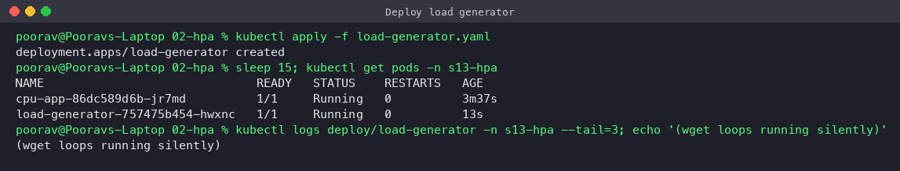

### Step 6–7: Observe CPU utilization and Pod scaling
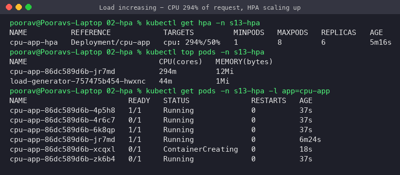
**Observed:** CPU jumped to **294 %** of request (294m on a 100m request, capped by the 300m limit). HPA computed `ceil(1 × 294/50) = 6` → new pods created (5, then 6).

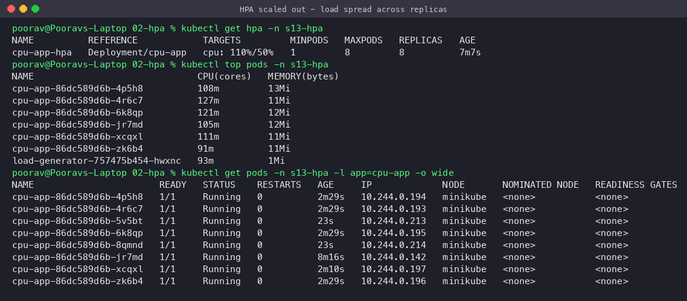
**Observed:** HPA reached **maxReplicas = 8**; load is spread, each pod now uses ~90–127m. Utilization stays at 110 % because 8 is the cap (`ScalingLimited: TooManyReplicas`).

```bash
kubectl describe hpa cpu-app-hpa -n s13-hpa
```
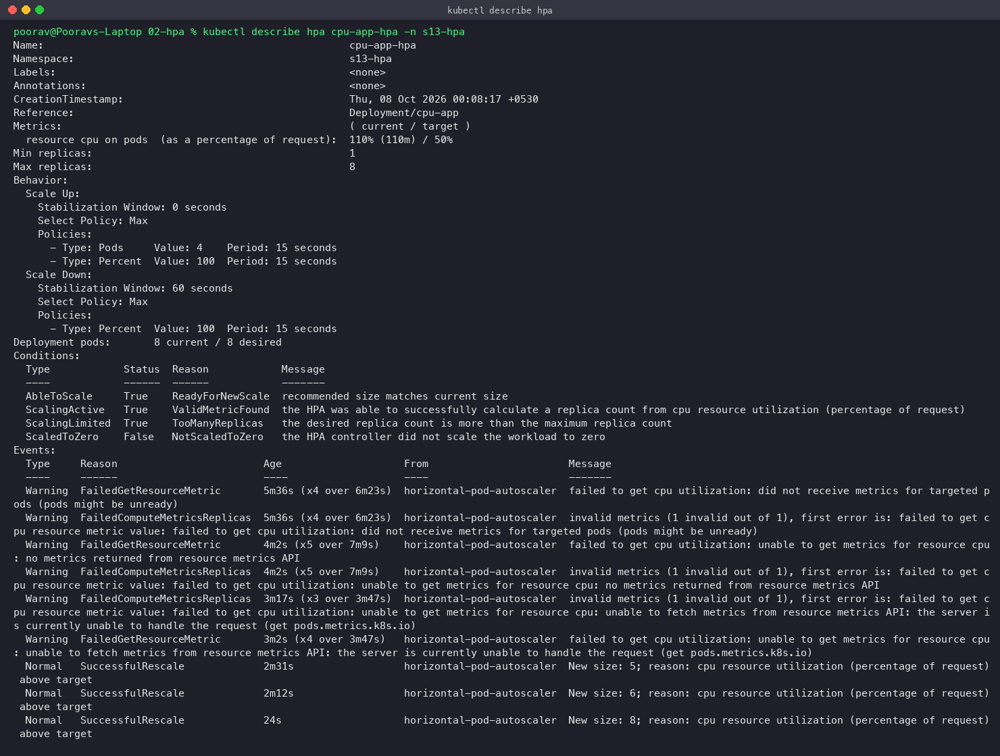
`describe` shows the current metric (`110% (110m) / 50%`), the scale-up/down behaviour policies, conditions (`AbleToScale`, `ScalingActive`, `ScalingLimited`) and events. The earlier `FailedGetResourceMetric` warnings came from metrics-server briefly timing out while scraping an overloaded kubelet (the shared node was at load-average ~16–37) — HPA simply keeps the current replica count while metrics are unavailable and resumed once they returned.

### Scale-down after removing load
```bash
kubectl delete -f 02-hpa/load-generator.yaml
```
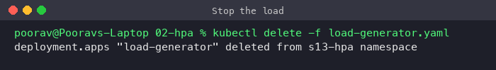
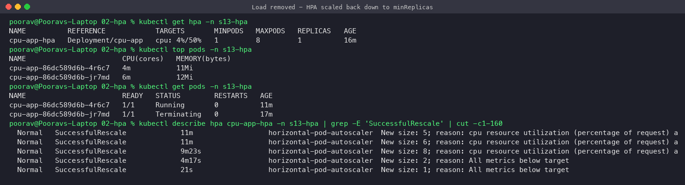
**Observed:** CPU fell to 4–11 %, HPA scaled **8 → 2 → 1** (`reason: All metrics below target`).

### Step 8: Full timeline (`kubectl get hpa -w`)
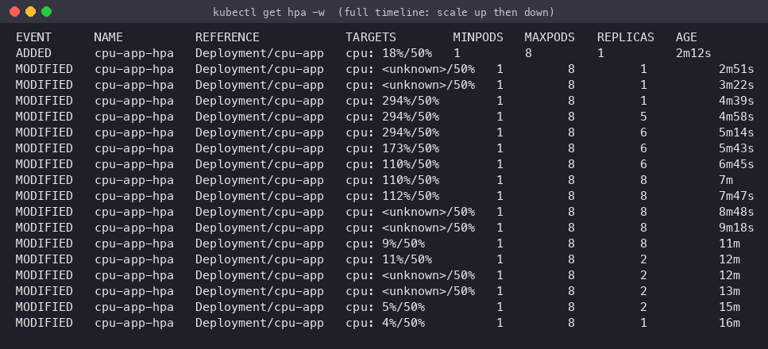

| Time | CPU | Replicas | What happened |
|---|---|---|---|
| 2m | 18 % | 1 | baseline |
| 4m39s | 294 % | 1 → 5 → 6 | load generator started |
| 7m | 110 % | 8 | hit maxReplicas |
| 11m | 9 % | 8 → 2 | load removed, after 60s stabilization |
| 16m | 4 % | 1 | back to minReplicas |

---

## Probes (Liveness, Readiness, Startup)

| Probe | Question it answers | On failure |
|---|---|---|
| **Startup** | Has the app finished booting? | Container killed & restarted after `failureThreshold × periodSeconds`; other probes disabled until it succeeds |
| **Readiness** | Can it receive traffic right now? | Pod marked `NotReady` and **removed from Service endpoints** (not restarted) |
| **Liveness** | Is it still healthy / not deadlocked? | Container **restarted** |

Probe mechanisms: `httpGet`, `tcpSocket`, `exec`, `grpc`. Tuning: `initialDelaySeconds`, `periodSeconds`, `timeoutSeconds`, `failureThreshold`, `successThreshold`.

### Liveness – [`03-probes/liveness.yaml`](03-probes/liveness.yaml)
Container deletes `/tmp/healthy` after 25 s → `cat /tmp/healthy` fails twice → kubelet kills and restarts it.
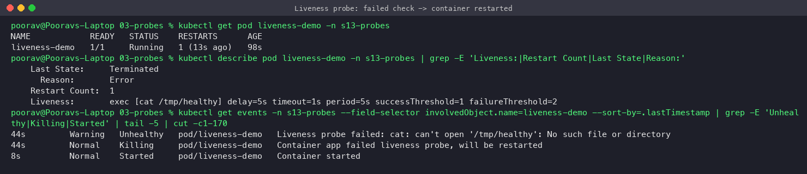

### Readiness – [`03-probes/readiness.yaml`](03-probes/readiness.yaml)
2 nginx pods behind a Service; I deleted `/ready` in one pod.
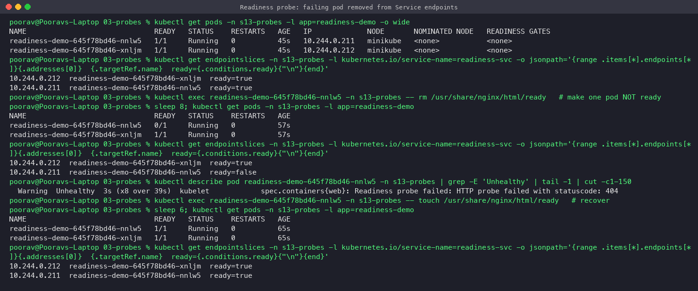
**Observed:** that pod went `0/1` and its endpoint became `ready=false` (no traffic), **no restart**. Re-creating the file made it ready again.

### Startup – [`03-probes/startup.yaml`](03-probes/startup.yaml) vs [`03-probes/startup-missing.yaml`](03-probes/startup-missing.yaml)
Both run an app that needs 20 s to boot and an aggressive liveness probe.
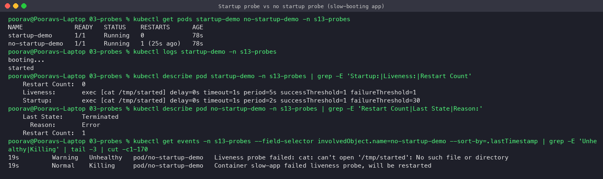
**Observed:** with a startup probe (up to 30 × 2 s = 60 s allowed) → **0 restarts**. Without it, liveness fails during boot → container killed (`Restart Count: 1`, `failed liveness probe, will be restarted`).

---

## Task 3: Mini Project – Production-ready web app

Based on the course mini project (namespace renamed to `s13-mini`). Combines **PVC persistence + HPA + startup/readiness/liveness probes + resource requests/limits**.

```
                 [ Service: web-service :80 ]
                              │
          ┌───────────────────┼───────────────────┐
          ▼                   ▼                   ▼
   [ web-app pod 1 ]   [ web-app pod 2 ]   [ pod N (HPA) ]
   startup/readiness/liveness probes, cpu 100m req / 200m limit
          └─────────── volumeMount /data ──────────┘
                              │
                 PVC web-data 500Mi RWO (StorageClass standard)
                              ▲
        HPA web-app-hpa: min 2, max 5, 50% CPU  ◄── metrics-server
```

| File | Content |
|---|---|
| [`namespace.yaml`](04-mini-project/namespace.yaml) | namespace `s13-mini` |
| [`pvc.yaml`](04-mini-project/pvc.yaml) | 500Mi RWO claim (dynamically provisioned) |
| [`deployment.yaml`](04-mini-project/deployment.yaml) | nginx:1.27, 2 replicas, 3 probes, requests/limits, PVC at `/data` |
| [`service.yaml`](04-mini-project/service.yaml) | ClusterIP `web-service` |
| [`hpa.yaml`](04-mini-project/hpa.yaml) | min 2 / max 5 / 50 % CPU |
| [`load-test.yaml`](04-mini-project/load-test.yaml) | 6 parallel wget loops |

### Deploy
```bash
kubectl apply -f namespace.yaml -f pvc.yaml -f deployment.yaml -f service.yaml -f hpa.yaml
kubectl get all,pvc -n s13-mini
```
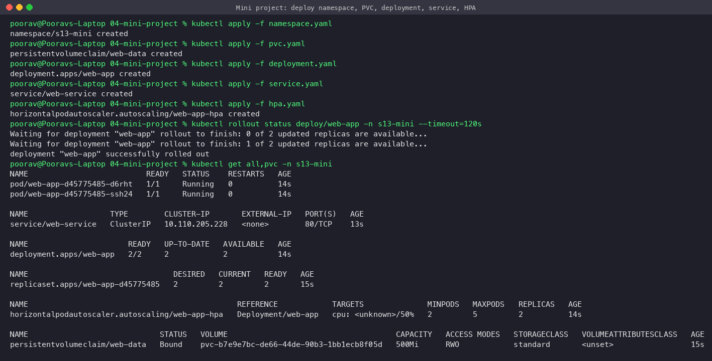

### Probes & Service
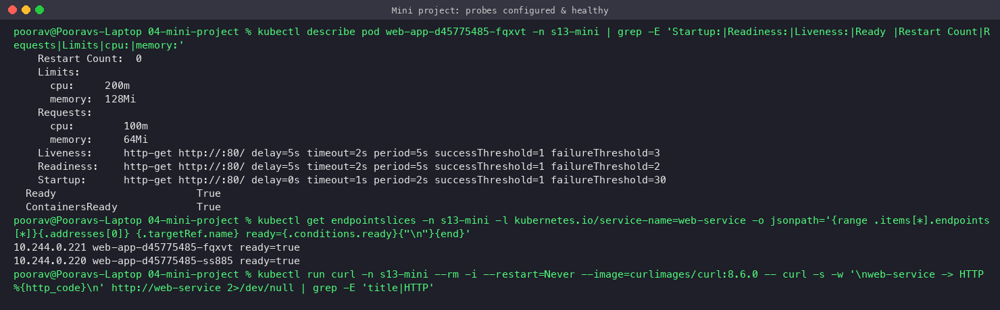

### Persistence
Wrote `/data/orders.txt`, deleted **both** pods, new pods still read the file.
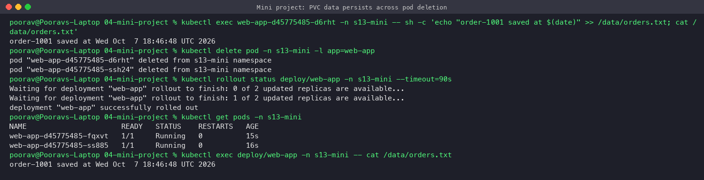

### HPA
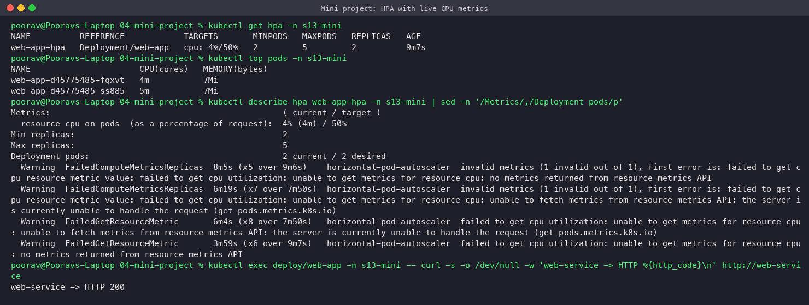
Under load (`kubectl apply -f load-test.yaml`) CPU reached 60 % / 50 % and HPA scaled **2 → 3**; the new replica mounts the same PVC:
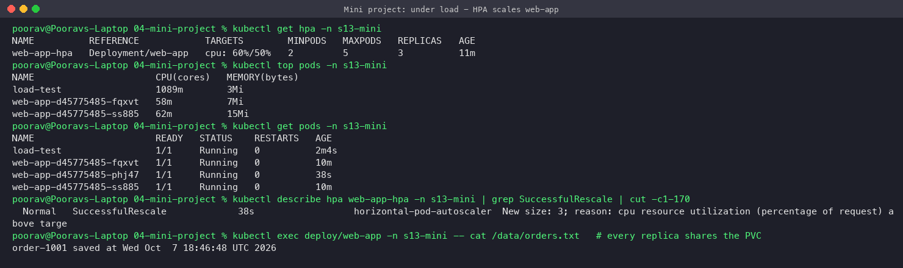

> Note: a `ReadWriteOnce` PVC can be shared by several pods only because they all run on the same (single) node. On a multi-node cluster use `ReadWriteMany` storage (NFS/EFS) or a StatefulSet with `volumeClaimTemplates` (one PVC per replica).

---

## Key learnings
- emptyDir dies with the Pod; hostPath is node-bound; PV/PVC give real persistence; StorageClasses enable dynamic provisioning.
- HPA needs metrics-server **and** CPU requests; it scales on `current/target × replicas`, bounded by min/max and behaviour policies.
- Readiness controls traffic, liveness controls restarts, startup protects slow boots.
- On a busy cluster metrics-server can time out → HPA shows `<unknown>` and holds replica count (fails safe).

## Cleanup
```bash
kubectl delete ns s13-volumes s13-hpa s13-probes s13-mini
```
