# Session 14: Kubernetes Troubleshooting

**Student:** Poorav Kumar Gupta — **Roll No:** 24bcs10080
**Cluster:** minikube v1.37 (docker driver, single node, 8 CPU allocatable), metrics-server enabled.

```
session14-kubernetes-troubleshooting/
├── 01-kubectl-commands/   demo-app.yaml + screenshots/          (Task 1)
├── 02-common-issues/      10 scenario folders (broken + fixed YAML) + screenshots/   (Task 2)
└── 03-mini-project/       course mini project + screenshots/    (Task 3)
```

**Troubleshooting mindset used for every problem:**
```
GET ──► DESCRIBE ──► EVENTS ──► LOGS ──► EXEC ──► TEST ──► FIX ──► VERIFY
```

---

## Task 1: Kubernetes troubleshooting commands

Demo workload: [`01-kubectl-commands/demo-app.yaml`](01-kubectl-commands/demo-app.yaml) — Deployment `demo-web` (2 replicas, `nginx` + a `logger` sidecar that prints a heartbeat every 5 s) and a ClusterIP Service, namespace `s14-commands`.

### `kubectl get` – list resources & their current status
```bash
kubectl get nodes
kubectl get pods -n s14-commands
kubectl get deploy,rs,svc -n s14-commands
kubectl get pods -n s14-commands --show-labels          # labels (selector debugging)
kubectl get pods -n s14-commands -l tier=frontend -o name
kubectl get pod <pod> -o jsonpath='{.status.phase} {.status.podIP}'
kubectl get pods -A --field-selector=status.phase!=Running   # find unhealthy pods cluster-wide
```
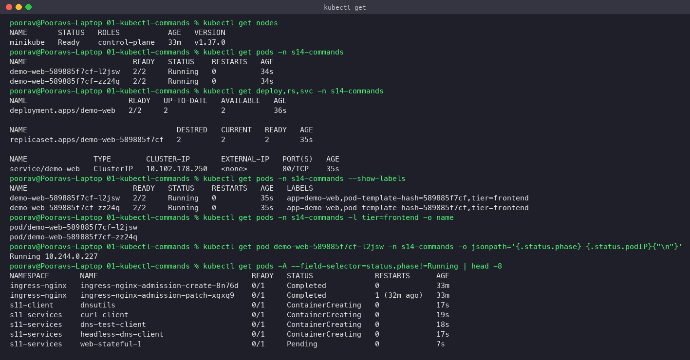

### `kubectl get -o wide` – extra columns: Pod IP, node, nominated node, selector, container images
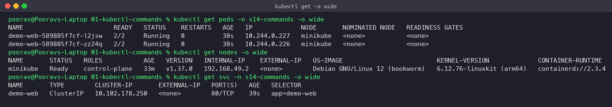

### `kubectl describe` – full detail + **Events** (most useful first step for a failing pod)
```bash
kubectl describe pod <pod> -n s14-commands
kubectl describe svc demo-web -n s14-commands     # Selector, TargetPort, Endpoints
kubectl describe deploy demo-web -n s14-commands  # strategy, replicas, image, rollout events
```
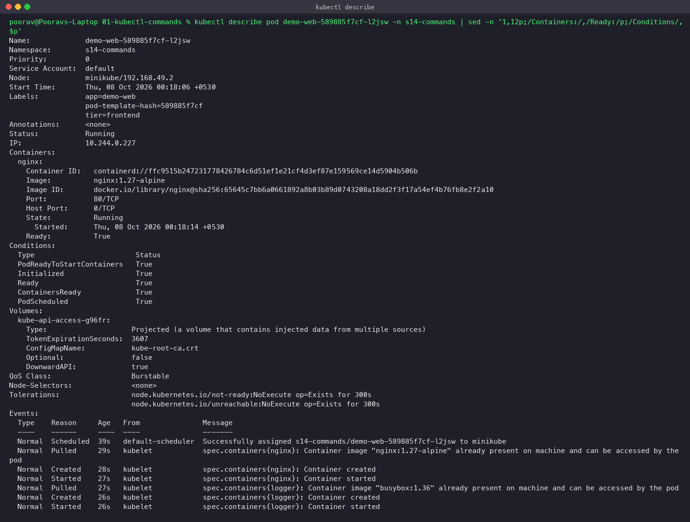
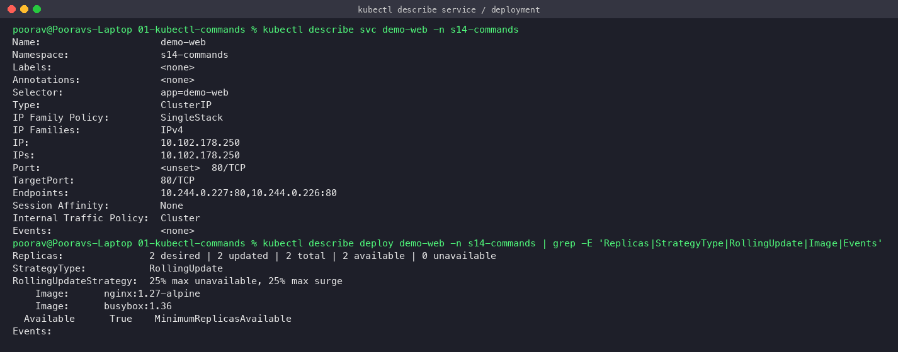

### `kubectl logs` – stdout/stderr of a container
```bash
kubectl logs <pod> -c logger --tail=5           # specific container in multi-container pod
kubectl logs deploy/demo-web -c logger --since=15s
kubectl logs -l app=demo-web -c logger --prefix # all pods matching a label
kubectl logs <pod> --all-containers --timestamps
kubectl logs <pod> --previous                   # logs of the crashed (previous) container
kubectl logs -f <pod>                           # follow / stream
```
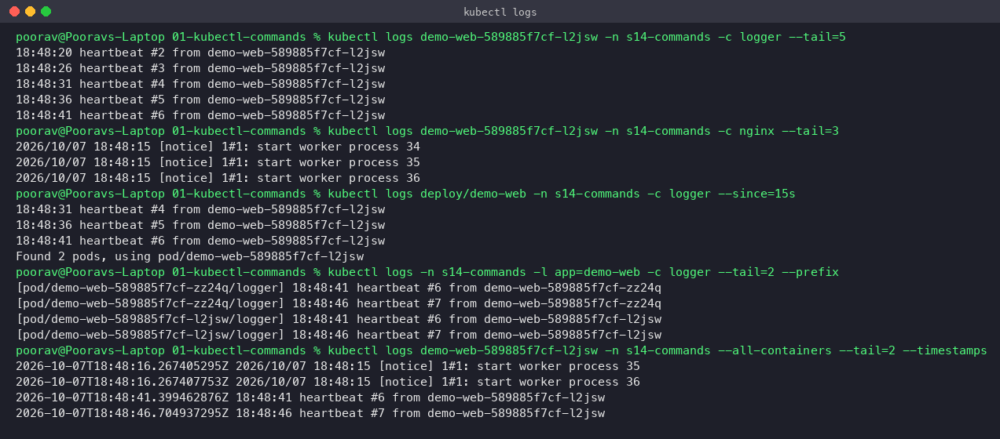

### `kubectl exec` – run commands inside a running container
```bash
kubectl exec <pod> -c nginx -- nginx -v
kubectl exec <pod> -c nginx -- cat /etc/resolv.conf              # DNS config
kubectl exec <pod> -c nginx -- wget -qO- http://demo-web.s14-commands.svc.cluster.local
kubectl exec -it <pod> -c nginx -- sh                             # interactive shell
```
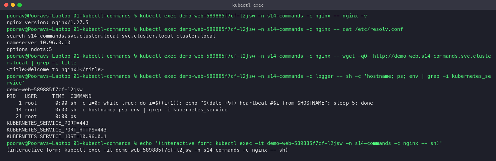

### `kubectl events` – what happened recently (scheduling, pulls, probe failures, kills)
```bash
kubectl events -n s14-commands
kubectl events -n s14-commands --types=Warning
kubectl events -n s14-commands --for deployment/demo-web
kubectl get events -n s14-commands --sort-by=.lastTimestamp
```
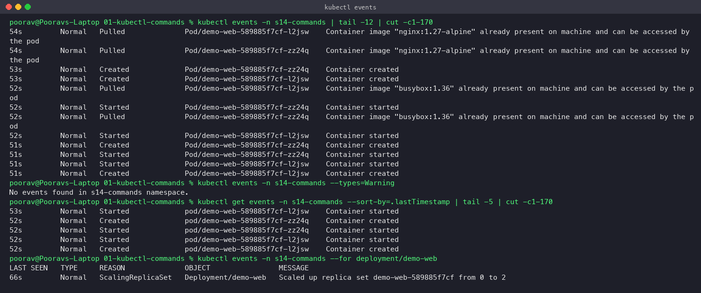

### `kubectl explain` – built-in API documentation for any field
```bash
kubectl explain pod.spec.containers.livenessProbe
kubectl explain deployment.spec.strategy.rollingUpdate.maxSurge
kubectl explain service.spec --recursive
```
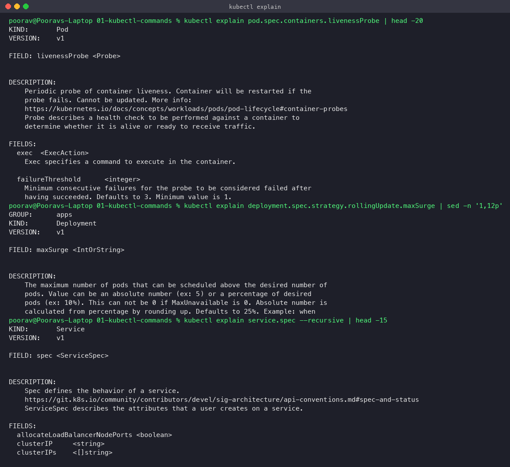

### `kubectl top` – live CPU/memory (needs metrics-server)
```bash
kubectl top nodes
kubectl top pods -n s14-commands --containers
kubectl top pods -A --sort-by=cpu
```
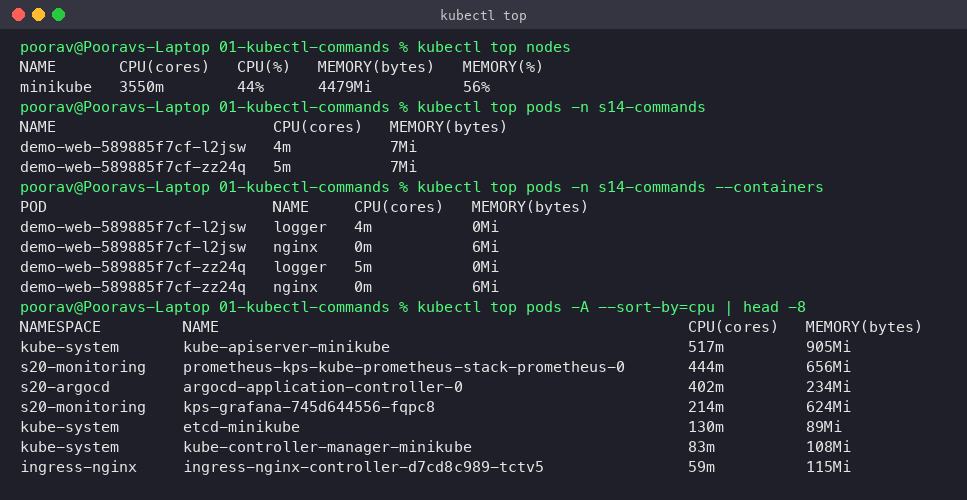

> Real-world note: while doing this homework my single minikube node hit load-average ~37 (other workloads incl. Prometheus/ArgoCD and a CPU-stress pod), and `kubectl top` returned `ServiceUnavailable` because metrics-server timed out scraping the kubelet (`Failed to scrape node, timeout to access kubelet` in `kubectl logs -n kube-system deploy/metrics-server`). Once load dropped, metrics returned. Lesson: when `top`/HPA shows `<unknown>`, check the metrics-server pod and its logs.

---

## Task 2: Troubleshooting common issues

All broken workloads were deployed at once into `s14-issues`:
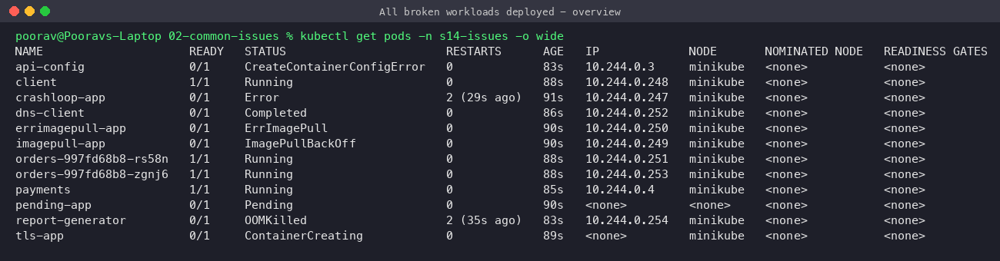

Each folder in [`02-common-issues/`](02-common-issues/) contains the `broken` and `fixed` manifests.

### 1. CrashLoopBackOff — [`01-crashloopbackoff/`](02-common-issues/01-crashloopbackoff/)
| Step | Detail |
|---|---|
| Identify | `kubectl get pod` → `CrashLoopBackOff`, restarts increasing |
| Investigate | `describe` → `Last State: Terminated, Reason: Error, Exit Code: 1`; `logs --previous` |
| Root cause | App exits because env var `DATABASE_URL` is missing: `[FATAL] DATABASE_URL environment variable is MISSING!` |
| Fix | Add `env: DATABASE_URL` to the pod spec (in production: from ConfigMap/Secret) |
| Verify | Pod `Running`, 0 restarts, log `Connected to postgres://... App running.` |

| Before | After |
|---|---|
| 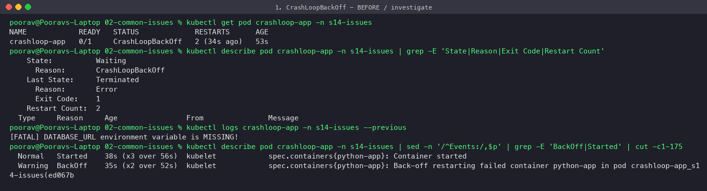 | 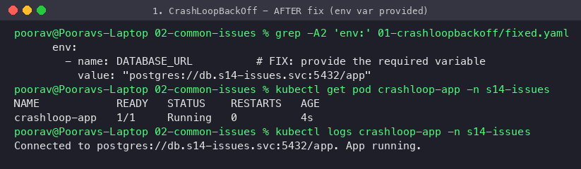 |

### 2. ImagePullBackOff — [`02-imagepullbackoff/`](02-common-issues/02-imagepullbackoff/)
| Step | Detail |
|---|---|
| Identify | Status `ImagePullBackOff` |
| Investigate | `describe` → `Image: nginx:1.27-alpine-typo`; events `Failed to pull image ... NotFound ... failed to resolve reference` |
| Root cause | Tag does not exist on Docker Hub. After repeated `ErrImagePull` failures kubelet backs off (exponential delay) → `ImagePullBackOff` |
| Fix | Correct tag `nginx:1.27-alpine` |
| Verify | Pod `Running`, events `Pulled / Created / Started` |

| Before | After |
|---|---|
| 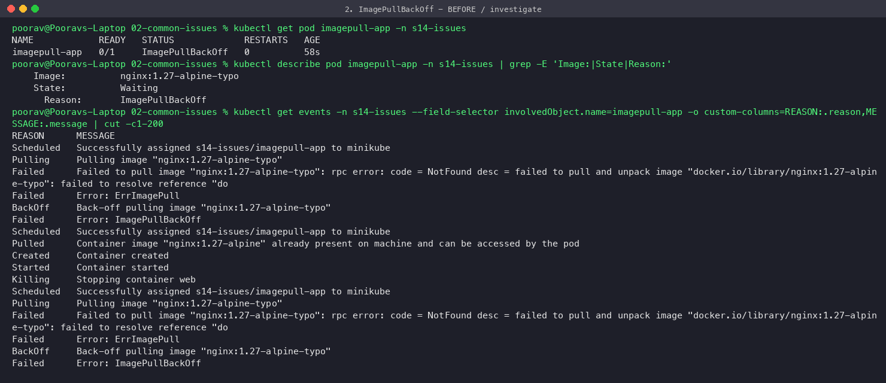 | 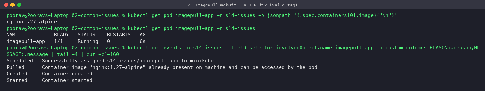 |

(The events list in the "before" screenshot also contains entries of a previous attempt of the same pod name, because events are kept per object name for ~1h.)

### 3. ErrImagePull — [`03-errimagepull/`](02-common-issues/03-errimagepull/)
| Step | Detail |
|---|---|
| Identify | Status `ErrImagePull` (the first pull failure, before back-off) |
| Investigate | Events: `failed to resolve reference "docker.io/yatri-company/yatri-api:v1": pull access denied`; `docker manifest inspect` → `denied: requested access to the resource is denied` |
| Root cause | Repository does not exist / is private and no `imagePullSecrets` are configured |
| Fix | Use the correct public image (for a private registry: `kubectl create secret docker-registry` + `imagePullSecrets`) |
| Verify | Pod `Running`, responds `yatri-api v1 OK` on its Pod IP |

| Before | After |
|---|---|
| 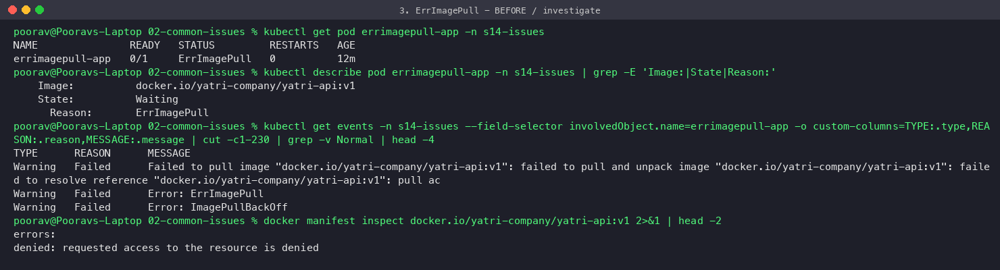 | 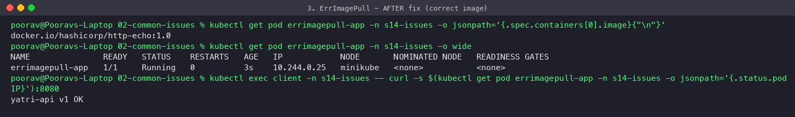 |

**ErrImagePull vs ImagePullBackOff:** `ErrImagePull` = the pull just failed; `ImagePullBackOff` = kubelet is waiting (10s, 20s, 40s… up to 5 min) before retrying after repeated failures. Same root causes: wrong name/tag, private repo without credentials, registry unreachable, rate limits.

### 4. Pending — [`04-pending/`](02-common-issues/04-pending/)
| Step | Detail |
|---|---|
| Identify | Status `Pending`, no IP, no node |
| Investigate | Event `FailedScheduling: 0/1 nodes are available: 1 node(s) didn't match Pod's node affinity/selector`; node labels have no `disktype`. After removing the selector, a second cause appeared: `1 Insufficient cpu` (requested 50 cores, node allocatable 8) |
| Root cause | (1) `nodeSelector: disktype=ssd` matches no node, (2) unrealistic CPU request |
| Fix | Remove the nodeSelector (or `kubectl label node minikube disktype=ssd`) and request `50m` |
| Verify | Pod scheduled on `minikube` and `Running` |

| Before (selector) | Before step 2 (cpu) | After |
|---|---|---|
| 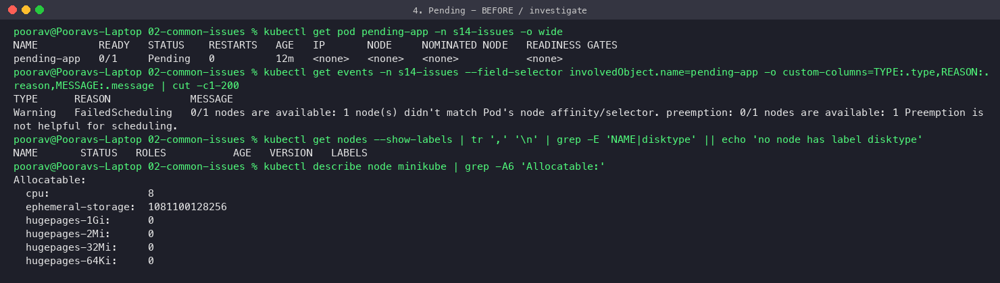 | 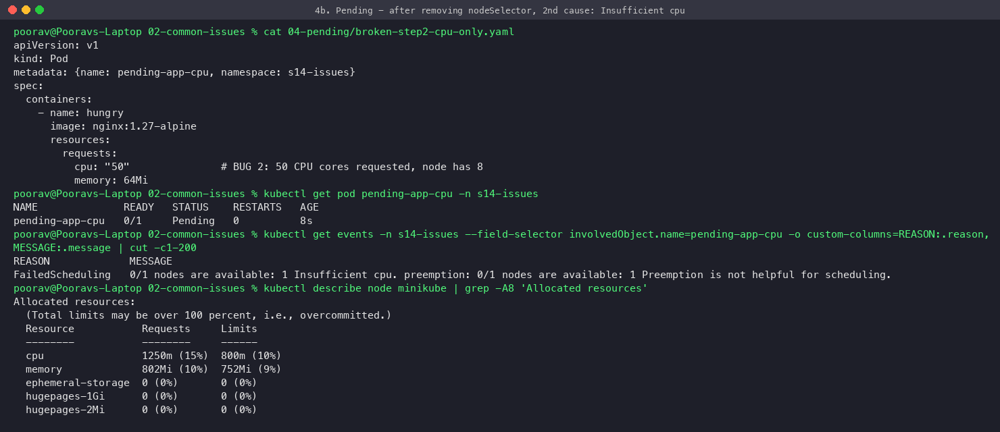 | 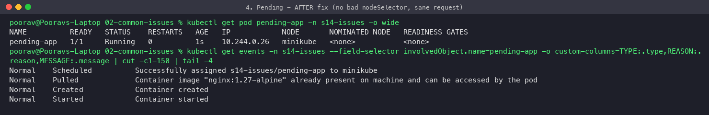 |

Other common Pending causes: unbound PVC, taints without tolerations, ResourceQuota, node `NotReady`.

### 5. ContainerCreating (stuck) — [`05-containercreating/`](02-common-issues/05-containercreating/)
| Step | Detail |
|---|---|
| Identify | Pod stuck in `ContainerCreating` for minutes |
| Investigate | Events: `FailedMount: MountVolume.SetUp failed for volume "tls" : secret "tls-cert" not found`; `kubectl get secret tls-cert` → NotFound |
| Root cause | Pod mounts a Secret volume that was never created |
| Fix | Create the Secret ([`fix-secret.yaml`](02-common-issues/05-containercreating/fix-secret.yaml)) — kubelet retries the mount automatically |
| Verify | Pod `Running`, files `tls.crt`/`tls.key` present in `/etc/tls` |

| Before | After |
|---|---|
| 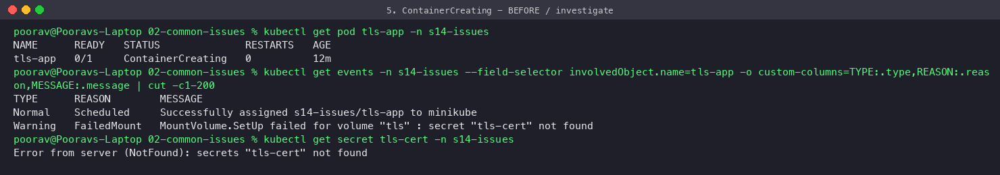 | 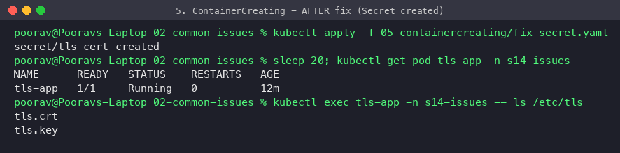 |

Other ContainerCreating causes: missing ConfigMap volume, PVC not attachable, CNI errors (`failed to set up sandbox`), slow image pull.

### 6. Service connectivity — [`06-service-connectivity/`](02-common-issues/06-service-connectivity/)
| Step | Detail |
|---|---|
| Identify | `curl http://orders-svc` from client pod → exit 7 (connection refused) although pods are Running |
| Investigate | `describe svc` → selector OK, endpoints exist but on **:8080**; container port is **5678**; curl directly to the Pod IP on 5678 works |
| Root cause | Wrong `targetPort` (8080 instead of 5678) |
| Fix | `targetPort: http` (named container port) |
| Verify | Endpoints `...:5678`, curl via Service returns `orders service OK` |

| Before | After |
|---|---|
| 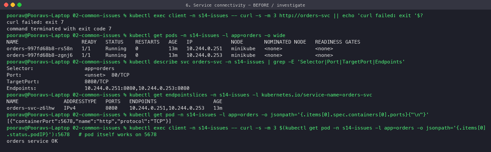 | 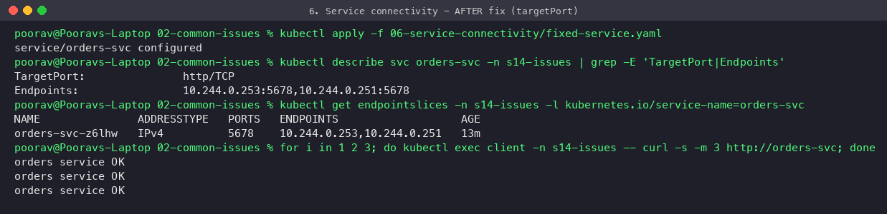 |

Service checklist: selector ↔ pod labels, `targetPort` ↔ containerPort, pods Ready (readiness probe), endpoints not empty, NetworkPolicies.

### 7. DNS issue — [`07-dns/`](02-common-issues/07-dns/)
| Step | Detail |
|---|---|
| Identify | Client log `ERROR: could not reach http://inventory-svc/` |
| Investigate | `nslookup inventory-svc` → `NXDOMAIN` for `inventory-svc.s14-issues.svc.cluster.local`; `/etc/resolv.conf` search domains start with the pod's own namespace; `kubectl get svc -A` shows the service lives in `s14-dns-backend`; CoreDNS pods healthy; FQDN lookup works |
| Root cause | Short service names only resolve inside the **same namespace**; the backend is in another namespace |
| Fix | Use `inventory-svc.s14-dns-backend.svc.cluster.local` (or `inventory-svc.s14-dns-backend`) |
| Verify | Client log `inventory: 42 items in stock` |

| Before | After |
|---|---|
| 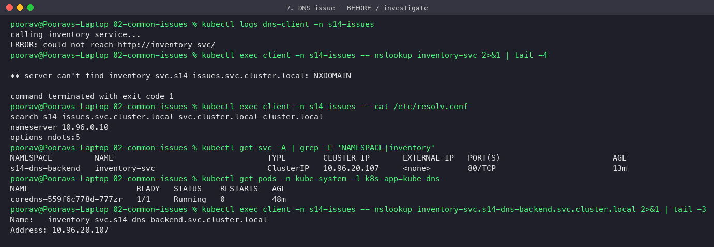 | 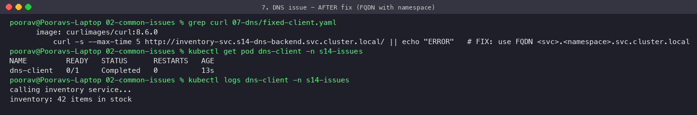 |

### 8. Pod networking issue — [`08-pod-networking/`](02-common-issues/08-pod-networking/)
| Step | Detail |
|---|---|
| Identify | Pod Running, endpoint present, but curl via Service **and** via Pod IP fail (exit 7) |
| Investigate | `exec` inside the pod: `127.0.0.1:8000` returns 200; `netstat -tln` → listening on `127.0.0.1:8000` only |
| Root cause | Application binds to loopback, so traffic arriving on the Pod's network interface (eth0) is refused |
| Fix | Bind to `0.0.0.0` |
| Verify | `netstat` shows `0.0.0.0:8000`; HTTP 200 via Pod IP and via Service |

| Before | After |
|---|---|
| 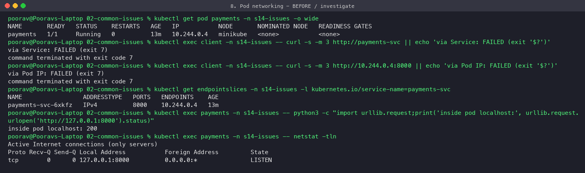 | 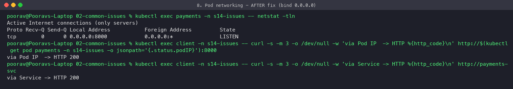 |

Other pod-networking causes: NetworkPolicy deny rules, CNI plugin down, wrong `hostPort`, MTU problems.

### 9. Configuration issue (resource limits → OOMKilled) — [`09-configuration/`](02-common-issues/09-configuration/)
| Step | Detail |
|---|---|
| Identify | `CrashLoopBackOff`, 7 restarts |
| Investigate | `describe` → `Last State: Terminated, Reason: OOMKilled, Exit Code: 137`; `Limits: memory 20Mi`; `logs --previous` stops at "Loading 100MB dataset…" |
| Root cause | Memory limit misconfigured far below what the app needs → kernel OOM killer kills the container |
| Fix | Limit `256Mi` (sized from real usage) |
| Verify | `Report generated OK`, 0 restarts, `kubectl top` shows 103Mi used |

| Before | After |
|---|---|
| 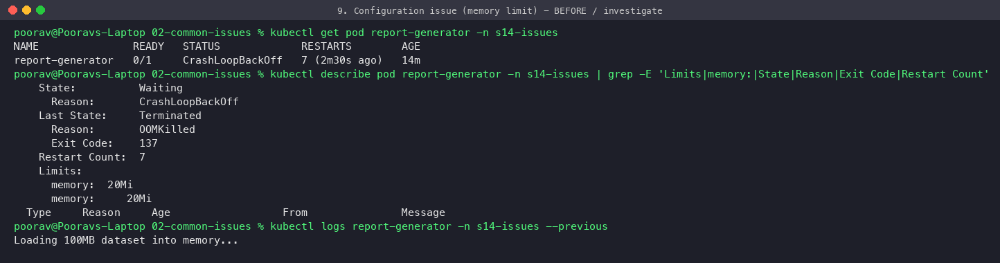 | 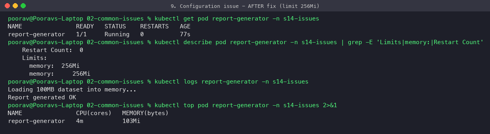 |

### 10. Configuration issue (missing Secret → CreateContainerConfigError) — [`10-createcontainerconfigerror/`](02-common-issues/10-createcontainerconfigerror/)
| Step | Detail |
|---|---|
| Identify | Status `CreateContainerConfigError` |
| Investigate | Warning event `Error: secret "api-secret" not found` |
| Root cause | Env var references a Secret that doesn't exist |
| Fix | `kubectl create secret generic api-secret --from-literal=API_KEY=...` |
| Verify | Pod `Running`, log `API_KEY length=14` |

| Before | After |
|---|---|
| 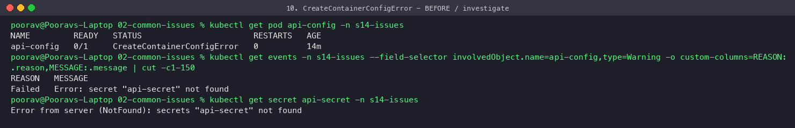 | 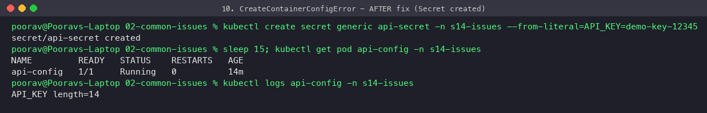 |

### All fixed
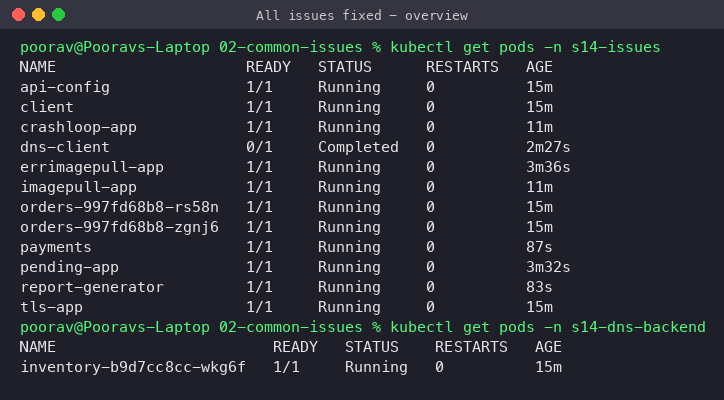

### Quick reference

| Symptom | First command | Typical root causes |
|---|---|---|
| CrashLoopBackOff | `logs --previous`, `describe` (exit code) | app error, missing env/config, bad command, failing liveness, OOM (137) |
| ImagePullBackOff / ErrImagePull | `describe` events | wrong image/tag, private repo, no pull secret, registry down |
| Pending | `describe` → FailedScheduling | resources, nodeSelector/affinity, taints, PVC unbound, quota |
| ContainerCreating | `describe` events | missing Secret/ConfigMap volume, PVC attach, CNI |
| CreateContainerConfigError | `describe` events | missing ConfigMap/Secret or key |
| Service not reachable | `describe svc`, `get endpoints` | selector mismatch, wrong targetPort, pods not Ready |
| DNS failure | `nslookup`, `/etc/resolv.conf` | wrong name/namespace, CoreDNS down |
| Pod IP unreachable | `exec … netstat` | app bound to 127.0.0.1, NetworkPolicy |
| OOMKilled | `describe` (Reason, 137) | memory limit too low / memory leak |

---

## Task 3: Mini project – Troubleshooting challenge

Files from the course ([`03-mini-project/`](03-mini-project/)): `deployment.yaml` (nginx:1.27 ×2), `service.yaml`, `broken-pod.yaml`; plus my `fixed-pod.yaml` and `service-broken-selector.yaml`. Namespace `s14-mini`.

### 1. Deploy
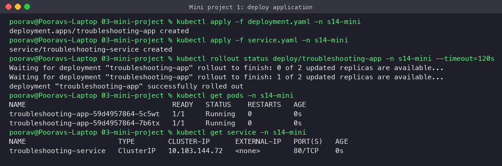

### 2. Check the application (`get -o wide`, `describe`, `logs`, `exec curl localhost`)
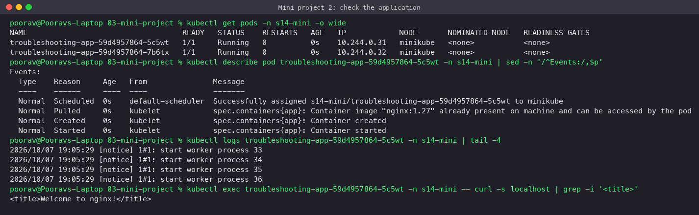

### 3–4. Check the Service and endpoints (selector, targetPort, endpoints = pod IPs)
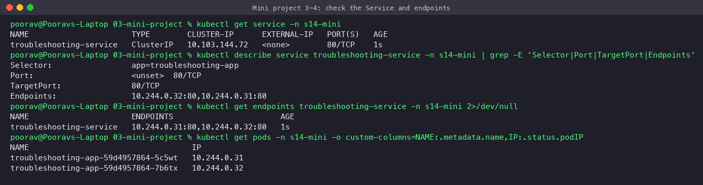

### 5–6. Broken pod
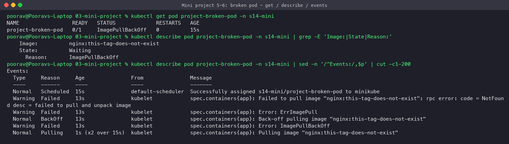

**Q1. What is the Pod status?** `ImagePullBackOff` (preceded by `ErrImagePull`).
**Q2. What is the actual error?** `Failed to pull image "nginx:this-tag-does-not-exist": rpc error: code = NotFound desc = failed to pull and unpack image`.
**Q3. Which command helped find the reason?** `kubectl describe pod project-broken-pod` (Events section).
**Q4. What is wrong with the image?** The repository `nginx` exists but the tag `this-tag-does-not-exist` does not.
**Q5. How to fix it?** Use a valid tag (`nginx:1.27`) — pod spec images are immutable for most fields, so delete and re-create the pod (or fix it in the Deployment).

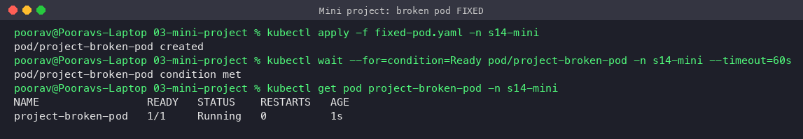

### 8–9. Service selector challenge
Changed selector to `app: wrong-app`:
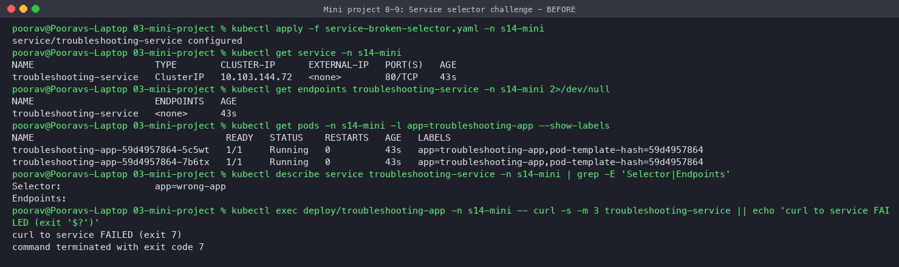
Endpoints `<none>`, curl fails. `get pods --show-labels` shows `app=troubleshooting-app` ≠ selector `app=wrong-app`. Restored selector:
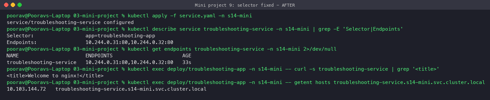

### 11. Troubleshooting table

| Problem | What I Saw | Command I Used | Root Cause | Fix |
|---|---|---|---|---|
| **Broken Pod** | `project-broken-pod 0/1 ImagePullBackOff` | `kubectl get pod`, `kubectl describe pod` | Image tag does not exist | Use `nginx:1.27`, recreate pod |
| **Service Problem** | Endpoints `<none>`, curl to service fails (exit 7) | `kubectl get endpoints`, `kubectl describe service`, `kubectl get pods --show-labels` | Selector `app=wrong-app` doesn't match pod label `app=troubleshooting-app` | Restore selector `app: troubleshooting-app` |
| **Image Problem** | Events `Failed to pull image ... NotFound`, `Back-off pulling image` | `kubectl describe pod` (Events) | Non-existent tag `this-tag-does-not-exist` | Correct tag; verify with `docker manifest inspect` before deploying |

### 12. README questions

1. **What does `kubectl get` tell us?** A one-line summary per resource: name, readiness (e.g. `1/1`), status/phase, restarts, age — plus IP/node with `-o wide`. It's the "what is the current state" command.
2. **Difference between `get` and `describe`?** `get` is a compact list (or raw YAML/JSON with `-o yaml`); `describe` is a human-readable deep view of one object including related info (conditions, volumes, endpoints) and its recent **Events** — where the *why* usually is.
3. **Why `kubectl logs`?** To read the application's stdout/stderr — runtime errors, stack traces, startup messages. `--previous` shows logs of the last crashed container, essential for CrashLoopBackOff.
4. **When to use `kubectl exec`?** To test from inside the container: check config files/env vars, `curl localhost` vs Pod IP, DNS lookups (`nslookup`), listening ports (`netstat`), connectivity to other services.
5. **CrashLoopBackOff?** The container starts and keeps exiting/crashing; kubelet restarts it with increasing back-off delay (10 s → 5 min).
6. **ImagePullBackOff?** Kubelet can't pull the image (wrong name/tag, private repo, no credentials, network) and is waiting before retrying.
7. **Why can a Pod stay Pending?** The scheduler can't place it: insufficient CPU/memory, nodeSelector/affinity mismatch, taints without tolerations, unbound PVC, quotas, no Ready nodes.
8. **Why can a Service have no endpoints?** Selector doesn't match any pod labels, matching pods aren't Ready (readiness probe failing), pods in a different namespace, or no pods running.
9. **Service selector ↔ Pod labels?** The Service's `selector` is a label query; every Ready pod whose labels match is added to the Service's EndpointSlice. Labels are the only link between them.
10. **What is Kubernetes DNS?** CoreDNS running in `kube-system` (Service `kube-dns`, 10.96.0.10). It gives every Service a name `<service>.<namespace>.svc.cluster.local`; pods get `nameserver 10.96.0.10` and search domains in `/etc/resolv.conf`, so short names resolve within the same namespace.

---

## Key learnings
- Don't guess: `get → describe → events → logs → exec → test → fix → verify`.
- The **Events** section explains almost every scheduling, pull, mount and probe problem.
- `logs --previous` is the key for crashing containers; exit code 137 = OOMKilled/SIGKILL, 1 = app error.
- Most Service problems are label/selector or port mismatches; most DNS problems are wrong names/namespaces.
- Some fixes self-heal (creating a missing Secret/ConfigMap), others need the pod to be recreated (image, env, resources).

## Cleanup
```bash
kubectl delete ns s14-commands s14-issues s14-dns-backend s14-mini
```
