# Session 15: Helm

**Student:** Poorav Kumar Gupta | **Enrollment No:** 24bcs10080
**Environment:** minikube v1.37 (Kubernetes v1.37.0) on macOS, Helm v4.3.0

Helm is the package manager for Kubernetes. A **chart** is a package of templated Kubernetes manifests, `values.yaml` holds the default configuration, and each install of a chart is a **release**. Every install/upgrade/rollback creates a new numbered **revision** that Helm stores as a Secret in the release's namespace, which is what makes `helm history` and `helm rollback` possible.

```
session15-helm/
├── myapp/                    # chart made by `helm create` (+ a configmap-served HTML page)
│   ├── Chart.yaml
│   ├── values.yaml
│   └── templates/ (deployment, service, configmap, ingress, hpa, serviceaccount, NOTES.txt, tests/)
├── rollback-values/          # v2.yaml, v3.yaml used in the rollback workflow
├── rollback-workflow.sh      # Task 2, fully scripted
├── mini-project/
│   ├── notes-chart/          # Task 3 chart (Chart.yaml, values.yaml, values-prod.yaml, templates/)
│   └── run-mini-project.sh
└── screenshots/
```

---

## Task 1: Helm commands

| Command | What it does |
|---|---|
| `helm create <name>` | Scaffolds a new chart with best-practice templates |
| `helm lint <chart>` | Checks a chart for errors and recommended practices |
| `helm template <rel> <chart>` | Renders templates locally to plain YAML without installing |
| `helm install <rel> <chart>` | Installs a chart into the cluster as a new release (revision 1) |
| `helm list` | Lists releases (`-n ns` for one namespace, `-A` for all) |
| `helm status <rel>` | Shows release status, last deploy time, revision and NOTES |
| `helm get values/manifest/notes/metadata/all` | Shows the stored data of a release revision |
| `helm upgrade <rel> <chart>` | Applies new chart/values to a release and creates a new revision |
| `helm history <rel>` | Lists all revisions of a release with status and description |
| `helm rollback <rel> <rev>` | Re-deploys a previous revision as a **new** revision |
| `helm uninstall <rel>` | Deletes all resources of a release and its history |
| `helm repo add/list/update/remove` | Manages chart repositories |
| `helm search repo / hub` | Searches added repositories / Artifact Hub |

### helm create
Generates the standard chart skeleton: `Chart.yaml` (metadata), `values.yaml` (defaults), `templates/` (deployment, service, ingress, HPA, service account, NOTES.txt, test hook) and `_helpers.tpl` (named templates for names and labels).

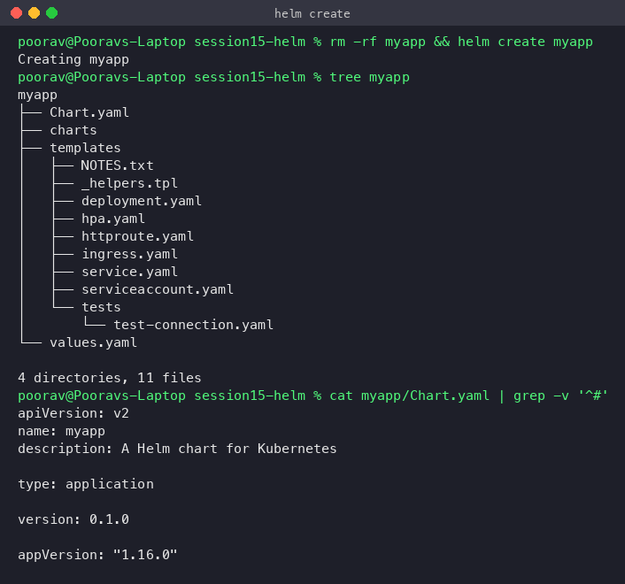

I then pinned `image.tag: "1.24"` and added `templates/configmap.yaml`, which renders an `index.html` showing the release name, revision and image. Nginx serves that page, so every version can be checked in a browser. The deployment also gets a `checksum/config` annotation, which makes the pods roll whenever the page changes.

### helm lint / template / install
`lint` passes (only an informational "icon is recommended"). `template` shows the rendered kinds and image before anything touches the cluster. `install --wait` waits until the deployment is ready.

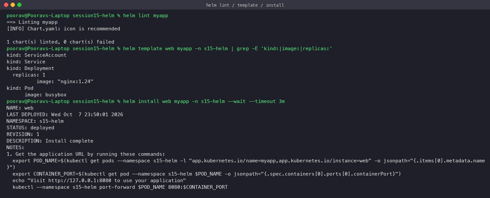

### helm list / helm status
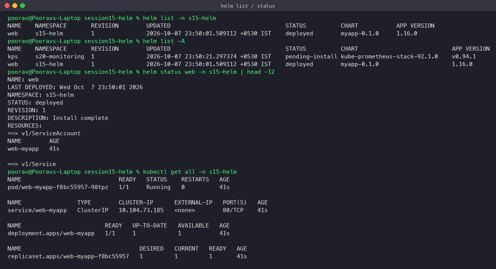

### helm get
`get values` shows only user-supplied values (none at install). `--all` shows the merged values. `get manifest` shows exactly what was applied to the cluster. `get metadata` shows chart, version, revision and status.

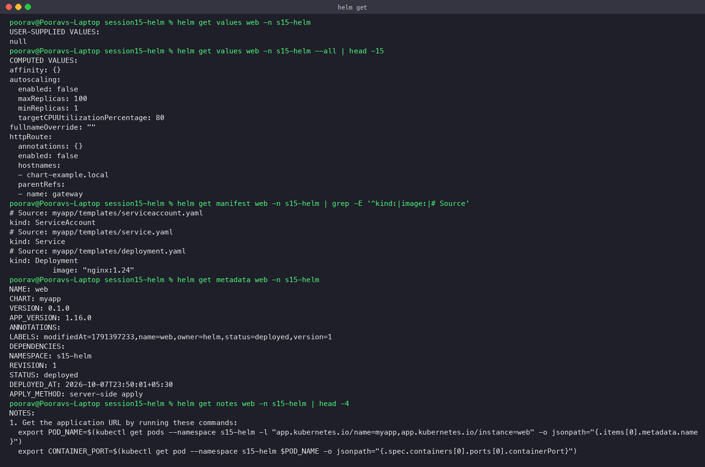

### helm upgrade
Upgrading with `--set image.tag=1.25 --set replicaCount=2` creates revision 2. The deployment now runs 2 pods with `nginx:1.25`.

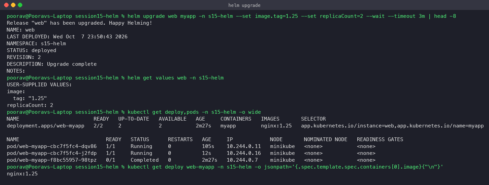

### helm history / helm rollback
`helm rollback web 1` does not delete revision 2. It creates **revision 3**, which is a copy of revision 1 (description "Rollback to 1"). The deployment returns to 1 replica of `nginx:1.24`.

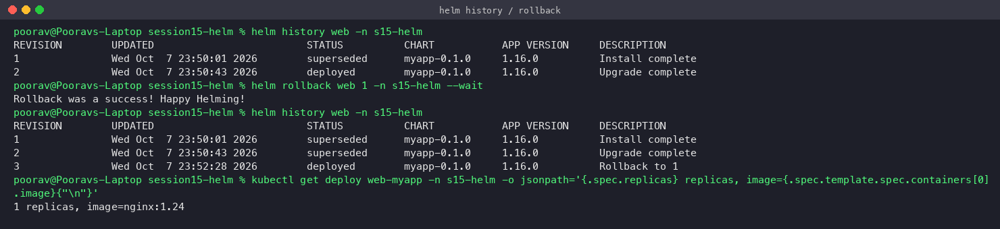

### helm repo / helm search
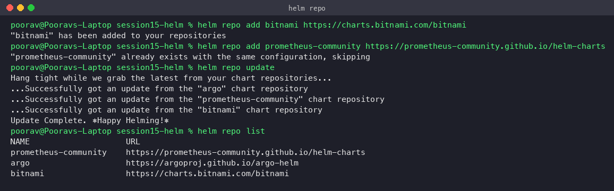
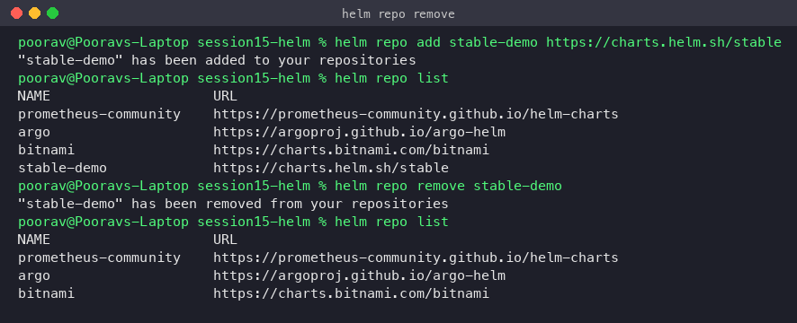
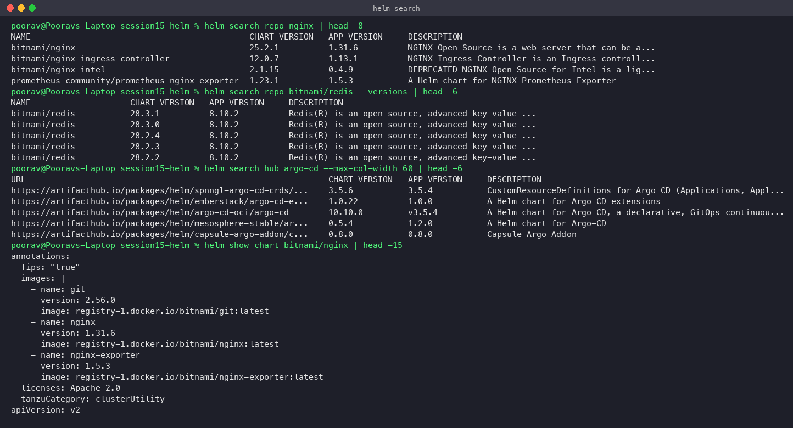

### helm uninstall
All resources (deployment, service, configmap, service account) and the release history are removed.

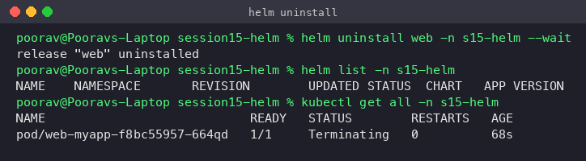

---

## Task 2: Helm rollback workflow

Script: [`rollback-workflow.sh`](rollback-workflow.sh). Release `webapp` in namespace `s15-rollback`. Verification happens after each step through `helm history`, `kubectl get deploy,rs,pods`, a `curl` of the page and a real browser screenshot taken over `kubectl port-forward`.

| Step | Command | Revision | Result |
|---|---|---|---|
| Install | `helm install webapp myapp` | 1 | nginx:1.24, 1 replica, blue "v1" page |
| Upgrade | `helm upgrade webapp myapp -f rollback-values/v2.yaml` | 2 | nginx:1.25, 2 replicas, green "v2" page |
| Upgrade again | `helm upgrade webapp myapp -f rollback-values/v3.yaml` | 3 | nginx:1.26, 3 replicas, red "v3" page |
| Rollback | `helm rollback webapp 2` | 4 | back to nginx:1.25, 2 replicas, green "v2" page |

### 1. Install → verify
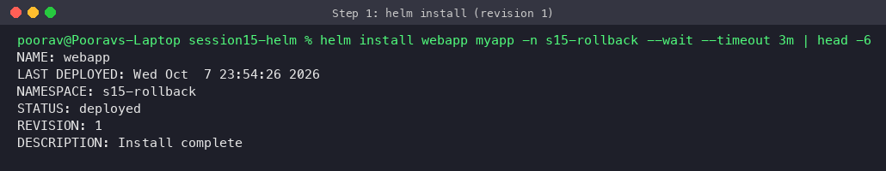
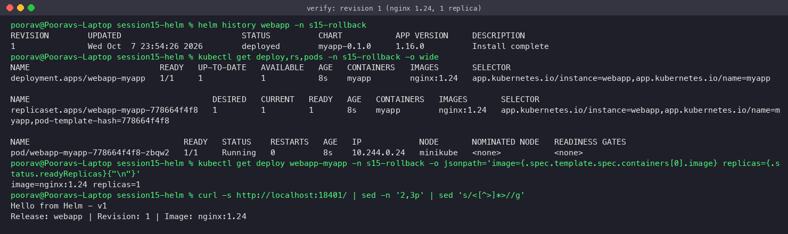
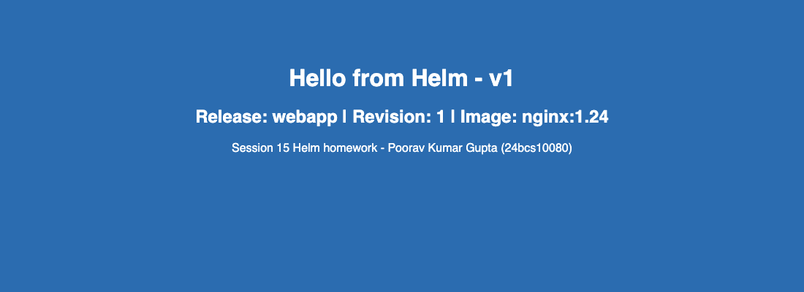

### 2. Upgrade → verify

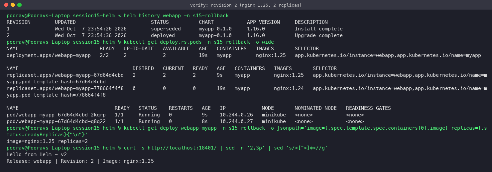


### 3. Upgrade again → verify
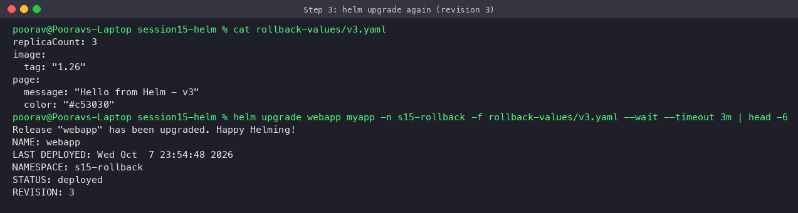
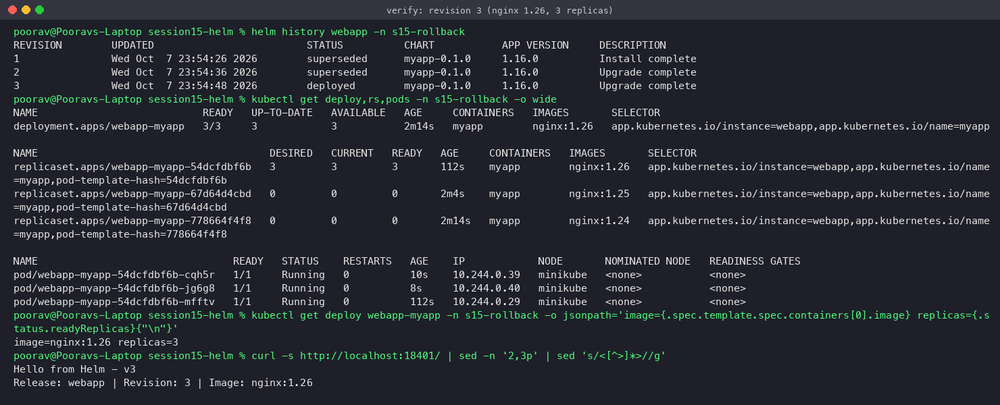
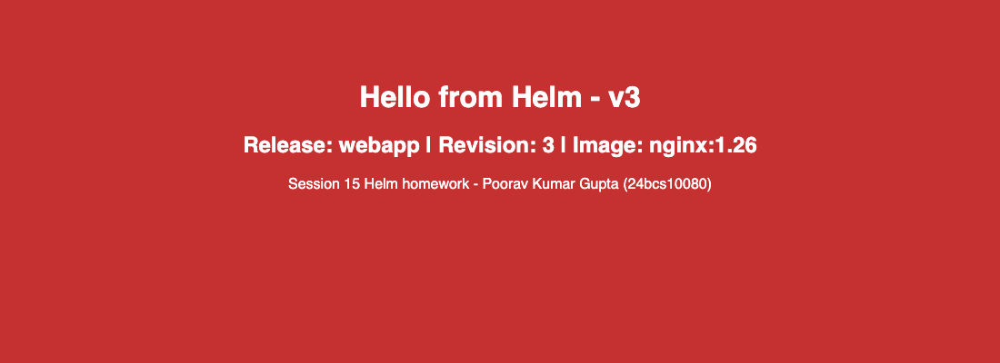

### 4. Rollback → verify
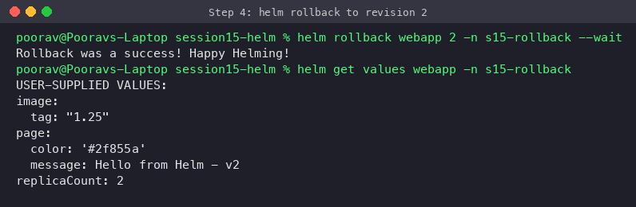
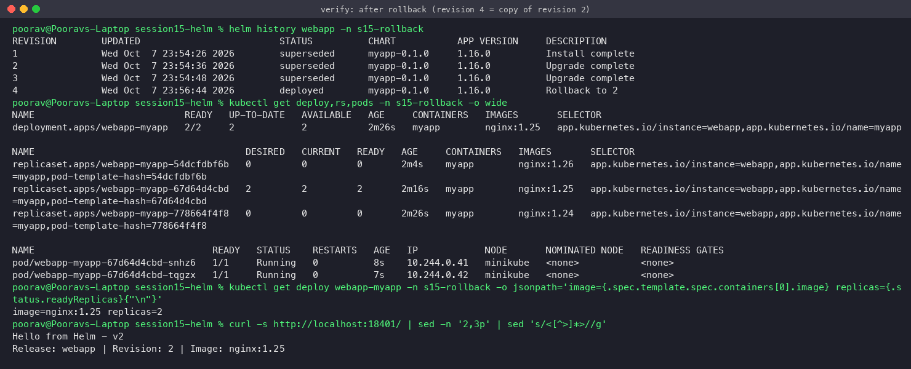
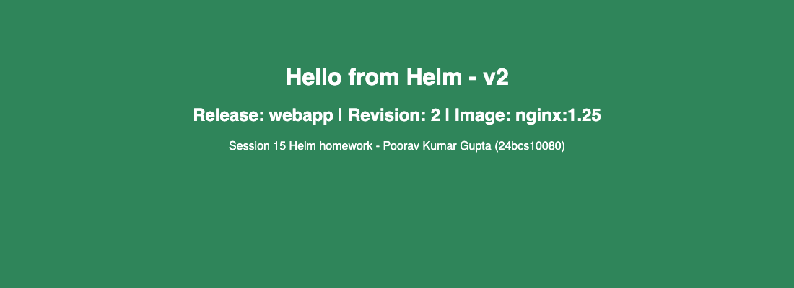

**Observations**
- After the rollback, `helm history` shows revision 4 with the description "Rollback to 2". History is append-only.
- The page after the rollback says **"Revision: 2"** even though the release is at revision 4. This is because Helm re-applies the *stored rendered manifest* of revision 2 and does not re-render templates. Good to know for interviews.
- `kubectl get rs` shows that Kubernetes kept the old ReplicaSets (`nginx:1.24`, `1.26` scaled to 0). The rollback simply scaled the `nginx:1.25` ReplicaSet back up, so it was almost instant.

---

## Task 3: Mini project: Notes app chart

Chart: [`mini-project/notes-chart`](mini-project/notes-chart). Script: [`mini-project/run-mini-project.sh`](mini-project/run-mini-project.sh). Namespace: `s15-notes`.

- `values.yaml` (development): 1 replica, nginx:1.24, `ENVIRONMENT=development`
- `values-prod.yaml` (production): 3 replicas, nginx:1.25, `ENVIRONMENT=production`
- Templates: Deployment (env injected from the ConfigMap via `envFrom`), NodePort Service (nodePort 30415), ConfigMap (`APP_NAME`, `ENVIRONMENT`)

### Lint and render
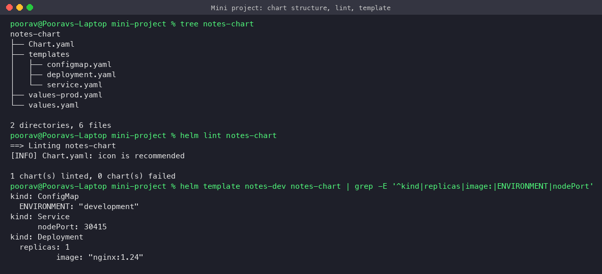

### Install with development values
The ConfigMap values are visible inside the container (`printenv`).
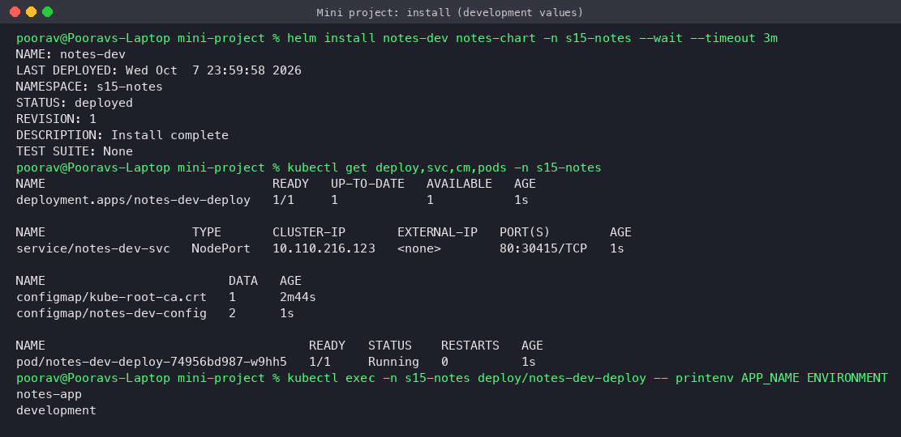

### Upgrade to production values
3 pods on `nginx:1.25`, `ENVIRONMENT=production`.
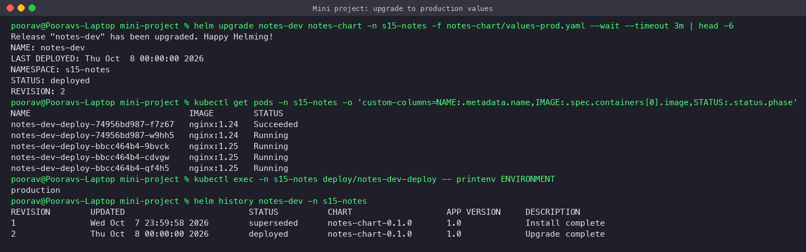

### Simulate a bad upgrade
`--set image.tag=broken-tag-does-not-exist --wait` fails after the timeout. The new pod is in `ErrImagePull`, and revision 3 is marked **failed**. Because of the rolling update strategy, the old healthy pods keep serving traffic.
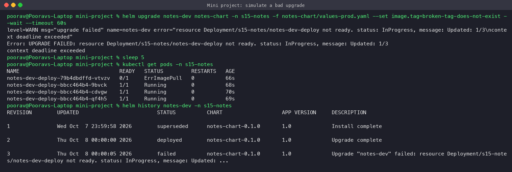

### Rollback to revision 2 and verify
Revision 4 = "Rollback to 2". All pods are back on `nginx:1.25`, and the app answers through NodePort 30415.
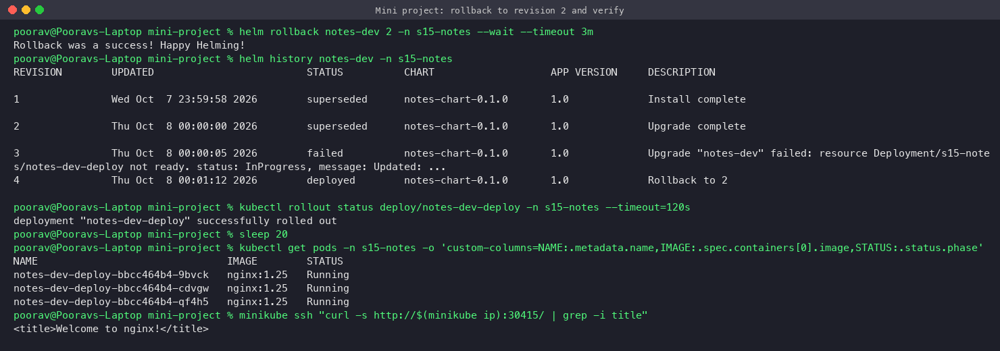

### Package and clean up
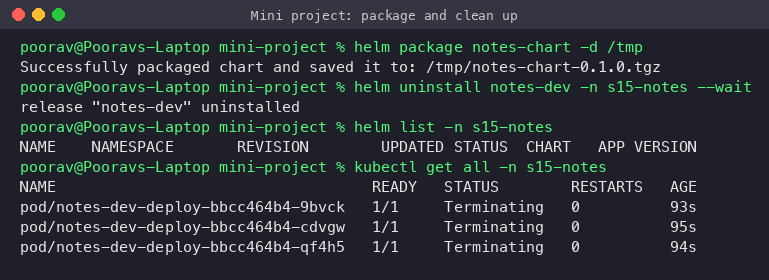

---

## Key takeaways
- Use `helm lint` and `helm template` before every install or upgrade to catch errors without touching the cluster.
- `--wait --timeout` makes an upgrade fail visibly (status `failed`) when pods never become ready. With `--rollback-on-failure` (Helm 4; `--atomic` in Helm 3), Helm would roll back automatically.
- Use separate values files per environment (`values.yaml`, `values-prod.yaml`) instead of copying the chart.
- A rollback is itself a new revision. Nothing in history is lost.
