# Session 16: CI/CD & GitHub Actions: Demo Project

**Student:** Poorav Kumar Gupta | **Enrollment No:** 24bcs10080

A complete CI/CD demo for a small **Flask calculator API**, built with GitHub Actions and based on the course's `10-final-cicd-pipeline` example:

- **CI** (`.github/workflows/ci.yml`): lint → unit tests (matrix) → build → Docker build and smoke test, plus a security check that uses a secret. Test reports, the build package and the Docker image are saved as artifacts.
- **CD** (`.github/workflows/cd.yml`): tests run again as a gate → the image is built and pushed to a password-protected container registry (credentials from secrets) → the app is deployed to Kubernetes from a self-hosted runner → rollout check and smoke test.

> **How it was run:** as the homework allows, everything ran **locally**. The workflows were executed with [`act`](https://github.com/nektos/act) v0.2.89, which runs GitHub Actions workflows in Docker:
> - `runs-on: ubuntu-latest` jobs ran in the `catthehacker/ubuntu:act-latest` container, the local equivalent of GitHub's hosted runner.
> - `runs-on: self-hosted` (deploy) ran directly on my machine (`-P self-hosted=-self-hosted`). This is exactly how a real self-hosted runner works: it sits next to the cluster.
> - The **container registry** was a local `registry:2` with htpasswd authentication on `localhost:18410`, standing in for GHCR/Docker Hub. The **cluster** was minikube.
> - Secrets came from a git-ignored `.secrets` file (`--secret-file`), and `REGISTRY` from `--var` (on GitHub: *Settings → Secrets and variables → Actions*).
>
> Pushed to GitHub as-is, the same workflows would run on GitHub-hosted runners. You would set the `API_TOKEN`, `REGISTRY_USERNAME` and `REGISTRY_PASSWORD` secrets, set the `REGISTRY` variable (default `ghcr.io/poorav`), and register a self-hosted runner that has `kubectl` access.

## Project structure
```
session16-github-actions-cicd/
├── app/
│   ├── calculator.py          # business logic
│   └── main.py                # Flask API: /, /health, /api/<add|subtract|multiply|divide>
├── tests/                     # 10 pytest tests (unit + API)
├── requirements.txt / requirements-dev.txt
├── Dockerfile                 # python:3.12-slim, non-root user, gunicorn, HEALTHCHECK
├── build.sh                   # packages app into build/calculator-build.tar.gz
├── k8s/deployment.yaml        # 2 replicas, readiness/liveness probes, resource limits
├── k8s/service.yaml
├── .github/workflows/ci.yml   # CI pipeline
├── .github/workflows/cd.yml   # CD pipeline
├── .secrets.example           # names of required secrets (real .secrets is git-ignored)
├── scripts/act_log_filter.py  # condenses act logs for screenshots
├── logs/                      # full act run logs (secrets are masked as ***)
└── screenshots/
```

## Concepts covered

| Concept | Where it shows up in this project |
|---|---|
| **CI vs CD** | CI = every push/PR is automatically linted, tested, built and packaged (fast feedback, broken code never gets packaged). CD = a verified commit on `main` is automatically delivered (image pushed to a registry) and deployed (rolled out to Kubernetes). |
| **CI/CD pipeline** | Code → Lint → Test → Build → Docker → Registry → Deploy → Smoke test |
| **GitHub Actions** | GitHub's built-in automation platform: YAML workflows in `.github/workflows/` that run on events |
| **Workflow** | `ci.yml`, `cd.yml`. Triggers: `push` to main, `pull_request`, manual `workflow_dispatch`, `paths-ignore` for docs |
| **Jobs** | CI: `lint`, `test`, `build`, `docker`, `security-check`. Order is set with `needs:` (test needs lint, build needs test, …). Jobs without a dependency between them (e.g. `test` and `security-check`) run in parallel |
| **Steps** | `uses:` (reusable actions: checkout, setup-python, upload/download-artifact) and `run:` (shell commands) |
| **Runners** | `ubuntu-latest` (GitHub-hosted, ephemeral VM), `self-hosted` (deploy job, a machine with cluster access). A **matrix** runs the tests on Python 3.11 and 3.12 |
| **Secrets** | `API_TOKEN` (security-check job), `REGISTRY_USERNAME`/`REGISTRY_PASSWORD` (docker login). Masked as `***` in logs |
| **Artifacts** | `test-report-py3.11/3.12` (JUnit + coverage XML), `calculator-build` (tarball), `docker-image` (saved image). The `docker` job **downloads** the build artifact that the `build` job produced |
| **Build** | `build.sh` + `docker build` with the commit SHA baked in as `APP_VERSION` |
| **Test** | pytest + coverage (97%), run in CI and again as a gate in CD |
| **Pipeline execution** | Screenshots below: successful CI, successful CD, and a failing CI that blocks a bad commit |

### Pipeline flow
```
                ┌──────────── CI (ci.yml) ────────────────────────────────────────────┐
 git push ──►   │ lint ──► test (py3.11, py3.12) ──► build ──► docker build + smoke    │
                │   └────► security-check (uses secret)          │ artifacts         │
                └──────────────────────────────────────────────────────────────────────┘
                ┌──────────── CD (cd.yml) ────────────────────────────────────────────┐
 push to main ► │ test ──► build & push image (registry login via secrets) ──►        │
                │          deploy [self-hosted]: pull → load → kubectl apply →        │
                │                                rollout status → smoke test          │
                └──────────────────────────────────────────────────────────────────────┘
```

---

## Pipeline execution: screenshots

### Jobs and stages detected in both workflows
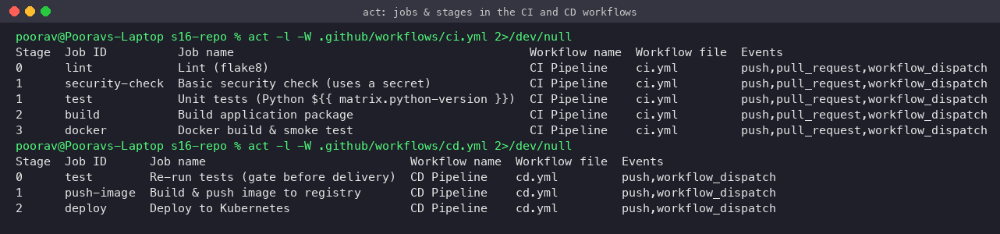

### CI pipeline: successful run (all 6 jobs green)
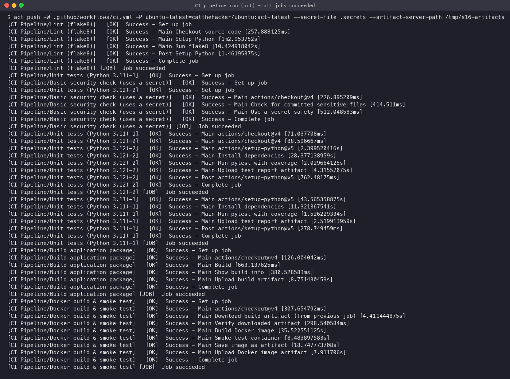

**Lint job**
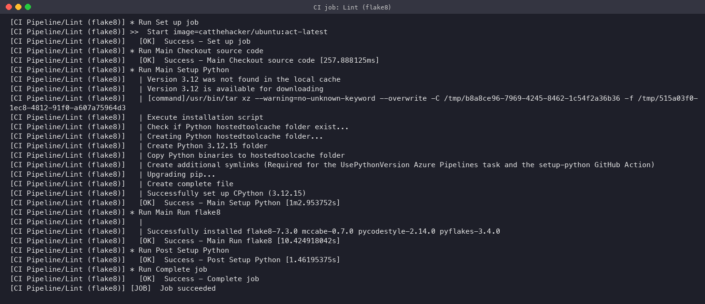

**Security check job.** The `API_TOKEN` secret is used, and even when it is echoed by mistake the runner masks it as `***`.
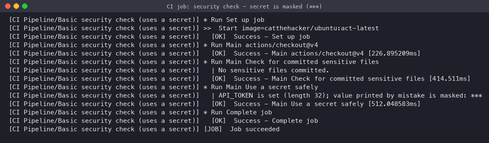

**Unit tests (matrix).** 10 tests pass with 97% coverage, and the JUnit/coverage reports are uploaded as an artifact.
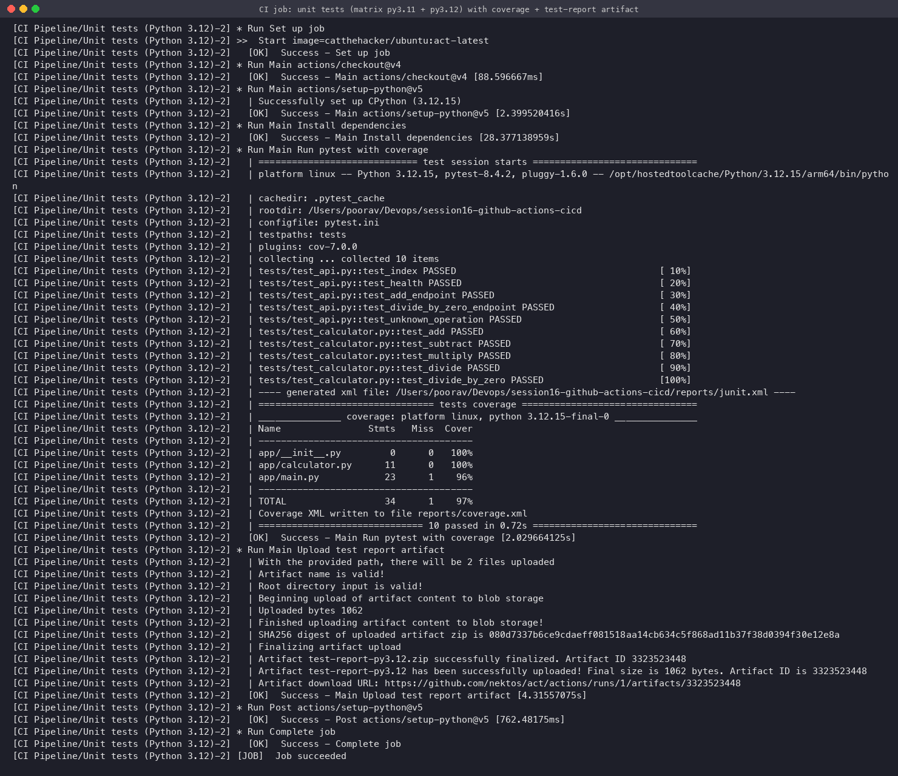

**Build job.** Packages the app and uploads `calculator-build`.
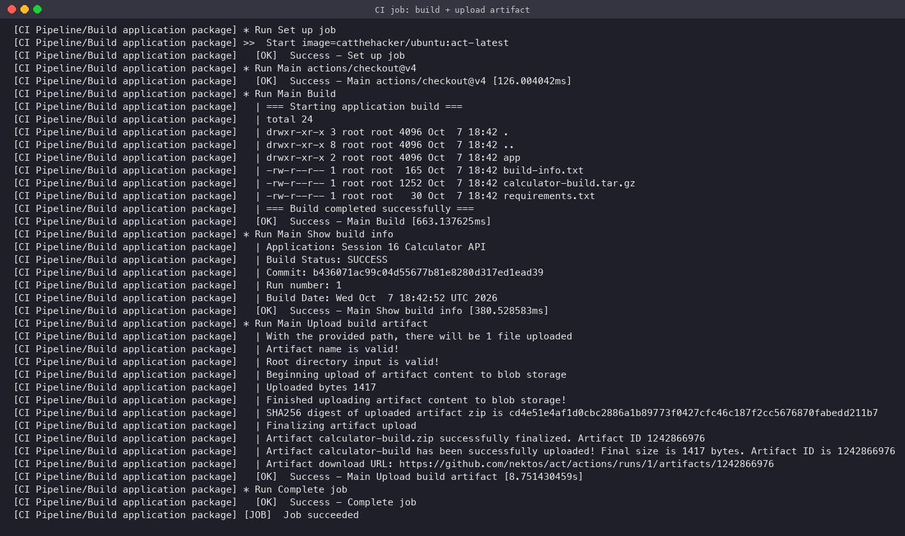

**Docker job.** Downloads the build artifact from the previous job, builds the image, smoke-tests the running container (`/api/add?a=10&b=5 → 15`) and uploads the image as an artifact.
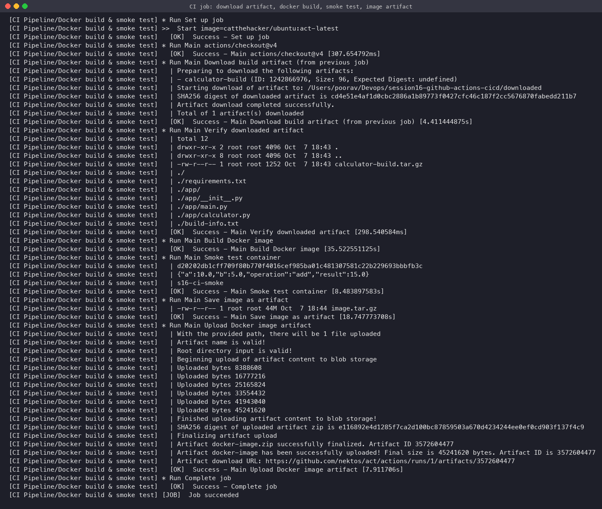

**Artifacts** stored by the artifact server:
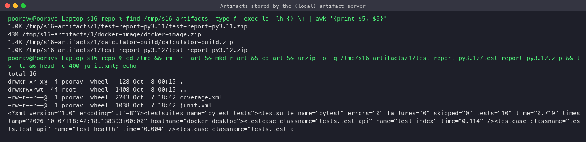

### CI pipeline: failing run (the pipeline protects `main`)
I introduced a bug on purpose (`add()` returns `a - b`). Both matrix test jobs fail with clear assertion messages. Because of `needs: test`, the **build and docker jobs never start**, so broken code is never packaged or shipped.
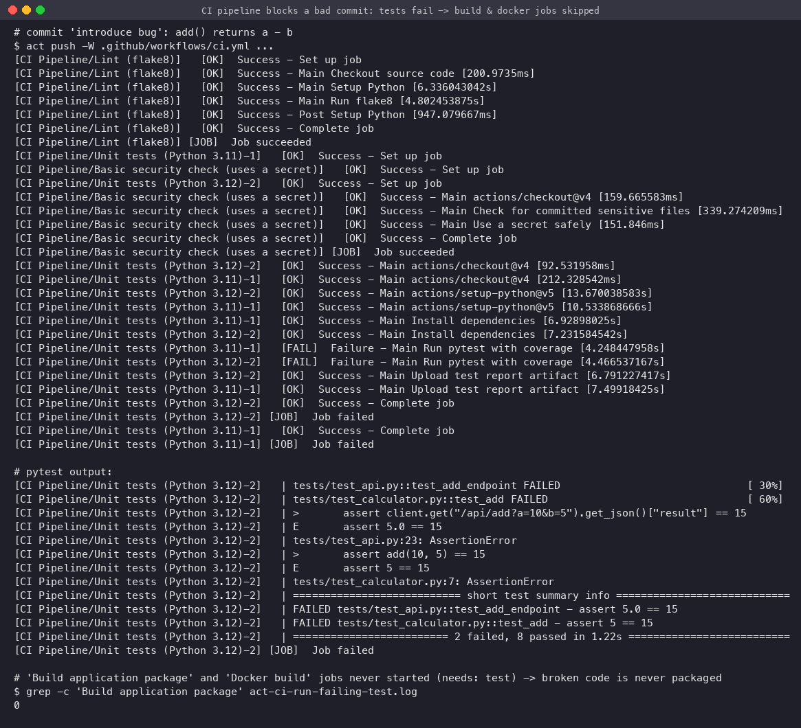

### CD pipeline: successful run (test → push → deploy)
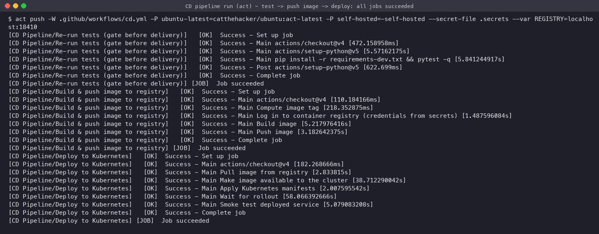

**Build & push job.** `docker login` with the registry secrets, then the image is built and pushed with both the `<sha>` and `latest` tags.
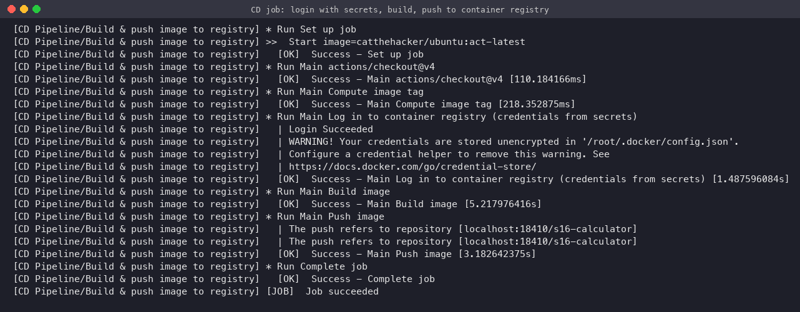

**Deploy job (self-hosted runner).** It pulls the image, loads it into the cluster, runs `kubectl apply`, waits for `rollout status`, then smoke-tests the service from inside the cluster. This was the second CD run (commit `f02858c`), so the screenshot also shows the old pods (`b436071`) terminating during the **rolling update**.
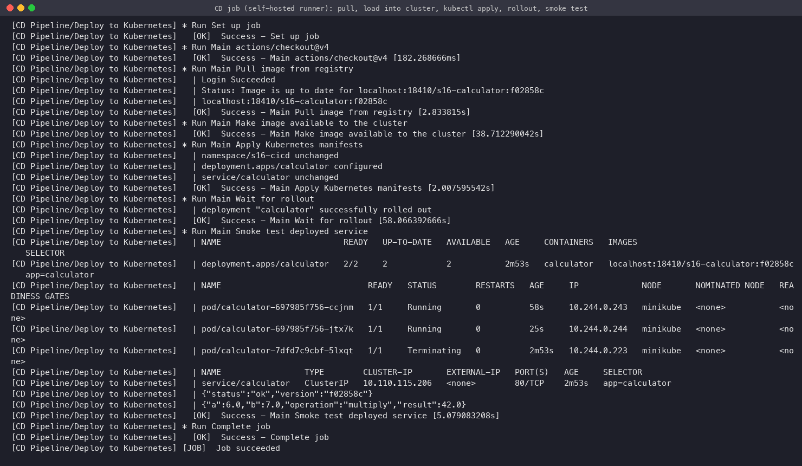

**Verification.** The registry holds the `b436071`, `f02858c` and `latest` tags, and anonymous access is rejected (401). The deployment runs 2/2 pods of the new image, and `rollout history` shows 2 revisions (one per CD run).
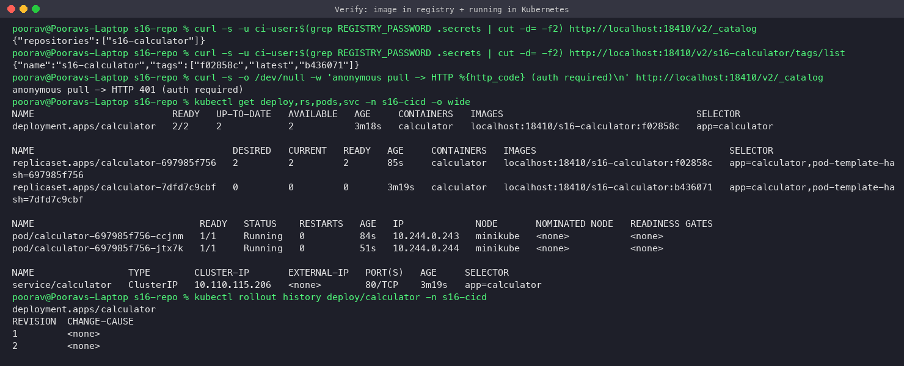

**Application deployed by the pipeline** (browser via `kubectl port-forward`), showing the commit SHA as its version:
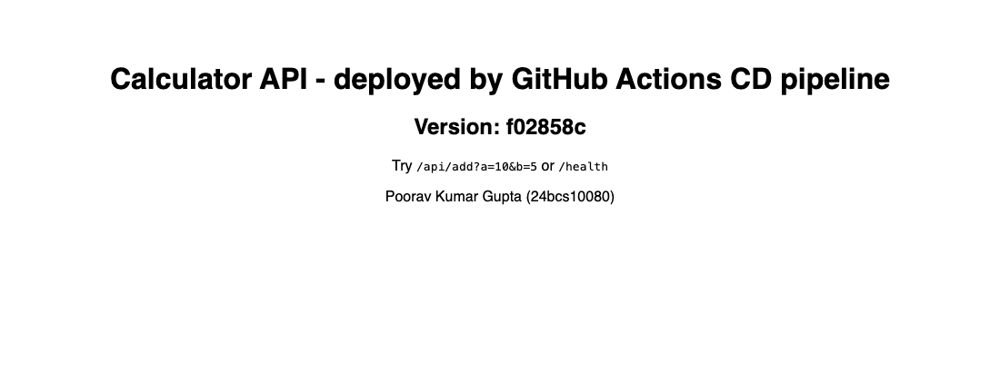
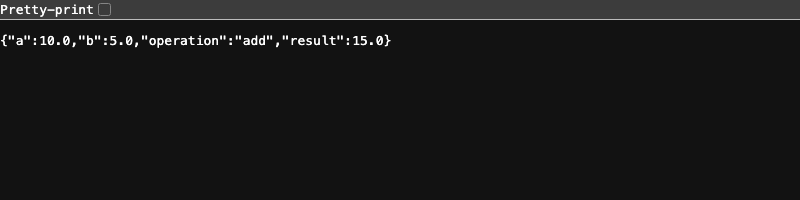

---

## How to run it yourself
```bash
pip install -r requirements-dev.txt && pytest -v           # tests
docker build -t s16-calculator . && docker run -p 5000:5000 s16-calculator

# Workflows locally with act (needs Docker); requires a git repo for the commit SHA
cp .secrets.example .secrets    # fill in values
act push -W .github/workflows/ci.yml -P ubuntu-latest=catthehacker/ubuntu:act-latest \
    --secret-file .secrets --artifact-server-path /tmp/artifacts
act push -W .github/workflows/cd.yml -P ubuntu-latest=catthehacker/ubuntu:act-latest \
    -P self-hosted=-self-hosted --secret-file .secrets --var REGISTRY=localhost:18410
```

## Lessons learned
- `needs:` turns independent jobs into a pipeline and is what stops a failing test from shipping.
- Keep secrets out of the repo (`.secrets` is git-ignored, and the CI job also checks that no `.env`/`.pem`/`.key`/`.secrets` file is committed). Use secrets through `env:`, and rely on log masking only as a safety net.
- Artifacts are how jobs pass files to each other, because each job gets a fresh runner.
- Tagging images with the commit SHA makes every deployment traceable. The running app reports the exact commit it was built from.
- Deploying from a self-hosted runner inside the network avoids exposing the Kubernetes API to the internet.
