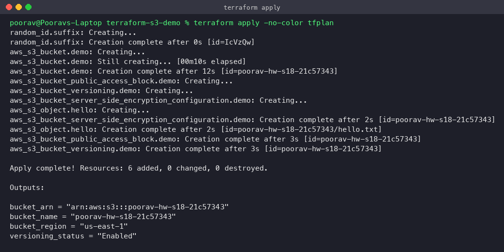

# Session 18: Terraform & Infrastructure as Code

**Student:** Poorav Kumar Gupta · **Enrollment No:** 24bcs10080

```
session18-terraform-iac/
├── terraform-s3-demo/          # Task 1: real S3 bucket with Terraform (init → destroy), with screenshots
│   ├── main.tf  variables.tf  outputs.tf  provider.tf  terraform.tfvars
│   ├── screenshots/
│   └── README.md
└── aws-services/               # Task 2: AWS services research
    ├── 01-iam/README.md            # IAM: governance
    ├── 02-ec2/README.md            # EC2: compute
    ├── 03-s3/README.md             # S3: storage
    ├── 04-vpc/README.md            # VPC: networking
    └── 05-dynamodb-rds/README.md   # DynamoDB & RDS: databases
```

## Task 1: Terraform S3 Demo
See [terraform-s3-demo/README.md](terraform-s3-demo/README.md). All of `init, fmt, validate, plan, apply, show, output, destroy`
were run against a real AWS account (us-east-1), each with a screenshot. AWS CLI checks confirmed the bucket,
versioning, encryption and public-access block.



**Note on destroy:** the IAM user has an explicit-deny policy (`InfrastructureAdminNoDelete`) on delete actions.
`terraform destroy` removed 4 of the 6 resources, but `DeleteBucket` returned 403, so the empty bucket
`poorav-hw-s18-21c57343` is still in the account. An admin with delete rights needs to remove it (commands are in the demo README).

## Task 2: AWS Services Research
| # | Service | Covers |
|---|---|---|
| 01 | [IAM](aws-services/01-iam/README.md) | users, groups, roles, policies, permission evaluation, least privilege, best practices, use cases |
| 02 | [EC2](aws-services/02-ec2/README.md) | AMI, instance types, key pairs, security groups, EBS, public vs private IP, lifecycle, use cases |
| 03 | [S3](aws-services/03-s3/README.md) | buckets, objects, storage classes, versioning, lifecycle, encryption, bucket policies, use cases |
| 04 | [VPC](aws-services/04-vpc/README.md) | CIDR, subnets, route tables, IGW, NAT GW, SGs, NACLs, public vs private subnets |
| 05 | [DynamoDB & RDS](aws-services/05-dynamodb-rds/README.md) | NoSQL, tables/items/attributes, partition & sort keys; RDS engines, instances, security, backups, Multi-AZ, read replicas |
