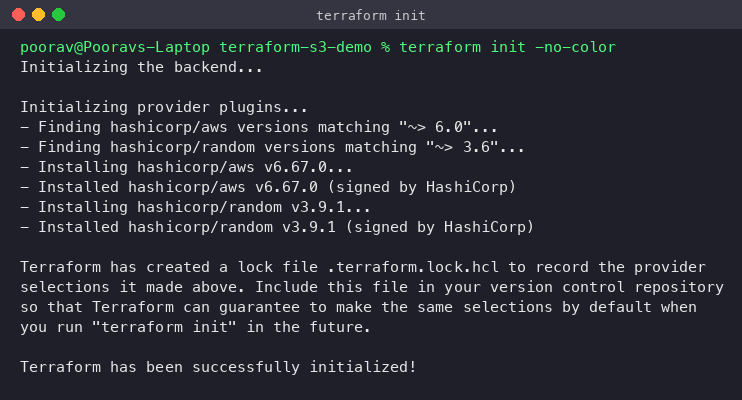
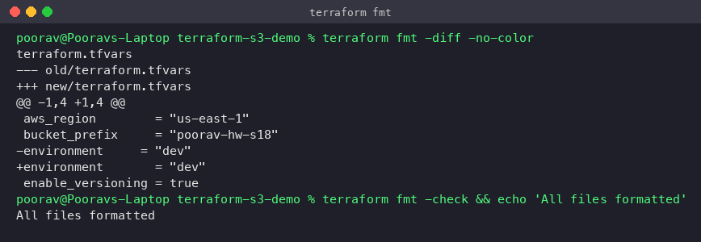
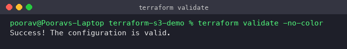
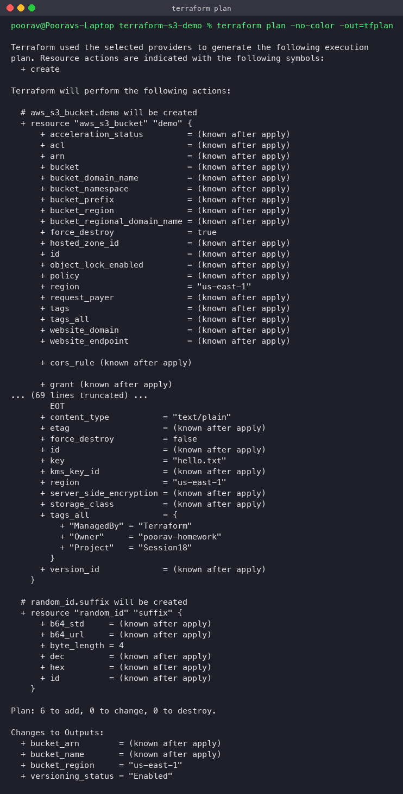
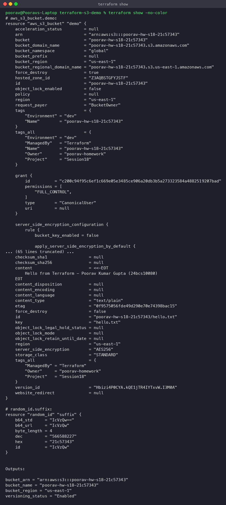
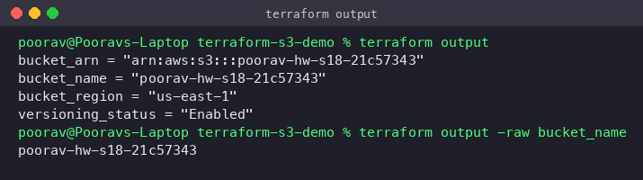
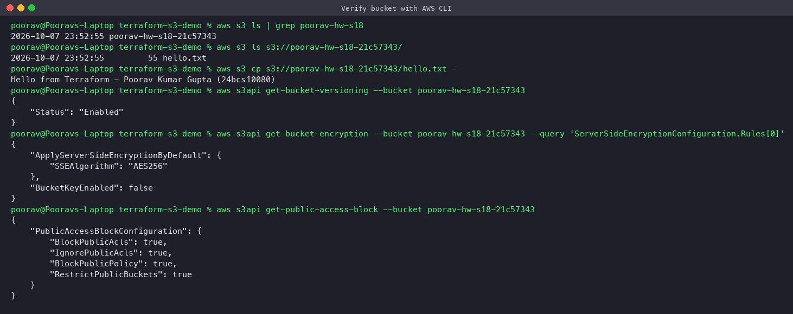
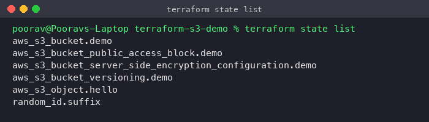
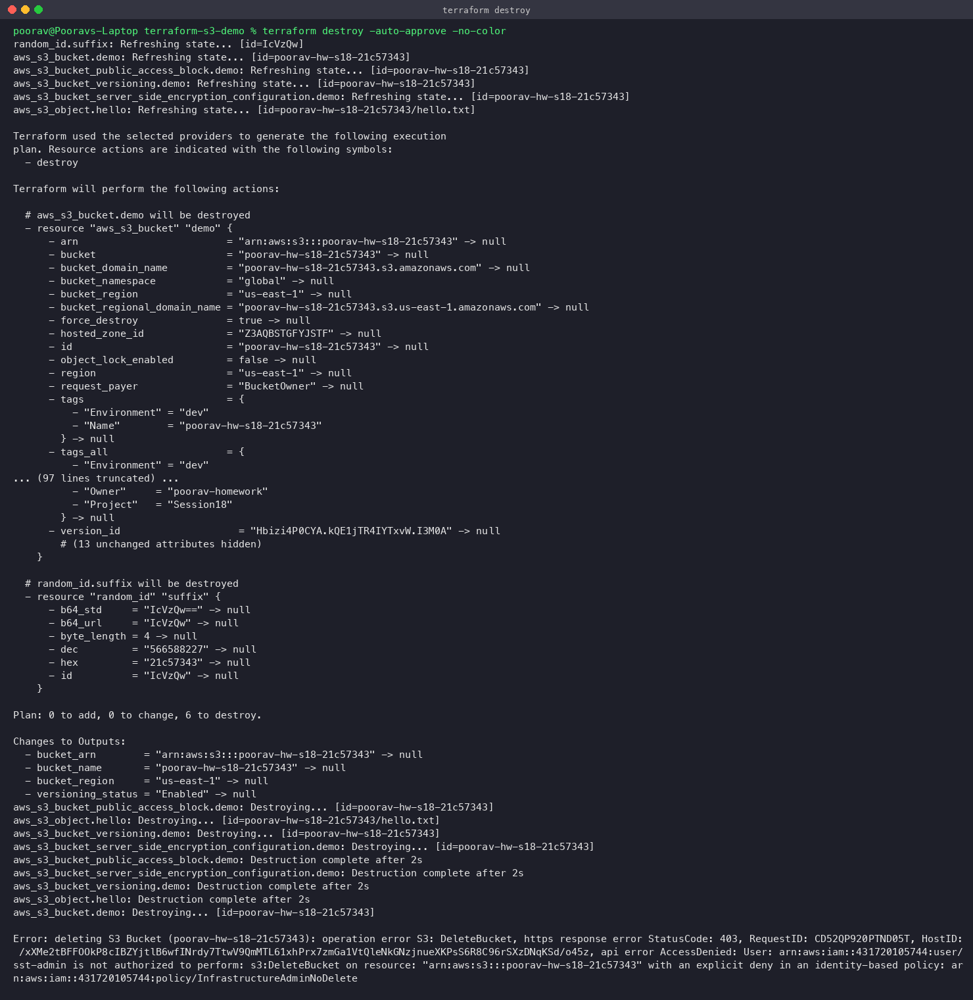
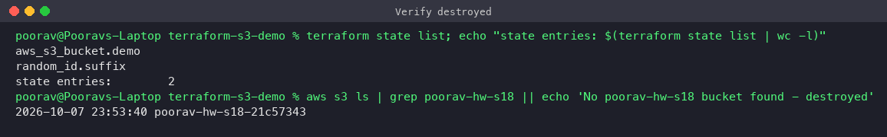

# Terraform S3 Demo — Session 18

**Student:** Poorav Kumar Gupta · **Enrollment No:** 24bcs10080

Creates a real **AWS S3 bucket** in `us-east-1` with Terraform, then walks through the full Terraform workflow:
`init → fmt → validate → plan → apply → show → output → destroy`.

## Project structure

```
terraform-s3-demo/
├── provider.tf        # terraform{} block (required providers/versions) + aws provider with default tags
├── main.tf            # random suffix, S3 bucket, versioning, encryption, public-access-block, sample object
├── variables.tf       # input variables (region, bucket prefix, environment, versioning toggle)
├── outputs.tf         # bucket name / ARN / region / versioning status
├── terraform.tfvars   # values for the variables
├── terraform-show-evidence.txt   # copy of `terraform show` taken while the bucket existed
└── README.md
```

### What gets created (6 resources)

| Resource | Purpose |
|---|---|
| `random_id.suffix` | 4-byte hex suffix so the bucket name is globally unique (`poorav-hw-s18-<hex>`) |
| `aws_s3_bucket.demo` | The bucket itself (`force_destroy = true` so destroy also removes objects) |
| `aws_s3_bucket_versioning.demo` | Turns on object versioning |
| `aws_s3_bucket_server_side_encryption_configuration.demo` | Default SSE-S3 (AES256) encryption |
| `aws_s3_bucket_public_access_block.demo` | Blocks all public ACLs/policies |
| `aws_s3_object.hello` | A `hello.txt` object to prove the bucket works |

All resources get the default tags `Owner=poorav-homework`, `ManagedBy=Terraform`, `Project=Session18` from the provider's `default_tags`.

## Workflow

### 1. `terraform init`
Downloads the `hashicorp/aws` (~> 6.0) and `hashicorp/random` providers into `.terraform/` and writes `.terraform.lock.hcl` (pins exact provider versions/checksums).



### 2. `terraform fmt`
Rewrites files to the canonical HCL style. `terraform.tfvars` was intentionally mis-aligned; `fmt -diff` shows the fix, and `fmt -check` then confirms everything is formatted (useful in CI).



### 3. `terraform validate`
Checks syntax, references and argument types without contacting AWS.



### 4. `terraform plan`
Refreshes state, compares desired config to reality and prints the execution plan (`6 to add`). `-out=tfplan` saves the exact plan so `apply` does precisely what was reviewed.



### 5. `terraform apply`
Executes the saved plan. Terraform builds the dependency graph: `random_id` → bucket → (versioning, encryption, public-access-block, object in parallel).


### 6. `terraform show`
Human-readable view of the current state — every attribute of every managed resource.



### 7. `terraform output`
Prints the output values (`-raw` gives a bare string, handy in scripts).



### 8. Verification with the AWS CLI
Independent proof the bucket exists in AWS: listed in `aws s3 ls`, contains `hello.txt`, versioning `Enabled`, AES256 encryption, and all four public-access blocks `true`.





### 9. `terraform destroy`





> **Important — what actually happened on destroy.**
> Terraform successfully destroyed 4 of the 6 resources (object, versioning, encryption, public-access block),
> but `DeleteBucket` failed with **403 AccessDenied**: the IAM user used for this homework has an
> *explicit deny* policy (`InfrastructureAdminNoDelete`) that blocks delete actions. An explicit deny always
> wins over any allow in IAM policy evaluation, so Terraform cannot remove the bucket.
>
> The bucket `poorav-hw-s18-21c57343` is still in the account (`hello.txt` was deleted; because versioning
> was on, an old version or delete marker may remain, so the cost is basically zero). To finish the cleanup, someone with
> delete permission should run:
> ```bash
> aws s3api delete-objects --bucket poorav-hw-s18-21c57343 \
>   --delete "$(aws s3api list-object-versions --bucket poorav-hw-s18-21c57343 \
>   --query '{Objects: [Versions,DeleteMarkers][][].{Key:Key,VersionId:VersionId}}' --output json)"
> aws s3 rb s3://poorav-hw-s18-21c57343
> # or: terraform destroy (from this folder, the local state still tracks the bucket)
> ```
> Lesson learned: check IAM permissions for **delete** as well as create *before* you `apply`. Teardown is part of
> the lifecycle, and a missing delete permission leaves orphaned resources behind.

## Key concepts

- **Provider** — plugin that talks to an API (AWS). Configured in `provider.tf`; versions pinned in `required_providers`.
- **Resource** — something Terraform manages (`aws_s3_bucket`). Address = `<type>.<name>`.
- **Variables / tfvars** — inputs; `terraform.tfvars` is loaded automatically.
- **Outputs** — values exported after apply (shown by `terraform output`, usable by other modules).
- **State** (`terraform.tfstate`) — Terraform's record of real resource IDs. Never edit it by hand and never commit it
  (it can contain secrets). It's git-ignored here; in teams use a remote backend (S3 + locking).
- **Plan file** — saved, reviewable plan guaranteeing apply does exactly what was approved.

## Commands summary

```bash
terraform init
terraform fmt -diff && terraform fmt -check
terraform validate
terraform plan -out=tfplan
terraform apply tfplan
terraform show
terraform output
terraform state list
terraform destroy -auto-approve
```
