# Session 19: Cloud & Terraform in Action

**Student:** Poorav Kumar Gupta · **Enrollment No:** 24bcs10080

An end-to-end AWS infrastructure project in Terraform: **VPC → public subnet → Internet Gateway + route table →
security group → EC2 web server (nginx) + S3 bucket**, covering providers, variables, resources, outputs,
implicit and explicit dependencies, state, plan, apply and destroy.

> ### ⚠️ Honest status: the AWS stack was planned, not applied
> The AWS user available for this homework has an **explicit-deny policy on delete actions**
> (`InfrastructureAdminNoDelete`). I found this in Session 18 when `terraform destroy` couldn't delete an S3 bucket.
> Applying this stack would have created an **EC2 instance, public IPv4 and VPC that could not be destroyed**, so they would keep running and billing.
> So for the AWS stack I ran `init → fmt → validate → plan` (real AWS API reads: AMI lookup, AZs) but **did not apply**.
>
> To still show `apply / state / destroy` for real, `state-demo/` runs the full lifecycle offline with the
> `random` and `local` providers, and the EC2 hello page is previewed locally in Docker. With an IAM user that's allowed to delete,
> the AWS stack is applied with the same commands (see [How to run](#how-to-run-with-delete-permissions)).

## Architecture

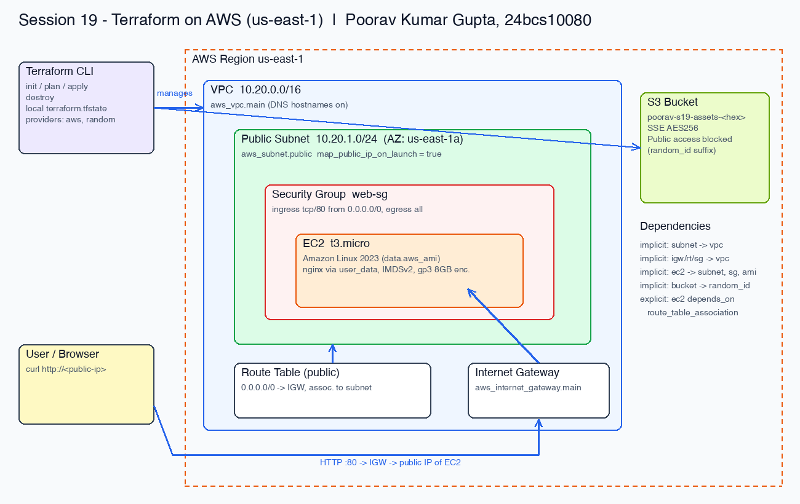

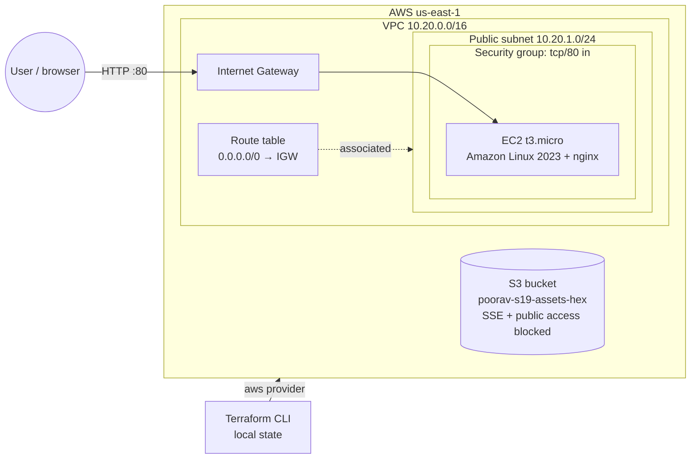

## Project structure

```
session19-cloud-terraform/
├── versions.tf          # terraform{} + required_providers (aws ~> 6.0, random ~> 3.6) + aws provider (default_tags)
├── variables.tf         # region, project, CIDRs, instance type, allowed CIDR
├── terraform.tfvars     # variable values
├── data.tf              # data sources: availability zones, latest Amazon Linux 2023 AMI
├── network.tf           # VPC, subnet, IGW, route table + association, security group + rules
├── compute.tf           # EC2 instance (user_data, IMDSv2, encrypted gp3, explicit depends_on)
├── storage.tf           # random_id + S3 bucket + public access block + encryption
├── outputs.tf           # vpc_id, subnet_id, sg_id, ami_id, instance_id, public_ip, web_url, bucket
├── user_data.sh         # installs nginx and writes the hello page on first boot
├── draw_architecture.py # generates screenshots/architecture.png
├── plan-output.txt      # full `terraform show tfplan` output
├── state-demo/          # offline lifecycle demo (random + local providers)
└── screenshots/
```

## Concepts demonstrated

| Concept | Where |
|---|---|
| **Providers** | `versions.tf`: `hashicorp/aws ~> 6.0` with `default_tags`, `hashicorp/random ~> 3.6` |
| **Variables** | `variables.tf` + `terraform.tfvars` (types, descriptions, defaults) |
| **Resources** | 13 resources across `network.tf`, `compute.tf`, `storage.tf` |
| **Data sources** | `aws_ami.al2023` (latest AL2023, so no hard-coded AMI ID), `aws_availability_zones` |
| **Outputs** | `outputs.tf`, including `web_url = "http://${aws_instance.web.public_ip}"` |
| **Implicit dependencies** | references such as `vpc_id = aws_vpc.main.id`, `subnet_id = aws_subnet.public.id` |
| **Explicit dependency** | `aws_instance.web` → `depends_on = [aws_route_table_association.public]`: user_data needs a working internet route to `dnf install nginx`, which Terraform can't infer from references |
| **State** | local `terraform.tfstate` (git-ignored); `state list` / `state show` in `state-demo/` |
| **plan / apply / destroy** | plan on AWS; full apply/destroy in `state-demo/` |

## Workflow & evidence

### 1. Files and versions
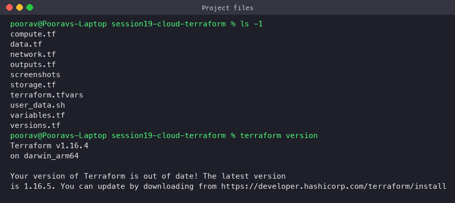

### 2. `terraform init`
Downloads the aws + random providers and creates `.terraform.lock.hcl`.
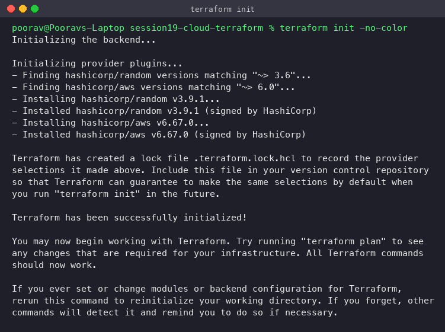

### 3. `terraform fmt` + `terraform validate`
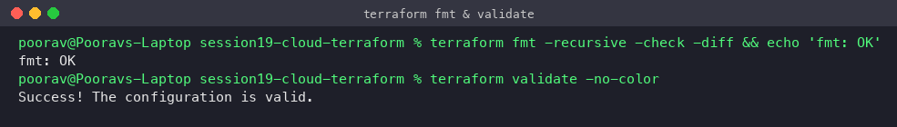

### 4. `terraform plan` (real AWS reads)
Terraform queried AWS for the AZ list and the latest Amazon Linux 2023 AMI (`ami-03c3da4cfa8e8943a`) and planned
**13 resources to add**. The full plan is in [plan-output.txt](plan-output.txt).
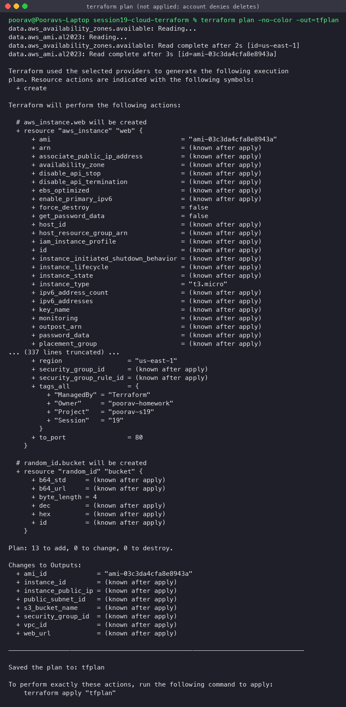

### 5. Resources in the plan and the explicit dependency
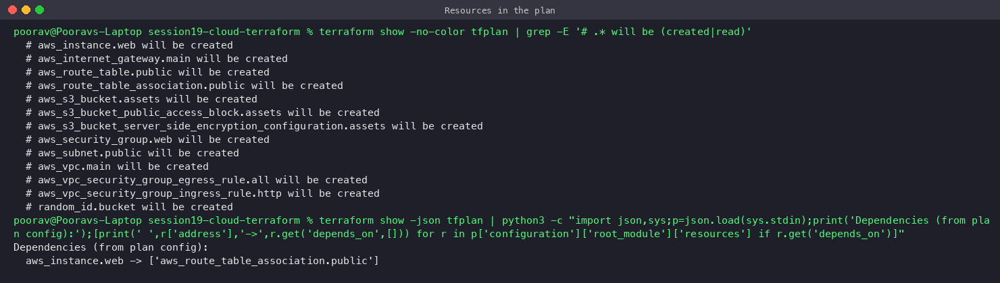

### 6. Dependency graph (`terraform graph | dot -Tpng`)
Arrows point from a resource to what it depends on: EC2 → subnet/SG/AMI/route-table-association, everything → VPC,
bucket → random_id.
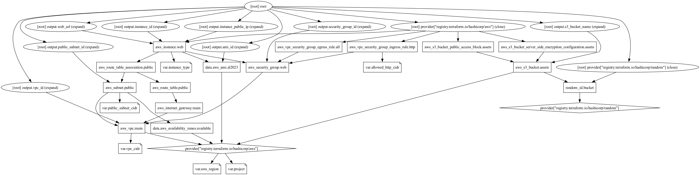

### 7. Terraform state, apply and destroy: `state-demo/`
`state-demo/main.tf` uses `random_pet`, `local_file` (implicit dependency on the pet name) and `random_integer`
(explicit `depends_on`) to run the **whole lifecycle for real** without cloud costs.

**plan + apply:** creates 3 resources and prints outputs.
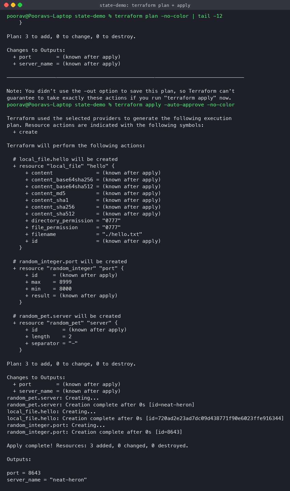

**state:** `terraform state list`, `terraform state show`, the generated file, and the raw `terraform.tfstate` JSON
(serial number + resource list). State is how Terraform maps config to real objects.
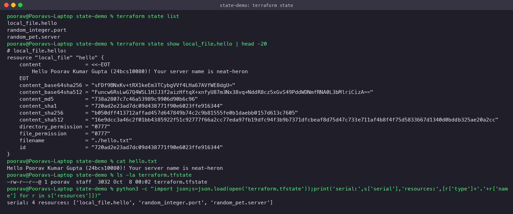

**destroy:** removes everything; state is empty and the file is gone.
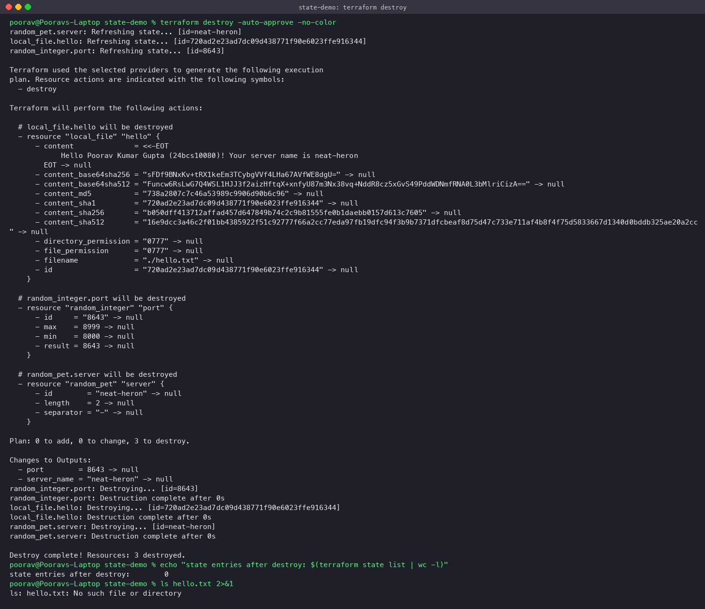

### 8. AWS project state: nothing was created
`terraform state list` is empty and `plan -destroy` has nothing to destroy, so no AWS resources from this project exist.
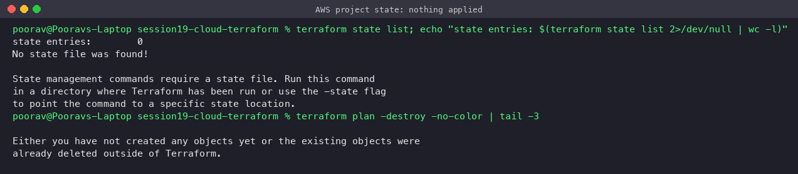

### 9. Hello page preview (local Docker, *not* AWS)
The exact HTML that `user_data.sh` writes on the EC2 instance, served by `nginx:alpine` on `localhost:18500` to show
what the page looks like (instance ID/AZ replaced with placeholders).
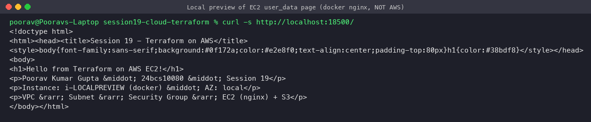
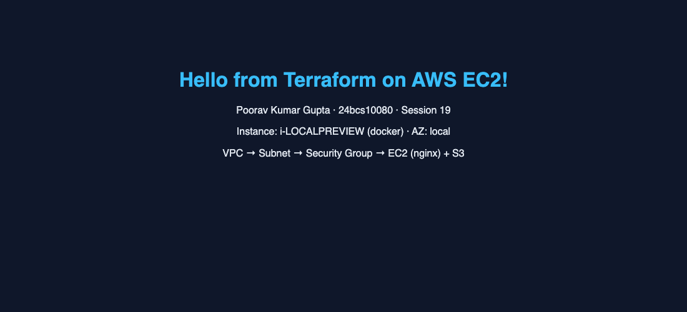

## How to run (with delete permissions)

```bash
terraform init
terraform fmt -recursive && terraform validate
terraform plan -out=tfplan
terraform apply tfplan

terraform output web_url
curl "$(terraform output -raw web_url)"          # wait ~1-2 min for user_data
aws ec2 describe-instances --filters Name=tag:Owner,Values=poorav-homework \
  --query 'Reservations[].Instances[].{id:InstanceId,state:State.Name,ip:PublicIpAddress}'
terraform state list
terraform state show aws_instance.web

terraform destroy -auto-approve
terraform state list                              # empty
```

## Lessons learned
- **Check delete permissions before applying.** IaC is create *and* destroy; an explicit `Deny` on delete actions turns every apply into orphaned resources.
- Use **data sources** for AMIs rather than hard-coding region-specific IDs.
- Terraform infers most ordering from references; use `depends_on` only for hidden dependencies (like "internet route must exist before boot").
- `default_tags` on the provider tags every resource consistently (`Owner=poorav-homework`), which makes cleanup and cost tracking easy.
- Keep state out of Git (`.gitignore`); for teams use a remote backend with locking.
