# Session 20 — Monitoring, Observability & GitOps

**Student:** Poorav Kumar Gupta · **Enrollment No:** 24bcs10080

Everything below was run for real on a local **minikube** cluster (Kubernetes v1.37, docker driver, macOS). The screenshots are real browser captures (headless Chrome / Playwright) and real terminal output.

| Task | What was built | Evidence |
|------|----------------|----------|
| 1. Monitoring | kube-prometheus-stack (Prometheus, Grafana, Alertmanager, node-exporter, kube-state-metrics) installed with Helm. Demo app scraped via ServiceMonitor, custom Grafana dashboard, custom PrometheusRule alerts fired and then resolved | screenshots 01–13, 22 |
| 2. Observability | Write-up on metrics, logs and traces, why observability matters, common tools, Kubernetes observability | [section below](#task-2--observability) |
| 3. GitOps | Argo CD plus a Git server running inside the cluster. Shows a Git commit being auto-synced to the cluster, and manual drift being undone by self-heal | screenshots 14–21 |

```
session20-monitoring-observability-gitops/
├── README.md
├── monitoring/
│   ├── kps-values.yaml          # lightweight kube-prometheus-stack Helm values (Grafana anonymous auth, low requests)
│   ├── demo-app.yaml            # podinfo Deployment + Service + ServiceMonitor (liveness/readiness probes)
│   ├── alert-rules.yaml         # PrometheusRule: PodinfoTargetDown, PodinfoHighCPU, PodNotReady
│   ├── cpu-stress.yaml          # busybox busy-loop pod to trigger the CPU alert
│   └── grafana-dashboard.yaml   # dashboard as code (ConfigMap picked up by the Grafana sidecar)
├── gitops/
│   ├── git-server.yaml          # in-cluster git daemon (namespace s20-gitops) = "GitHub" for this demo
│   ├── argocd-values.yaml       # minimal Argo CD Helm values
│   ├── argocd-application.yaml  # Argo CD Application (automated sync, prune, selfHeal)
│   ├── repo-content/apps/guestbook/   # manifests that live in the Git repo (final state: replicas 3)
│   ├── gitops-repo-history.txt  # git log of the GitOps repo
│   └── gitops-demo.bundle       # full copy of the GitOps repo (git clone gitops-demo.bundle)
└── screenshots/
```

---

## Task 1 — Monitoring

### 1.1 Install the monitoring stack with Helm

```bash
helm repo add prometheus-community https://prometheus-community.github.io/helm-charts
helm repo update
helm install kps prometheus-community/kube-prometheus-stack \
  -n s20-monitoring --create-namespace -f monitoring/kps-values.yaml --wait
```

`kps-values.yaml` keeps the stack small enough for a laptop cluster:
- low resource requests
- 6 h retention
- 15 s scrape interval
- no etcd, scheduler or controller-manager scrapes (minikube doesn't expose them)
- Grafana anonymous auth turned on, so the dashboards could be screenshotted headlessly
- `*SelectorNilUsesHelmValues: false`, so Prometheus picks up ServiceMonitors and PrometheusRules from **every** namespace

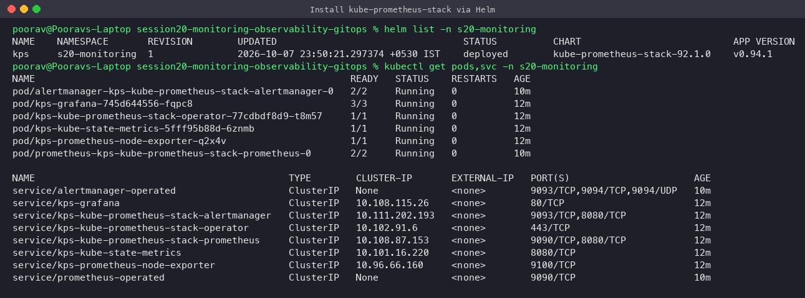

What each component does:

| Component | Role |
|-----------|------|
| Prometheus | Pull-based time-series DB; scrapes `/metrics` endpoints and evaluates alert rules |
| Prometheus Operator | Turns CRDs (`ServiceMonitor`, `PrometheusRule`) into Prometheus config |
| node-exporter | Node-level CPU, memory, disk and network metrics |
| kube-state-metrics | Object state as metrics (pod ready, restarts, replicas…) |
| cAdvisor (in kubelet) | Per-container CPU and memory (`container_cpu_usage_seconds_total`, …) |
| Alertmanager | Receives firing alerts; dedupes, groups and routes them (Slack/e-mail/PagerDuty) |
| Grafana | Dashboards and visualisation |

### 1.2 Demo application and ServiceMonitor

The demo app is `podinfo` (2 replicas). It exposes Prometheus metrics on `/metrics`, a liveness endpoint on `/healthz` and a readiness endpoint on `/readyz`. A `ServiceMonitor` tells Prometheus to scrape it every 15 s.

```bash
kubectl create ns s20-app
kubectl apply -f monitoring/demo-app.yaml -f monitoring/alert-rules.yaml -f monitoring/grafana-dashboard.yaml
```

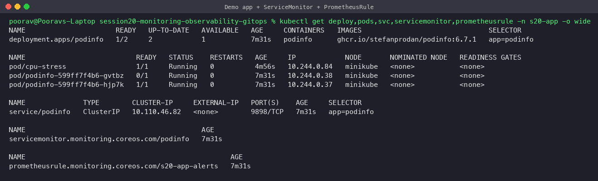

Prometheus discovered both pods through the ServiceMonitor, and both targets are **UP**:

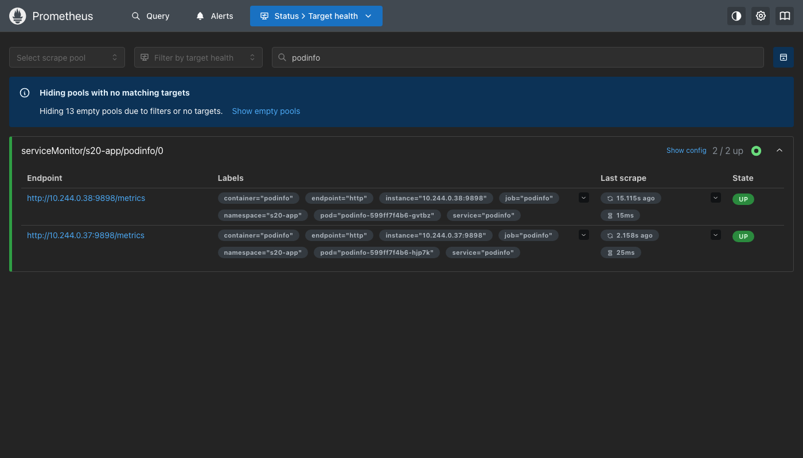

### 1.3 Metrics — CPU and memory utilisation

Traffic was generated with a curl loop (200 / 404 / 500 responses). The `cpu-stress` pod burned CPU up to its 300m limit.

**metrics-server** (`kubectl top`) gives a live snapshot:

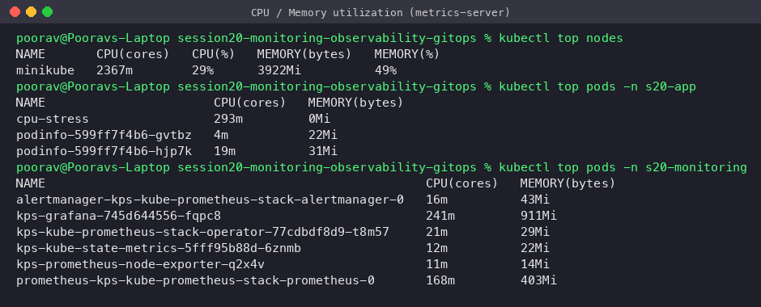

**PromQL** queries the stored history. These are the queries the dashboard uses:

```promql
up{job="podinfo"}                                                                   # target health
sum by (pod) (rate(container_cpu_usage_seconds_total{namespace="s20-app",container!=""}[1m]))   # CPU cores
sum by (pod) (container_memory_working_set_bytes{namespace="s20-app",container!=""})            # memory
sum by (status) (rate(http_requests_total{namespace="s20-app"}[1m]))                # request rate by status code
```

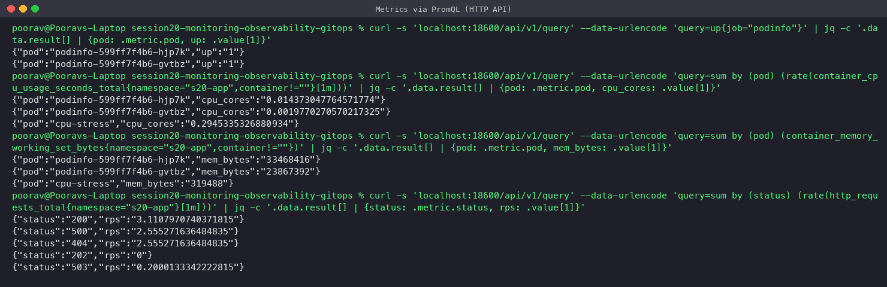

CPU graph in the Prometheus UI. The `cpu-stress` pod sits at ~0.3 cores, which is its limit:

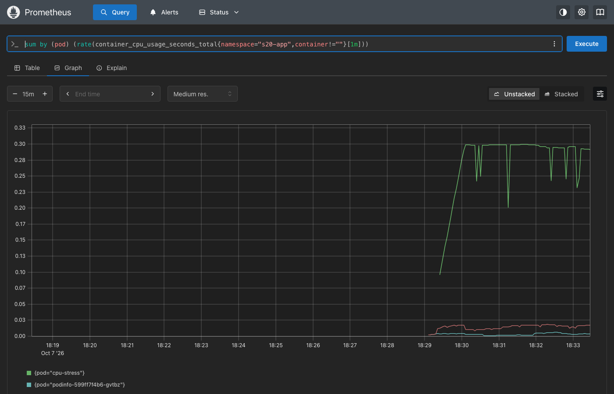

### 1.4 Grafana dashboards

This is a custom **dashboard-as-code** (`grafana-dashboard.yaml`). It is a ConfigMap with label `grafana_dashboard: "1"`, which the Grafana sidecar loads automatically. It shows:
- targets UP
- ready pods
- firing alerts
- restarts
- CPU by pod
- memory by pod
- HTTP request rate by status code

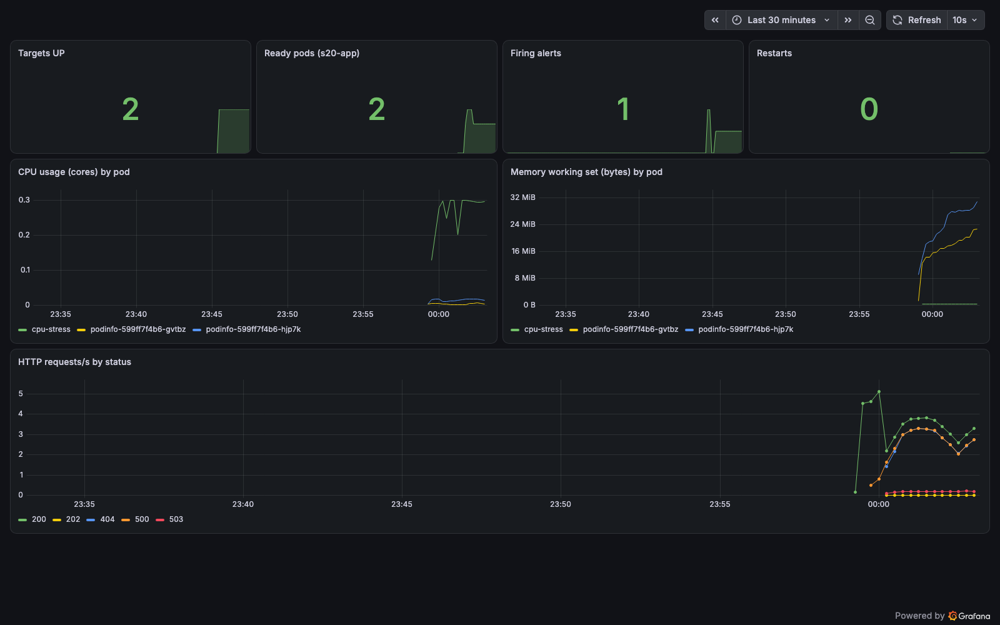

Built-in dashboard *Kubernetes / Compute Resources / Namespace (Pods)* for `s20-app`. It shows CPU and memory usage compared with requests and limits:

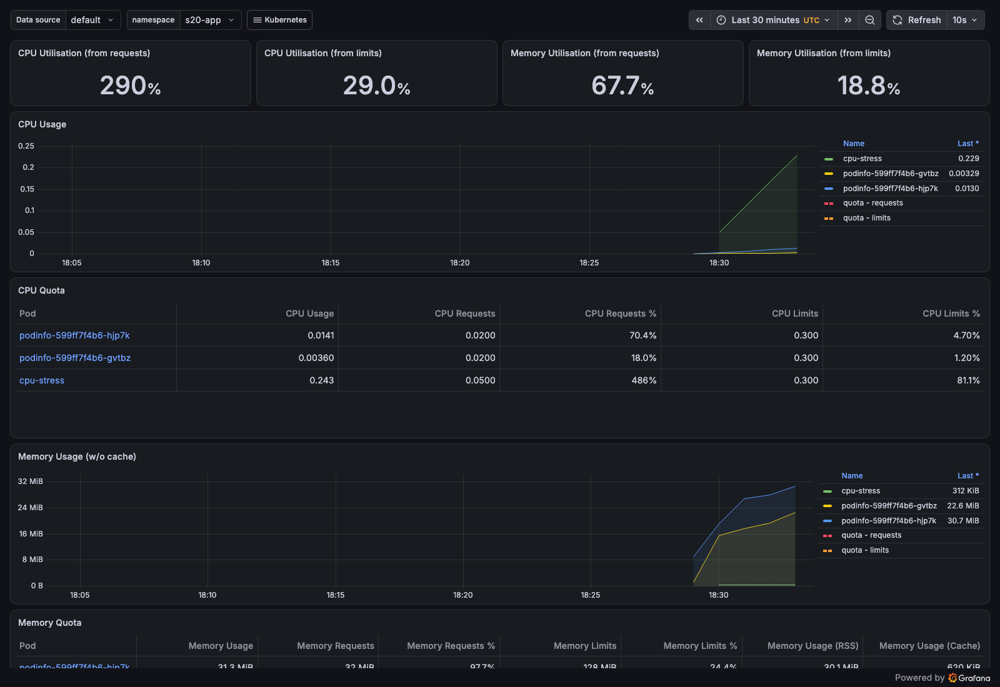

### 1.5 Application health (probes)

- The **liveness probe** (`/healthz`) restarts a hung container.
- The **readiness probe** (`/readyz`) takes a pod out of the Service endpoints until it is ready.

To demonstrate this, I made one pod report "not ready" on purpose (`POST /readyz/disable` inside the pod). It now fails readiness with **HTTP 503**, shows `0/1`, and is removed from the EndpointSlice. Traffic only reaches the healthy pod.

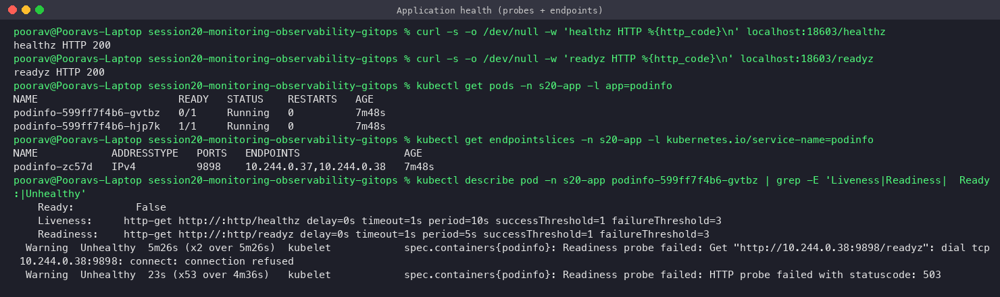

### 1.6 Alerts

`alert-rules.yaml` is a `PrometheusRule` that defines three alerts:

| Alert | Expression | For |
|-------|-----------|-----|
| PodinfoTargetDown | `up{job="podinfo"} == 0` | 30s |
| PodinfoHighCPU | per-pod CPU rate > 0.15 cores | 30s |
| PodNotReady | `kube_pod_status_ready{namespace="s20-app",condition="false"} == 1` | 30s |

Both triggered conditions (the CPU stress pod and the not-ready pod) moved through **pending → firing**:

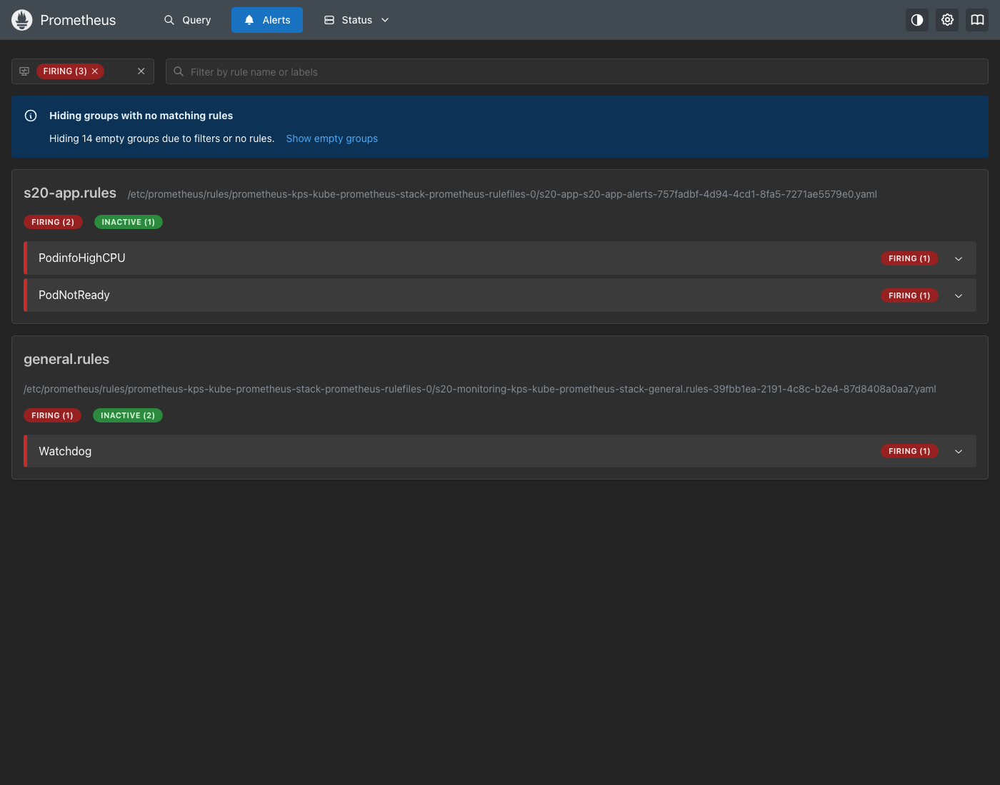

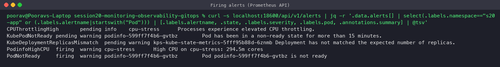

Prometheus sent the alerts to **Alertmanager**, which groups them and would route them to a receiver such as Slack or e-mail. `Watchdog` is an always-firing heartbeat alert. It proves the alerting pipeline itself is working.

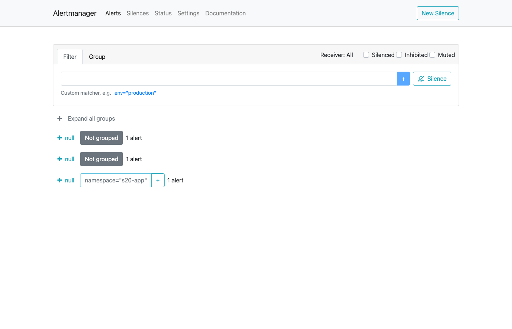

**Resolution:** I deleted the stress pod and replaced the not-ready pod. The custom alerts went back to inactive, with 0 firing:

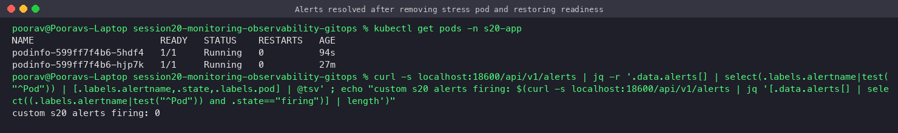

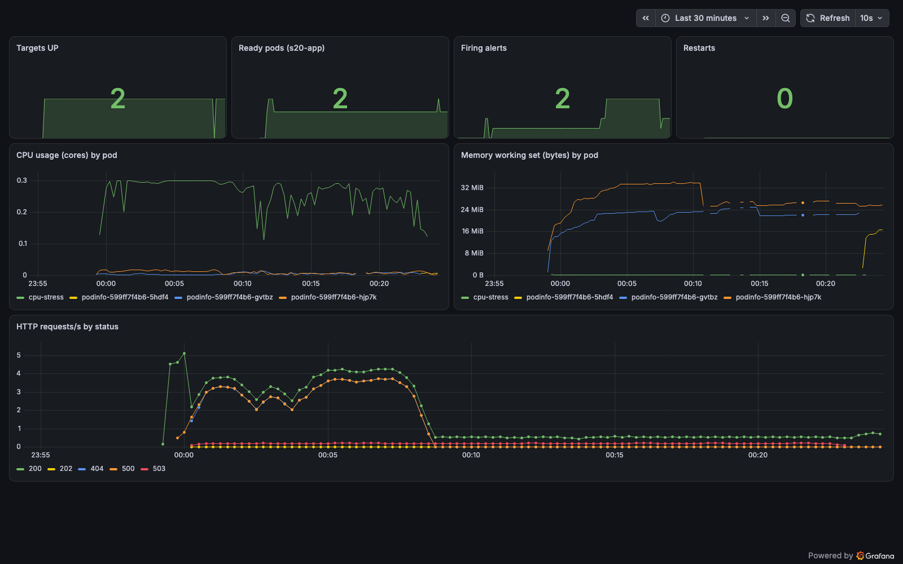

### 1.7 Logs

Kubernetes stores each container's stdout and stderr. These are read with `kubectl logs`, and `kubectl get events` shows cluster-level events. podinfo writes **structured JSON logs**, which are easy to parse with a log pipeline. The events list shows the readiness-probe failures from step 1.5.

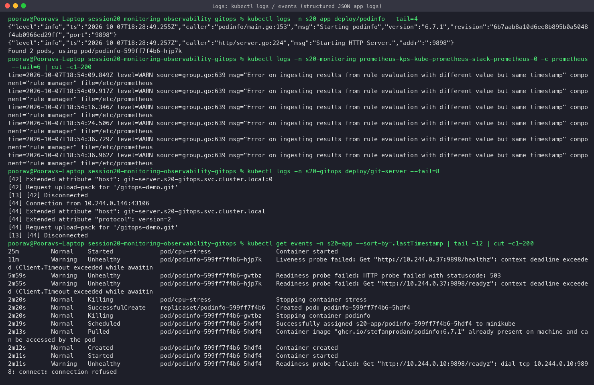

> In production these logs are shipped by an agent (Promtail / Fluent Bit / Grafana Alloy) to Loki or Elasticsearch, so they survive pod deletion and can be searched next to the metrics in Grafana.

---

## Task 2 — Observability

### Monitoring vs observability
**Monitoring** tells you *when* something is wrong. It works with known questions: "is CPU > 80%?", "is the target up?". **Observability** is how well you can work out *why* something is wrong, from the data the system produces, including failures nobody predicted. Monitoring is one part of observability.

### The three pillars

| Pillar | What it is | Example | Good for |
|--------|-----------|---------|----------|
| **Metrics** | Numbers sampled over time, with labels; cheap to store and query | `http_requests_total{status="500"}`, CPU cores, memory bytes | Dashboards, trends, SLOs, alerting |
| **Logs** | Timestamped records of individual events, ideally structured (JSON) | `{"level":"error","msg":"db timeout","order_id":42}` | Detail on a specific error; auditing |
| **Traces** | The path of one request across services, made of *spans* that share a trace ID | `frontend → api (120ms) → db (95ms)` | Finding latency and failures in microservices |

How the three work together:
1. A **metric** alert fires: "error rate 5%".
2. A **trace** shows the failing requests all go through the `payment` service.
3. That service's **logs** for the trace ID show `connection refused` to the database.

### Why observability is needed
- Microservices and Kubernetes are dynamic. Pods come and go, IPs change, and one request touches many services. SSH-ing into a server doesn't scale.
- It reduces **MTTD/MTTR** (mean time to detect and mean time to resolve incidents).
- It lets teams set and measure **SLIs/SLOs**, for example "99.9% of requests < 300 ms".
- It supports capacity planning and autoscaling. HPA reads metrics.
- It shows the effect of deployments, e.g. whether error rate went up after a release.

### Common tools

| Area | Tools |
|------|-------|
| Metrics | Prometheus, Thanos/Mimir/VictoriaMetrics (long-term), metrics-server, Datadog, CloudWatch |
| Visualisation | Grafana, Kibana |
| Logs | Loki + Promtail/Alloy, ELK/EFK (Elasticsearch, Logstash/Fluentd/Fluent Bit, Kibana), CloudWatch Logs |
| Traces | OpenTelemetry (instrumentation standard + Collector), Jaeger, Tempo, Zipkin |
| Alerting | Alertmanager, Grafana Alerting, PagerDuty, Opsgenie |
| All-in-one SaaS | Datadog, New Relic, Dynatrace, Elastic Observability, Honeycomb |

### Kubernetes observability
- **Cluster and node level:** node-exporter (host metrics), kube-state-metrics (desired vs actual object state), and the API server and kubelet metrics endpoints.
- **Container level:** cAdvisor inside the kubelet provides per-container CPU, memory, network and filesystem metrics. metrics-server feeds `kubectl top` and HPA.
- **Application level:** apps expose `/metrics`, and the Prometheus Operator discovers them through `ServiceMonitor` / `PodMonitor` CRDs. Health is shown by liveness, readiness and startup probes.
- **Events:** `kubectl get events` covers scheduling failures, image pull errors, probe failures and OOMKills. They can be exported with event-exporter.
- **Logs:** containers write to stdout and stderr. The kubelet stores these on the node, and a DaemonSet agent ships them to Loki or ELK.
- **Traces:** apps are instrumented with OpenTelemetry SDKs (or eBPF auto-instrumentation). Traces go to an OTel Collector and then to Tempo or Jaeger. A service mesh (Istio/Linkerd) also adds request metrics and traces.
- **Alerts as code:** `PrometheusRule` CRDs live in Git next to the app, which ties into GitOps.

---

## Task 3 — GitOps

### Concepts
- **GitOps** means running infrastructure and applications with **Git as the single source of truth** for the desired state. An agent inside the cluster continuously makes the live state match Git.
- **Git as the source of truth:** every change is a commit or pull request, which gives review, an audit trail (who changed what and why), and rollback with `git revert`. Nobody runs `kubectl apply` by hand in production.
- **Declarative configuration:** you describe *what* you want (YAML: 3 replicas of nginx:1.27), not *how* to get there. Kubernetes controllers work out the steps.
- **Continuous reconciliation:** the GitOps controller compares *desired* (Git) with *live* (cluster) in a loop.
  - If Git changes, it applies the change (**auto-sync**).
  - If the cluster changes by hand, it reverts it (**self-heal / drift correction**).
  - If something is removed from Git, it deletes it from the cluster (**prune**).
- **Pull vs push:** classic CD pushes changes into the cluster, so CI needs cluster credentials. In GitOps the agent inside the cluster *pulls* from Git, so no cluster credentials leave the cluster.
- **Typical workflow:**
  1. A developer pushes app code.
  2. CI builds, tests and pushes an image.
  3. CI (or Argo CD Image Updater) commits the new image tag to the config repo.
  4. Argo CD / Flux sees the commit and syncs.
  5. Health checks and monitoring confirm the rollout.
  6. Rollback is `git revert`.
- **Kubernetes + GitOps tools:** Argo CD (with a UI; Applications/ApplicationSets) and Flux CD (a set of controllers). Both work with plain YAML, Kustomize and Helm.

### Demo setup
The cluster cannot reach a GitHub repo on this laptop, so I ran a **Git server inside the cluster** (`git daemon`, namespace `s20-gitops`) to play the role of GitHub. Argo CD watches it at `git://git-server.s20-gitops.svc.cluster.local/gitops-demo.git`.

```bash
# Argo CD (minimal) + Git server
helm repo add argo https://argoproj.github.io/argo-helm
helm install argocd argo/argo-cd -n s20-argocd --create-namespace -f gitops/argocd-values.yaml --wait
kubectl apply -f gitops/git-server.yaml

# push the manifests to the in-cluster repo (through a port-forward)
kubectl -n s20-gitops port-forward svc/git-server 18610:9418 &
git clone git://localhost:18610/gitops-demo.git && cd gitops-demo
cp -R ../gitops/repo-content/. . && git add -A && git commit -m "Add guestbook app manifests (replicas: 2)" && git push origin main

# register the application
kubectl apply -f gitops/argocd-application.yaml
```

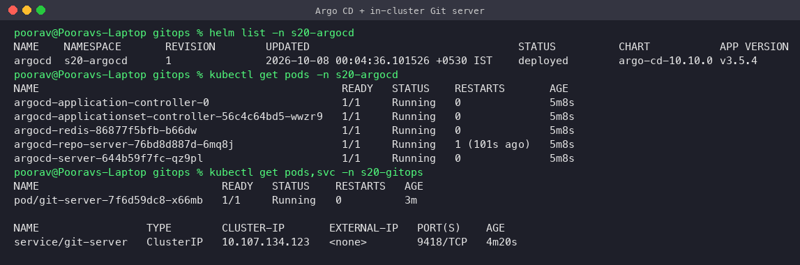

### Step 1 — initial sync: Synced / Healthy (replicas = 2)
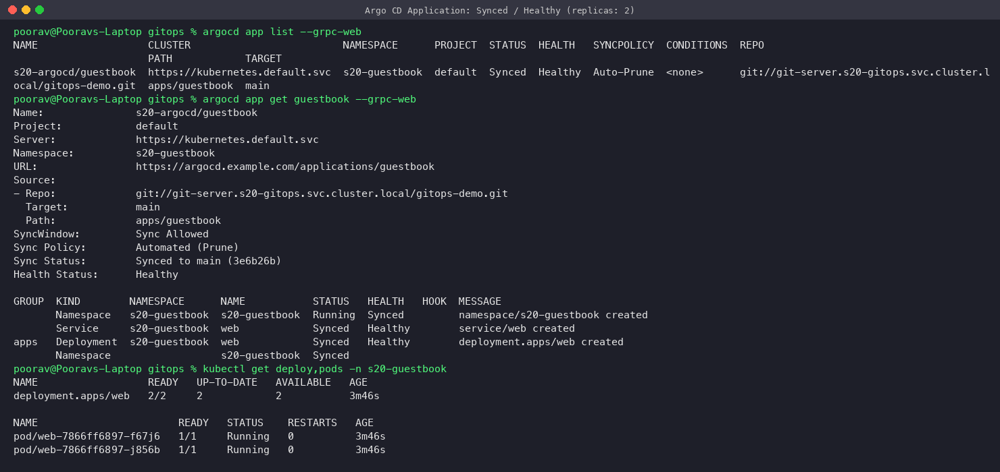

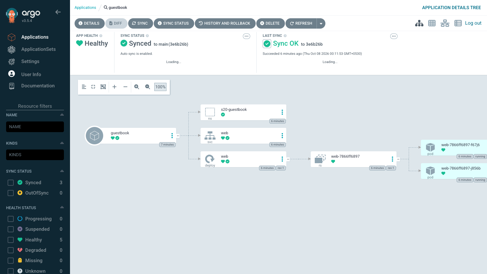

### Step 2 — change desired state in Git (replicas 2 → 3)
I changed only the file in Git and ran no `kubectl` command. Right after the push, the cluster is still at 2 replicas:

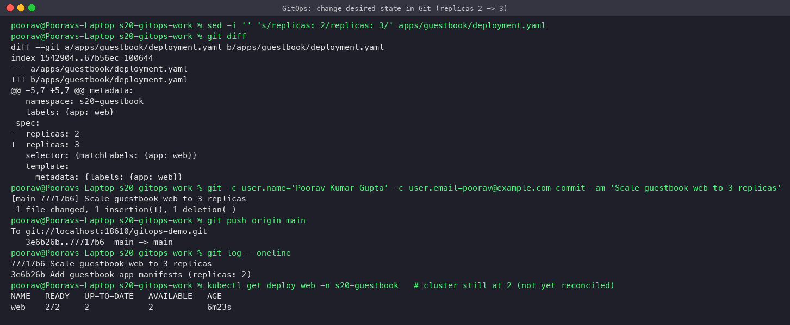

### Step 3 — Argo CD auto-sync reconciles the cluster
Argo CD polled the repo, found new commit `77717b6`, and synced automatically. `readyReplicas` went to 3, and the history shows both revisions. Argo CD's default Git polling interval is about 3 minutes, which is why this took ~170 s. In real setups a Git webhook to Argo CD makes it almost instant.

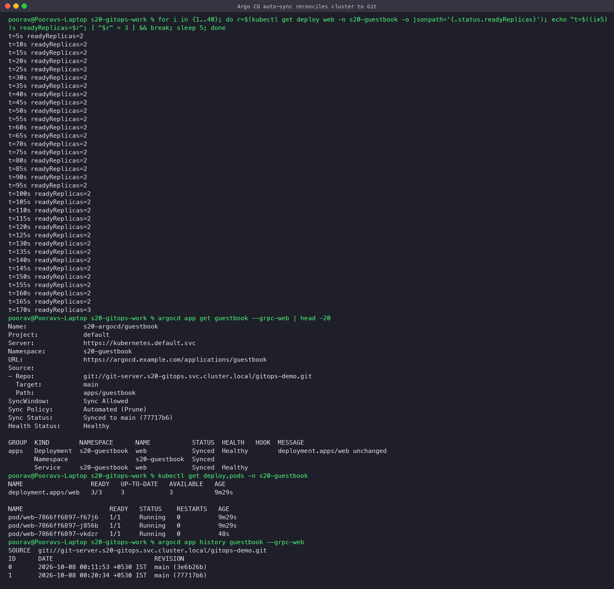

### Step 4 — self-heal: manual drift is reverted
I scaled the deployment to 6 by hand with `kubectl scale`. That state is not in Git. Argo CD detected the drift and set it back to 3 replicas within ~6 seconds (`selfHeal: true`):

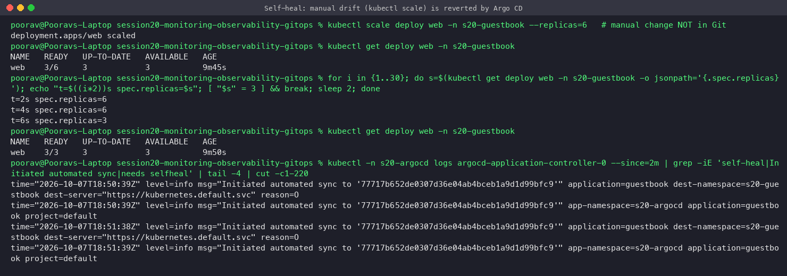

The UI caught the moment of self-heal. The extra pods created by the manual scale are **terminating**, the app is still **Synced** to commit `77717b6`, and the commit author and message are shown:

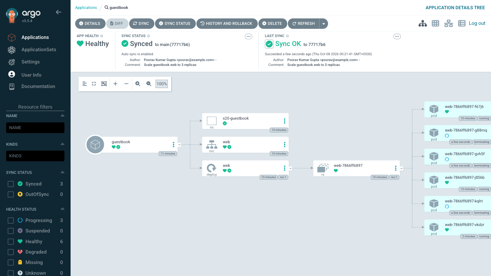

Deployment history: every sync is tied to a Git revision. Rollback means picking an earlier revision, or better, running `git revert`:

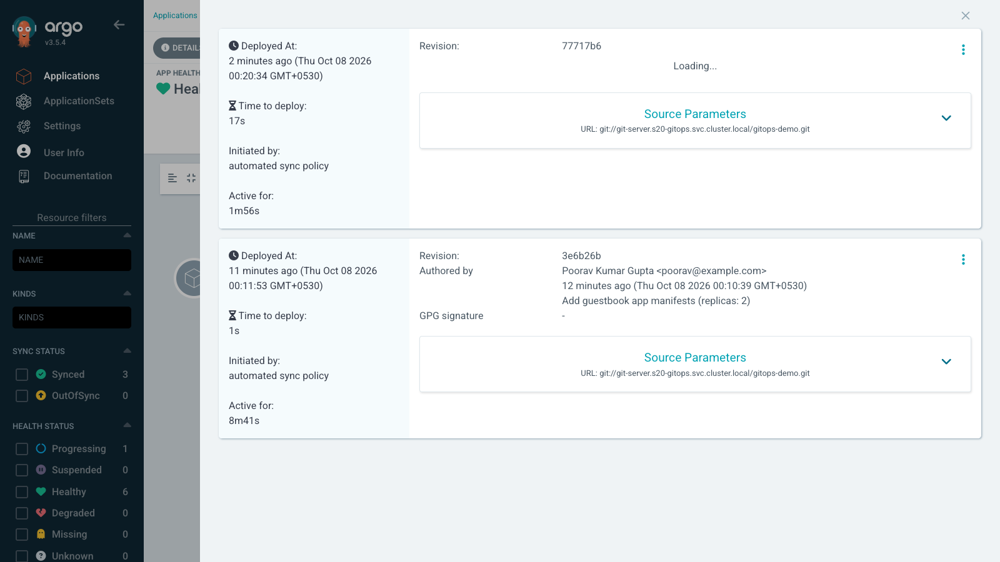

---

## Cleanup
```bash
kubectl delete -f gitops/argocd-application.yaml
helm uninstall argocd -n s20-argocd
helm uninstall kps -n s20-monitoring
kubectl delete ns s20-app s20-guestbook s20-gitops s20-argocd s20-monitoring
```

## Notes and lessons learned
- Headless screenshots of SPAs need patience. Grafana panels load their data asynchronously, so the capture has to wait for the queries to finish. Argo CD needs a real login session (I used Playwright).
- `kubectl port-forward` is fragile. A connection reset (for example from `argocd login`) kills the forward, so I wrapped it in a restart loop.
- Argo CD only watches `Application` objects in its own namespace by default, so the Application lives in `s20-argocd`.
- `timeout.reconciliation` belongs in `argocd-cm`, not `argocd-cmd-params-cm`. My attempt to shorten polling to 30 s had no effect, and the demo ran with the default ~3 min.
- Alert expressions that use `sum by (pod)` drop the `namespace` label. Keep the labels your routing and filtering depend on (e.g. `sum by (namespace, pod)`).
